# Εκχύλιση Στερεάς Φάσης (SPE)

## Εισαγωγή

Ο Ρώσος βοτανολόγος Michael Tswett το 1906 πρώτη φορά διαχώρηση μίγμα χλωροφυλλών σε στύλη $CaCO_3$ με πετρελαϊκό αιθέρα, όπου εμφανίστηκε πρώτη φορά η ***χρωματογραφία***. Η τεχνική της *εκχύλισης στερεάς φάσης* μοιάζει πολύ με τις χρωματογραφίες, και διαφέρει μόνο στο ότι μέσω φαινομένων προσρόφησης, δεν πετυχαίνουμε διαχωρισμό λόγο διαφορετικών ταχυτήτων/χρόνων έκλουσης των συστατικών. Αντίθετα, συστατικά κατακρατόνται αποκλειστικά σε διακριτές φάσης. Είναι επίσης μια φυσική διαδικασία εκχύλισης με μια υγρή, κινητική φάση και μία στερεά στατική φάση. Σε κάθε περίπτωση όμως βασίζεται στις γενικές αρχές της χρωματογραφίας.

Οι στήλες της SPE αντίθετα με αυτές τις χρωματογραφίας είναι μίας χρήσης και ονομάζονται *φυσίγγεα* ή *μικροφυσίγγεια*.

Τύπος|Στερεά Φάση|Παρατήρηση|Δεξαμενή|Πίεση
------|-------|-------|-------|------
Bond-elut cartridge|100-500 (mg)|Συμπιεσμένο Υλικό σε ξηρή κατάσταση|1-5 (mL)|Luer-tip, χαμηλή πίεση|
Sep-pak cartridge|370-900 (mg)|Συμπιεσμένο υλικό σε ξηρή κατάσταση|NA|Luer fitting, υψηλή πίεση|

Η στατική φάση αποτελείται από πορώδη σωματίδια καθορισμένης διαμέτρου και μεγέθους πόρων, τοποθετημένα από το κατασκευαστή σφικτά σε κυλινδρικές στήλες διαφόρων μεγεθών (*φυσίγγεια*).

>**Όγκος Κοίτης:**\
Είναι η ποσότητα διαλύτη που χρειάζεται για να γεμίσουν πλήρων οι πόροι των σωματιδίων και τα διαστήματος μεταξύ τους. Εκφράζεται σε όγκο διαλύτη ανά 100 mg στατικής και είναι ανάλογο του *νεκρού όγκου* κατά κάποιο τρόπο.

>**Χωρητικότητα Υποστρώματος:**\
Είναι η ολική μάζα συστατικού που μπορεί να συγκρατιθεί πλήρως, σε βέλτιστες συνθήκες, ανά μάζα υποστρώματος. Σε κάθε περίπτωση η μάζα αναλύτη δεν θα πρέπει να υπερβαίνει το 5% της μάζας στατικής.

*Εκλεκτικότητα* υποστρώματος, είναι η ικανότητα υποστρώματος να συγκρατεί κάποιο συστατικό ενδιαφέροντος παρουσία άλλων ουσιών, στο δείγμα στο οποίο είναι διαλυμένο. Εξάρτάται από τη δομή του αναλύτη, τις ιδιότητες του υποστρώματος και τη σύσταση του δείγματος.

## Αρχή Λειτουργίας

Η SPE βασίζεται στην ικανότητα της στερεάς φάσης να συνδέεται με και να κατακρατεί εκλεκτικά κάποια ουσία ενδιαφέροντος από το δείγμα. Σε επόμενο στάδιο οι κατακρατούμενες εκλούονται και επομένος πετυχαίνουμε διαχωρισμό. Κάθε εφαρμωγή SPE, έχει τα εξής στάδιο:

Στάδιο|Εξήγηση
------|------
Ενεργοποίηση|Η στατική είναι σε ξηρή μορφή και θα πρέπει να γεμίσει ομοιόμορφα με διαλύτη, και συγκεκριμένα τον διαλύτη. Κακή ενεργοποίηση δίνει με αναπαραγόγημα αποτελέσματα γιατί η ίδια η στατική δεν έχει ομοιογενείς αλληλεπιδράσεις με τον διαλύτη
Συγκράτηση|Διαβιβάζουμε το δείγμα οπότε οι ουσίες ενδιαφέροντος (συνήθως αναλύτες) προσκολούνται στη στατική δεν κινούνται (συνήθως με προσρρόφηση), ενώ οι υπόλειπες εξέρχονται
Έκπλυση|Επειδή είναι πολύ πιθανό μερικά συστατικά του δείγματος να παραμένουν στο φυσίγγειο παρ' ότι δεν κατακρατούνται χημικά, πρέπει να κάνουμε έκπλυση με περίσσεια διαλύτη.
Έκλουση|Διαβιβάζουμε δεύτερο διαλύτη, ισχυρότερο από τον πρώτο, ο οποίο εκτοπίζει τις ουσίες ενδιαφέροντος από τη στατική, οπότε αυτές εκλούονται και μπορούμε να τις παραλάβουμε

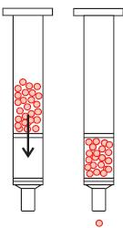
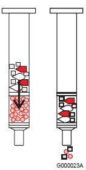\
*Ενεργοποίηση, φόρτωση δείγματος*\
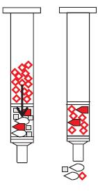
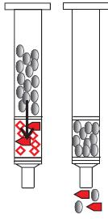\
*Έκπλυση και έκλουση δείγματος*\
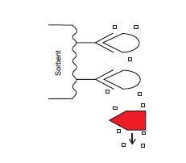
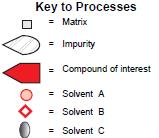\
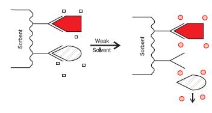\
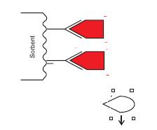\
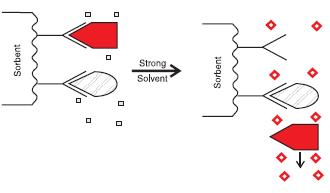\
*Προσρόφηση στα διάφορα στάδια*

Η πηκτή πυριτίας είναι ίσως το πλέον συνηθέστερο υπόστρωμα στατικής. Σε μικροσκοπικό επίπεδο αποτελείται από μακριές αλειφατικές αλυσίδες να συνδέονται στο κρυσταλλικό πλέγμα $(SiO_2)_x$. Σε ξηρή κατάσταση οι ομάδες είναι τυλιγμένες γύρο από την πυριτία και επομένως η επιφάνεια επαφής είναι μικρή. Με εμβροχή όμως οι αλυσίδες ξετυλίγονται και εκτείνονται κάθετο στη στατική, όπως τα φύκια στα θάλασσα. Είναι ένα παράδειγμα γιατί είναι σημαντική η ενεργοποίηση του υλικού πριν από την χρήση.

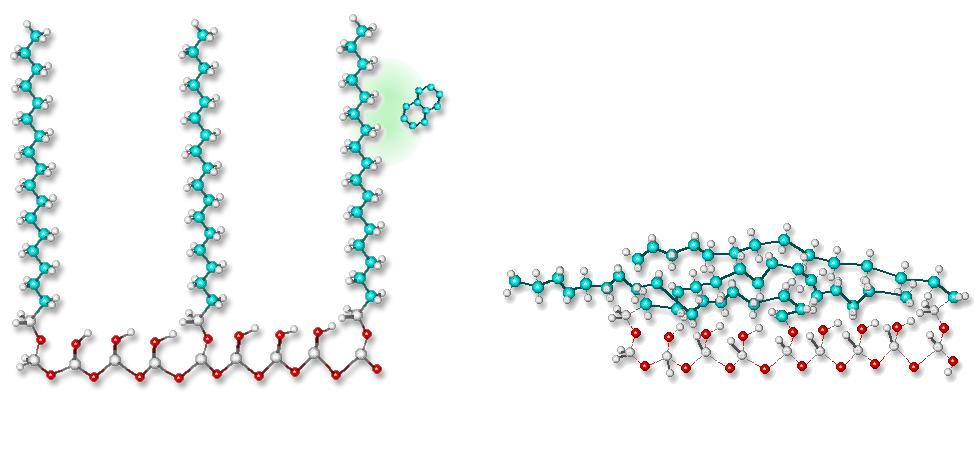\
*Στατική φάση ξηρή (αριστερά) και ενεροποιημένη με εμβροχή (δεξια)*

Υπάρχουνε διάφορες στατικές (ή προσροφητικά υλικά) και οι αλληλεπιδράσεις τους με τον αναλύτη μπορεί να είναι διαφόρων ειδών, όπως πολικές ή μη πολικές, ιοντικές ή κάποιος συνδιασμός.

Πρακτικά, οι κατασκευαστές ορίζουν για έκαστο υλικό, εφαρμωγές για τις οποίες είναι κατάλληλο, διαλύτες και τύπους δειγμάτων.

## Αλληλεπιδράσεις

Οι αλληλεπιδράσεις μήτρας-αναλύτη επιρρεάζουν την συγκράτηση. Ιδιαίτερο ενδιαφέρον έχει η πρωτεϊνική σύνδεση και η πολικότητα. Πάντα ζητάμε να μειώσουμε αυτές τις αλληλεπιδράσεις ώστε να γίνει αποτελεσματικότερος ο διαχωρισμός. Αυτό μπορούμε να το κάνουμε με απλή αραίωση, προκατεργασία με εκχύλιση, ή κάποια εξειδικευμένη διάσπαση πρωτεϊνικών συνδέσεων.

Στατική|Περιγραφή|Μηχανισμοί
-----|------|------
Πηκτή Πυριτίας|Υλικό υψηλής πολικότητας με επιφάνεια που φέρει ελεύθερες ομάδες σιλανόλης $SiOΗ$ και γέφυρες σιλοξανίου|Προσρόφηση
Αλουμίνα ($Al_2O_3$)||Προσρόφηση
Florisil|Ιοντικό Πολυμερές με $Mg^+$|Προσρόφησης
Χημικά Συνδεδεμένη Πυριτία|Προκύπτει με αντίδραση ελεύθερων $-OH$ των $SiOH$ με άλλες ομάδες. Συνηθέστερες είναι οι $C_{18},\;C_8$. Παραμένουν σταθερές για $pH\in[2.0,7.5]$, σε μεγαλύτερα διαλύονται σε υδατικά, ενώ σε μικρότερα, σπάνε οι αιθερικοί δεσμοί και καταστρέφεται η επιφάνεια της στατικής. Είναι πάντως σταθερές σε οργανικού διαλύτες|Κατανομή
End capping BDS $C_{18}$||Κατανομή
Ισχυροί ιονανταλλάκτες||Ανταλλαγή Ιόντων
Κυκλοδεξτρίνες|Για διαχωρισμού εναντιομερών|
*Κοινές στατικές στην SPE*

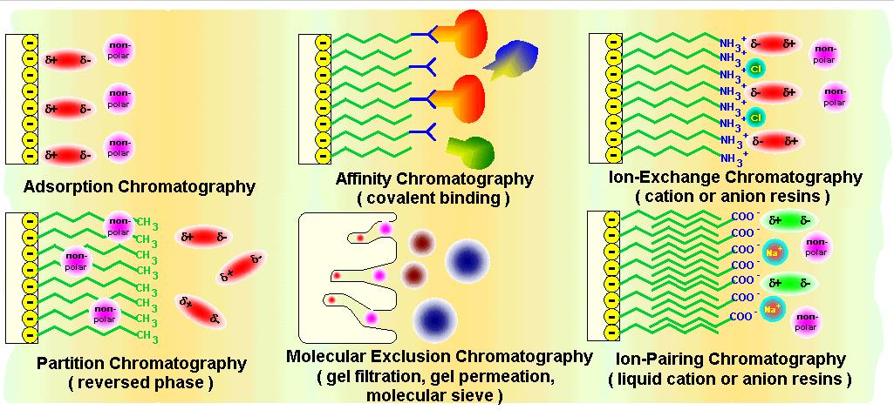\
*Διάφοροι τύποι αλληλεπιδράσεων*

Αλληλεπιδράσεις μη πολικών αναλυτών και στατικών μπορεί να είναι για παράδειγμα υδρόφοβες, μεταξύ πολικών μπορεί να είναι δεσμών υδρογόνου, διπόλου-διπόλου, ή διασποράς. Στις ιοντικές αλληλεπιδράσεις το υπόστρωμα πρέπει να είναι φορτισμένο και οι αλληλεπιδράσεις είναι στατικές. Θα πρέπει να γίνει προσεκτική ρύθμιση pH. Αν ο αναλύτης μας ιοντίζεται και υπάρχει και δυνατότητα μη πολικών αλληλεπιδράσεων τότε θα εξαιτάσουμε το δείγμα. Αν αυτό περιέχει άλατα, τότε θα επιλέξουμε στατική που βασίζεται με μη-πολικές αλλιώς θα κατακρατάτε εν μέρη το μητρικό υλικό.

## Ανάπτυξη Μεθόδου

Μια γενική πορεία που εφαρμόζουμε θα έχει ως εξής. Σε κάθε περίπτωση πρέπει να ξέρουμε τη φύση της μήτρας και των αναλυτών μας ώστε να είμαστε αποτελεσματικοί.

1. Σκοπός Μεθόδου

* Ποιά η επιθυμητή καθαρότητα του αναλύτη?
* Ποιά η επιθυμητή τελική συγκέντρωση του αναλύτη?
* Ποιά η αναμενόμενη συγκέντρωση του αναλύτη σε δείγματα?
* Ποιός ο επιθυμητός διαλύτης έκλουσης? (αφού αυτός εξαρτάται από τη μετέπειτα ανάλυση - για παράδειγμα για μετέποιτα GC θα πρέπει να είναι πτητικός όπως η ακετόνη)

2. Μελέτη Αναλύτη
* Ποιά τη φυσικοχημικά χαρακτηριστικά του?
* Υπάρχουν πολικές ομάδες?
* Υπάρχουν ομάδες $-NH_2$ και $-OH$?
* Υπάρχουν ομάδες που ιοντίζονται? Ποιότ το $pK_a$?
* Ποιά η διαλυτότητα σε διάφορους διαλύτες?
  Είναι σταθερό σε διάφορα pH?
  Είναι ελεύθερος ο αναλύτης ή δεσμευμένος? Μπορούμε να τον αποδεσμεύσουμε πχ με όξινη υδρόλυση?
* Ποιό το χρωματογραφικό του προφίλ?

3.  Μελέτη Μητρικού Υλικού
* Για τι είδος υλικού πρόκειται?
* Είναι υδατικό ή σε μη πολικό διαλύτη?
* Έχουν προκηγηθεί άλλες προκατεργασίες?
* Τι συστατικά περιέχει?
* Υπάρχουν συστατικά που με παραπλήσια δομή με αυτή του αναλύτη?

Μηχανισμοί Συγκράτησης Αναλύτη|Μήτρα|Παρατήρηση|Τυπικά δείγματα
-----|-----|-----|-----|
Μη πολικοί|Πολική|Ανάλογη της χρωματογραφίας αντίστροφης φάσης|Φαρμακευτικές ουσίες σε πλάσμα ή ορό, εντομοκτόνα σε νερά, κυκλοσπορίνες σε αίμα,προσταγλαδίνες σε κυτταρικές καλλιέργειες, εξαρτησιογόνα σε ούρα ή ορό
Πολικοί|Μη πολική||Βιταμίνη D, αραχιδονικό σε καλλιέγειες, αφλατοξίνες σε τρόφιμα
Ιοντικοί|Χαμηλή ιοντικής ισχύος||(Κατιονανταλλαγήςανταλλαγής) Κατεχολαμίνες, φαρμακευτικά σε πλάσμα και ούρα, (Ανιονανταλλαγής) οργανικά, ριβονουκλεοτίδια σε καλιέργειες
*Επιλογή στατικής φάσης και μηχανισμοί*

## Βελτιστοποίση και Έλεγχος

Στα πλαίσια της ανάπτυξης μεθόδου θα πρέπει να βελτιστοποιήσουμε τη συγκράτηση και την έκλουση προτύπων, στα πλαίσια της SPE και νε ελένξουμε για τυχόν παρεμποδίσεις από μητρικό υλικό (ανάλυση λευκού).

Για την ενεργοποίηση του υποστρώματος και για πολικού και μη πολικού μηχανισμούς ο διαλύτης είναι ίδιος με αυτόν που παρασκευάστηκαν τα πρότυπα σε 10-20 φορές όγκο κοίτης. Γι ιονανταλλακτικά θα πρέπει να βάλλουμε ρυθμιστικό. Στη φόρτωση προτύπων θα πρέπει να ελένξουμε το υγρό που περνάει αν παραμένει αναλύτης και το ίδιο και κατά το στάδιο έκλουσης.

Αλληλεπιδράσεις|Χαρακτηριστικοί Αναλύτες|Διαλύτες Συγκράτισης|Διαλύτες Έκλουσης
------|-------|--------|------
Μη πολικές|Ενώσεις με μη πολικά τμήματα, όπως αλκυλ- αρωματικέςμ αλικυκλικές, ή άλλες με δομή υδρογονάνθρακα|Νερό, ρυθμιστικά χαμηλής ισχύος,συνδιασμοί νερό,διαλυτών,μικρό ποσοστο οργανικού τροποποιητή| οργανικό διαλύτες(μεθανόλη, ακετονιτρίλιο, οξικός αιθυλεστέρας, τετραϋδροφουράνιο, χλωροφόρμιο, διχλωρομεθάνιο, εξάνιο), συνδιασμοί νερού διαλυτών υψηλού ποσοστού οργανικού
Πολικές|Ενώσεις με πολικές ομάδες|Εξάνιο, ισοοκτανιο,χλωροφόρμιο,διχλωρομεθάνιο,συνδιασμοί τους,τετραϋδροφουράνιο,οξικός αιθυλεστέρας|Μεθανόλη νερό, τετραϋδροφουράνιο,ισοπροπανόλη,οξιοκό,ακετονιτρίλιο,ακετόνη,αμίνες,ρυθμιστικά υψηλής ισχύος,συνδιασμοί τους
Κατιονανταλλαγή|Ενώσεις με βασικές ομάδες,ανόργανα κατιόντα|Νερό ρυθμιστικά χαμηλής ισχύος ($pK_a^{analyte}>pH>pK_a^{Sr}$)|Ρυθμιστικά σε 2 μονάδες υψηλότερο/χαμηλότερο το pK_a^{Sb}/pK_a^{analyte}, υψηλής ισχύος, εκλεκτικών κατιόντων ή συνδιασμός
*Πρακτική Επιλογή*

Βήμα|Περιγραφή|Διαδικασία|Κρητίρια
-------|---------|--------|-------
1|Ελέγχουμε την εκλουστική ισχύ διαλύτη έκλουσης|Διαλύουμε στον διαλύτη,το διαβιβάζουμε από τη στήλη και μετράμε τη παρουσία του αναλύτη.Υπολογίζουμε ανάκτηση σε σχέση με πρότυπα σε διαλυτη χωρίς SPE|$90-100\%$
2|Ελέγχουμε τον μηχανισμό συγκράτησης|Διαλύουμε σε απεσταγμένο νερό(μη πολικό ή ιονανταλλαγή), ή οργανικό(πολικά) και επαναλλαμβάνουμε ως άνω|$>90\%$
3|Ελέγχουμε τη συγκράτηση, έκλουση και απομάκρυνση προσμίξεων|Διαλύουμε σε μητρικό και επαναλλαμβάνουμε ως άνω. Οι παρεμποδίσεις ελέγχονται με λευκό, δηλαδή εν απουσία αναλυτών|NA
4|Ελέγχουμε τη γραμμικότητα|Κατασκευάζουμε καμπύλη αναφοράς με εμβολιασμένο κατά τα γνωστά, σε μητρικό|$R^2>0.95$
5|Διασταυρούμενη επικύρωση|Διασταυρώνουμε τα αποτελέσματα για άγνωστα συγκρίνοντας με μια δεύτερη μέθοδο γνωστής αποτελεσματικότητας. Εμβολιάζουμε άγνωστα με πρότυπα και βρισκουμε την ανάκτηση|$\%R\in[85,115]\%$
*Πρακτική ανάπτυξη μεθόδου*
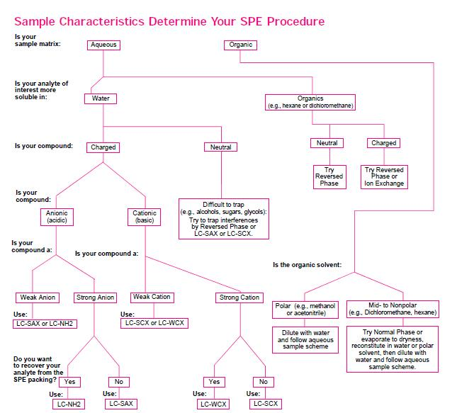\
*Διάγραμμα ροή ανάπτυξης μεθόδου*