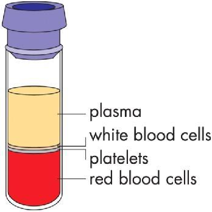
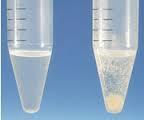
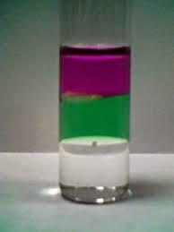
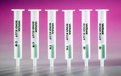
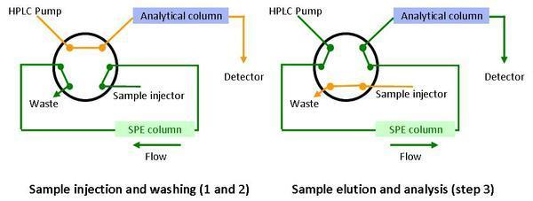
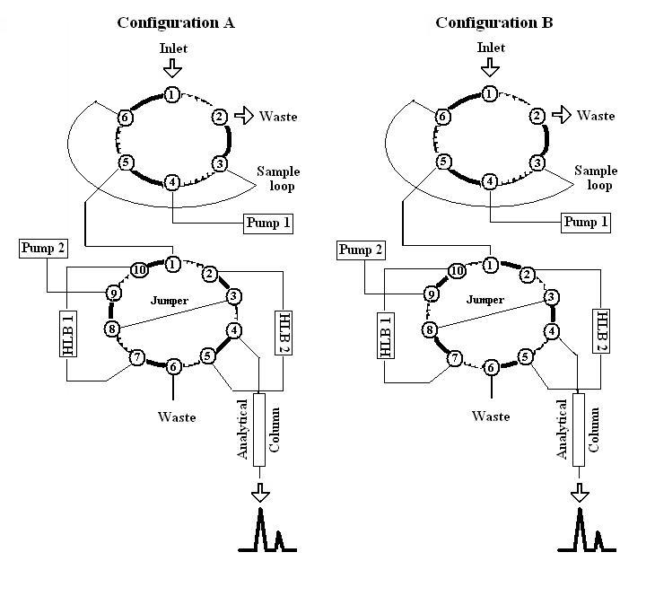

# Βιολογικά Δείγματα

## Εισαγωγή

Τα βιολογικά δείγματα είναι γενικά πολύπλοκα και πολύ διαφορετικά μεταξύ τους. Οι κυριώτερες κατηγορίες δειγμάτων είναι:

* **Αίμα**
* **Ούρα**
* **Σίελος**
* **Δάκρυα** (σπάνιο)
* **Κόπρανα**
* **Ιστοί**
* **Εγκεφαλονοτιαίο Υγρό** (ΕΝΥ)
* **Γάλα**

Το πλέον διαδέμο βιολογικό δείγμα είναι το *αίμα*. Αυτό που κοινός απακαλούμε αίμα ονομάζεται αυστηρότερα *ολικό αίμα* και είναι υγρό καθορισμένο pH (7,40) που περιέχει πρακτικά, όλες τις ενδογενείς ουσίες του οργανισμού και πολλά κυτταρικά στοιχεία, (ερυθροκύτταρα, λευκοκύτταρα). Δεν προτιμάτε γενικά λόγο της πολυπλοκότητας εκτός αν πρόκυται για εξαίταση *παρά τη κλίνη (Point of Care,  POC)*.

*Ορός* είναι ένα υποκίτρινο και σχετικά διαυγές υγρό, που παραλαμβάνουμε με φυγοκέντρηση τους αίματος χωρίς προσθήκη αντιπηκτικού. Χωρίς αντιπηκτικό το αίμα πήξη, οπότε κατακριμνίζονται όλα τα έμορφα συστατικά του αίματος (τα κύτταρα) και στο πλέγμα πρωτεϊνών τους εγκλωβίζονται και ορισμένα άλλα συστατικά του αίματος.

*Πλάσμα* ονομάζεται το επίσης υποκίτρινο υγρό που προκύπτει απο το ολικό αίμα, εάν του προσθέσουμε κάποιο αντιπηκτικό (συνήθως, EDTA, ηπαρίνη, κιτρικά) και φυγοκεντρίσουμε. Τότε εμφανίζεται διφασικό σύστημα, με τα ερυθροκύτταρα στο πυθμένα, το πλάσμα στη πάνω φάση και τα λευκοκύτταρα στη μεσεπιφάνεια τους.

Στη περίπτωση του αίματος θα πρέπει να προσέξουμε το δείγμα να μην *αιμολυθεί*, δηλαδή να μη σπάσουν τα ερυθροκύτταρα. Αν συμβεί αυτό, τότε η παρουσία αιμοσφαιρίνης στο δείγμα θα επιρρεάσει τις περισσότερες φωτοχημικές αναλύσεις γιατί η αιμοσφαιρίνη απορροφά στη περιοχή UV-Vis. Επιπλέον, πολλά συστατικά του αίματος (όπως η γλυκόζη) έχουν διαφορετικές συγκεντρώσεις εκτός και εντός των κυττάρων, οπότε να να μπορούμε να τα αναλύσουμε τα πορίσματα μας, δεν θα είναι σωστά. Εκτός των αιμολυμμένων, θα πρέπει να προσέξουμε τα δείγματα να μην είναι *ικτερικά*.

Στη συντριπτική πλειοψηφία των περιπτώσεων, τα βιολογικά δείγματα πρέπει να τα φυλάμε σε συνθήκες *απλής κατάψυξης* (~-$20\;^oC$), ή *βαθιάς κατάψυξης* (~-$70\;^oC$), ανάλογα με τις ουσίες ή τον χρόνο ανάλυσης. Αν πρέπει να τα φυλάξουμε για μερικές ώρες τότε μπορούμε τα φυλάξουμε και σε *απλή ψύξη* (~-$2-8\;^oC$). Ιδαιτέρως για τους μετβαολίτες φαρμάκων, θα πρέπει ο σχηματισμός τους να σταματήσει την ώρα της λήψης.

## Κατεργασίες Βιολογικών Δειγμάτων

Στόχος της κατεργασίας των δειγμάτων είναι η απελευθέρωση και η απομόνωση (ή συμπήκνωση) του αναλύτη, και ο καθαρισμός τους για να ελαχιστοποιήσουμε τις παρεμποδίσεις (καταστολή σήματος, ή πολλαπλοί παρμεποδιστές). Προσπαθούμε πάντα να έχουμε την ελάχιστη δυνατή απώλεια δείγματος, αποτελεσματικά απομάκρυνση παρεμποδίσουσων ουσιών με το μικρότερο δυνατό κόστος και στο μικρότερο δυνατό χρόνο.

### Κατακρήμνιση Πρωτεϊνών (PP)

Με διαλύματα μεθανόλης ή ακετονιτριλίου (3:1) σε πλάσμα ή διάλυμα οξέος, ανακίνηση και φυγοκέντριση κατακριμνίζονται οι πρωτεΐνες και πέφτουν στον πάτο. Είναι γρήγορα και απλή μέθοδος απομάκρυνσης πρωτεϊνών αλλά ατελής για πολλά υδατοδιαλυτά συστατικά. Τη χρησιμοποιούμε για αναλύσεις LC-MS/MS κάποιες φορές.

\
\
*Διαδικασία Κατακρίμνησης Πρωτεϊνών*

### Εκχύλιση Υγρού-Υγρού (LLE)

Είναι μια τεχνική που βασίζεται σε κατανομή διαλυμένης ουσίας μεταξύ δύο υγρών που έχουν λίγη ή καθόλου αμοιβέα δαιλυτότητα. Συνήθως η  μία είναι υδατική και η άλλος κάποιος οργανικός διαλύτης (1:5-1:10). Συχνά γίνεται περισσότερο αποτελεσματική με προσεκτικό έλεγχο pH ώστε οι αναλύτες να βρεθούν στη σωστή μορφή (μη-ιοντισμένη συνήθως). Είναι συνήθως η καθαρότερη μέθοδος. Συνήθως κάνουμε ανακίνηση, φυγοκέντριση, συλλέγουμε την οργανική στοιβάδα, εξατμίζουμε τον διαλύτη και κάνουμε ανασύσταση στην επιθυμητή κινητή (ή διαλύτη γενικότερα).

\
*Πολυφασικά Συστήματα LLE*

### Εκχύλιση Στερεά Φάσης (SPE)

Τεχνική που θα εξαιτάσουμε αλλού εκτενέστερα. Μοιάζει πολύ με τις διάφορες χρωματογραφίες και έχει τα εξής στάδια:

* Εξισορρόπηση Συστήματος
* Φόρτωση Δείγματος
* Έκπλυση
* Έκλουση

\
*Στήλες SPE*

>**Ταυτόχρονος (online) Καθαρισμός:**\
Μερικές φορές κάνουμε τον καθαρισμό πάνω στο σύστημα της στήλης. Συνήθως κατακριμνίζουμε τις πρωτεϊνες και κάνουμε ένεση το εκχύλισμα στο χρωματογραφικό σύστημα. Επιπλέον καθαρισμός γίνεται πάνω σε ειδικές στήλες. Οι στήλες αυτές δεν είναι συνήθως στη σειρά με την αναλυτική. Αντίθετα χρησιμοποιούμε συστήματα με πολυκάναλες αντλίες, οι οποίες πρώτα κατεθύνουν το δείγμα διαμέσου της στήλης καθαρισμού και προς τ' απόβλητα και οι αναλύτες κατευθόνται προς την αναλυτική στήλη.\
>
>\
*Βαλβίδες*\
Η αλλαγή μεταξύ στηλών μειώνει σημαντικά τον χρόνο της ανάλυσης. Οι διαλύτες φόρτωσης είναι γενικά υδατικοί και οι διαλύτες έκλουσης γενικά οργανικοί.

>**Αυτοματοποίηση:**\
Γι όλες αυτές τις τεχνικές έχουμε συστήματα αυτοματοποίησης με τις πολύ δηφιλείς πλάκες 96-πηγαδιών που μπορούμε να φορτώσουμε με έως 96 δείγματα παράλληλα και ρομποτικά συστήματα. Η αυτοματοποίηση μειώνει τον χρόνο της ανάλυσης και του αναλυτή (άρα μειώνει τις εργατοώρες) αλλά ελαχιστοποιεί και τα λάθοι.

>**Εσωτερικά Πρότυπα:**\
Και στις βιοαναλύσεις πρέπει να χρησημοποιούμε εσωτερικά πρότυπα, συνήθως ισοτοπικώς επισημασμένα. Σε κάποιες περιπτώσεις δεν υπάρχουν επισημασμένα πρότυπα, οπότε θα πρέπει να χρησιμοποιούμε κάποιο δομικό ανάλογο.

## Ξηραμένες Κηλίδες

Μια σύγχρονη μέθοδος συλλογής και μεταφοράς δείγμάτων είναι οι ξηραμένες κηλίδες του βιολογικού υλικού σε χαρτί. Μπορούμε να συλλέξουμε κηλίδες αίματος (DBS), κηλίδες πλάσματος (DPS), κηλίδες ούρων (DUS) σε ειδικό χαρτί. Συνήθως είναι το σχετικά κοινό Whatman 903 στο οποίο τοποθετούμε το μητρικό υλικό. Αφού στεγνώσει είναι έτοιμο για μεταφορά και συνήθως δεν απαιτεί κατάψυξη. Όταν είμαστε έτοιμοι για ανάλυση κόβουμε τη ένα δίσκο πρακαθορισμένης διαμέτρου

Διάμετρος Κηλίδας ($mm$)|Επιφάνεια ($mm^2$)|Ποσότητα Ολικου Αίματος ($\mu L$)
------|-------|-----
3|7,1|3,1
4,7|17,3|9,6
6|28,3|12,4
2*4,7|34,7|15,2

Πρακτικά, συλλέγουμε αίμα με αντιπηκτικό (πχ EDTA - επίσης απορροφά) και το τοποθετούμε στις κάρτες το συντομότερο. Το αφήνουμε να στεγνώσει για μερικές ώρες και το μεταφέρουμε σε αεροστεγείς σακούλες με ξηραντικό.
Μια βασική επιπλοκή της τεχνικής είναι ο *αιματοκρίτης*. Αιματοκρίτης ονομάζεται το κλάσμα του όγκου του ολικού αίματος που αντιστοιχεί στα ερυθροκύτταρα. Επιδή προφανώς δεν είναι σταθερός και συνήθως δεν αιμολύουμε επίτιδες τα δείγματα, για ίδια ποσότητα αίματος η αποσπόμενη ποσότητα αίματος θα εξαρτάται από τον αιματοκρίτη. Συγκεκριμένα:
$$
V_{disk}=\frac{A_{disk}}{A_{spot}}V_{spot}=\frac{\prod{({\frac d2}})^2}{\prod({\frac D2})^2}V_{spot}=(\frac dD)^2V_{spot}
$$

Για παράδειγμα έστων καμούλη βαθμονόμησης σε αιματοκρίτη 40 και x (μL) αίματος ανά δίσκο. Τότε:

* Τότε για άγνωστα μικρότερου αιματοκρίτη, ο αποσπόμενος δίσκος έχει y<x (μL) -δηλαδή αρνητικό σφάλμα. Σε κάθε περίπτωση θα πρέπει να διορθώσουμε.

1. Λήψη δίσκου
2. Προσθήκη διαλύτη εκχύλισης (σε φιαλύδιο ή 96-well plate)
3. Ανακίνηση
4. Εξάτμηση
5. Ανασύσταση
6. Ανάλυση (ανίχνευση, ποσοτικοποίση κλπ)

Γενικά με αυτή τη τενική έχουμε μεγαλύτερη σταθερότητα, μικρότερο όγκο αίματος, ευκολότερη αποθήκευση και μεταφορά, μικρή έως καθόλου προκατεργασία, ελαχιστοποίηση λαθών, αποφυγή ελέγχου ψύξης-απόψυξης, ελαχιστοποίηση επίδρασης μητρικού υλικού, και αποφυγή επιμόλυνση. Κυριότερες δυσκολίες είναι η εφαρμογή του αιματοκρίτη, η διαφορά συγκεντρώσεων σε πλάσμα και αίμα.