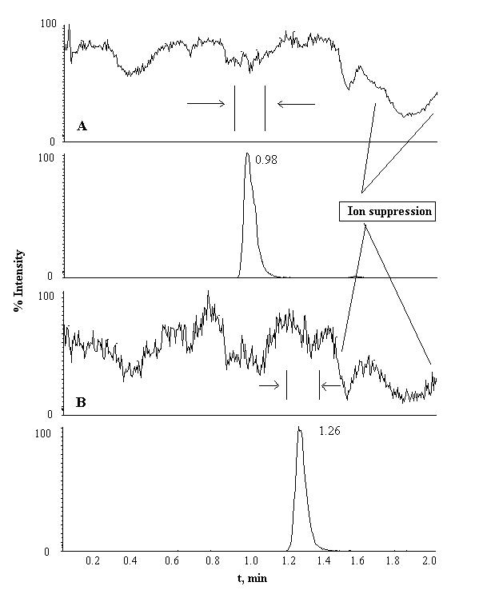

# Επικύρωση Βιοαναλυτικών Μεθόδων

## Εισαγωγή

Λόγο της πολυπλοκότητας των δειγμάτων και ορισμένων ιδιαιτέρων φαινομένων (αιματοκρίτης, αιμόλυση κλπ) τα κριτήρια είναι γενικά ποιό ελαστικά, και το εσωτερικό πρότυπο είναι πρακτικώς υποχρεωτικό στη χρωματογραφία. Ως εσωτερικό πρότυπο μπορούμε να χρησημοποιήσουμε:

* Ισοπικά Επισημασμένα Δομικά Ανάλογα
* Δομικά Ομόλογα
* Ουσίες ίδιας χημικής κατηγορίας

*Εκλεκτικότητα* είναι η ικανότητα της μεθόδου να δίνει σωστά αναλυτικά αποτελέσματα για τα διάφορα συστατικά του δείγματος, χωρίς καμία αλληλεπίδραση μεταξύ τους. Εκφράζει την ικανότητα της μεθόδου να διακρίνει τον αναλύτη από γνωστές προσμίξεις, υπολείμματα πρώτων υλών, προϊόντα διάσπασης και άλλα συστατικά της μήτρας. Την ελέγχουμε σε 6 διαφορετικές παρτίδες μητρικού υλικού (διαφορετικής προέλευσης) χωρίς συνένοση (pooling).
$$
\def\arraystretch{2.5}
\begin{array}{c}
\frac {\text{Area blank}}{\text{Mean LLOQ Area}}*100\%\le 20\%\\
\frac {\text{Area blank}}{\text{Mean LLOQ Area}}*100\%\le 5\%
\end{array}
$$

>**Μόλυνση Μεταφοράς (carry over):**\
Ορισμένες φορές, μπορεί κατάλοιπα αναλύτη από μια προηγούμενη μέτρηση να εμφανίσουμε σήμα σε μια μετέποιτα μέτρηση, κάτι που ονομάζουμε carry over. Για το ελένξουμε βάζουμε λευκό μετά απο το πρότυπο υψηλότερης συγκέντρωσης (ULOD), οπότε ξέρουμε οτι αν δεν εμφανιστεί σημαντική ποσότητα εκεί, δεν θα εμφανιστεί στα πρότυπα μικρότερη συγκέντρωσης. Θεωρούμε οτι σήμα απουσιάζει από αυτό το λευκό, όταν το σήμα είναι μικρότερο του 20% σήματος LLOQ(δηλαδή του μικρότερου προτύπου). Για το εσωτερικό θα πρέπει αντίστοιχα να είναι σήμα μικρότερο του 5%.

*Ελάχιστο όριο ποσοτικοποίησης (LLOQ)* ονομάζουμε το πρότυπο μικρότερης συγκεντρώσεως. Αυτή η συγκέντρωση θα πρέπει να είναι μεγαλύτερη του LOQ- δηλαδή τη θεωρητική τιμή συγκέντρωσης που δίνει λόγο $\frac SN$ μεγαλύτερο του 10. Ιδαιτέρως και για μελέτες βιοϊσοδυναμίας το LLOQ πρέπει να είναι μικρότερο του 5% τη μέγιστης συγκέντρωσης.

Η δε *καμπύλη αναφοράς* θα πρέπει να αποτελείται από τουλάχιστον έξι σημεία $(c_{_{LLOQ}},c_1,c_2,c_3,c_6, \dots,c_{_{ULOQ}})$ και αν αφαιρέσουμε σημεία, τότε τόσο πρέπει να απομένουν τουλάχιστον. Τα αντίστοιχα πρότυπα πρέπει να είναι στο ίδιο μητρικό υλικό με τα άγνωστα και το εύρος συγκεντρώσεων το επιλέγουμε από βιβλιογραφικά δεδομένα ή προκαταρκτικά πειράματα. Η τιμή του ULOQ θα πρέπει να έιναι τουλάχιστον διπλάσια της μέγιστης αναμενόμενης συγκέντρωσης, διότι υπάρχει κάποια μεταβλητότητα ανά ασθενή που μπορεί αλλιώς να εμφανιστεί πέραν τον ορίων της καμπύλης. Μαζί με αυτά τα πρότυπα βάζουμε και ένα λευκό καθώς και ένα *μηδενικό*, δηλαδή δείγμα που περιέχει μόνο εσωτερικό πρότυπο. Ο συντελεστής συσχέτισης πρέπει να είναι τουλάχιστον 98%, και αν περιέχει και επαναλήψεις σημείων, τότε τα άνω κρητίρια θα πρέπει να ισχύουν για το 50% αυτών.

Ως προτ την *ορθότητα* πρέπει να τα $\frac 23$ των επαναλήψεων ανά επίπεδο να παραμένουν στα όρια
$$
\begin{array}{cc}
85-115\%&&\text{Για τα επίπεδα 1-3}\\
80-120\%&&\text{για το επίπεδο L}
\end{array}
$$
ανά δοκιμασία. Διερευνούμε αυτά τα κρητίρια για έναν προσδιορισμό αλλά και μεταξύ διαφορετικών προσδιορισμών.

Η *πιστότητα* αποδίδεται ως τυπική απόκλιση και %RSD μετρήσεων και για είναι αποδεκτή θα πρέπει ανά επίπεδο να είναι στα όρια
$$
\begin{array}{cc}
15\%&&\text{Για τα επίπεδα 1-3}\\
20\%&&\text{Για το επίπεδο L}
\end{array}
$$

Ένα περισσότερο εξειδικευμένο μέγεθος για τις βιοαναλυτικές ονομάζεται *ακεραιότηα αραίωσης*. Ιδαιτέρως σε περιπτώσεις όπου το δείγμα μας έχει προβλεπόμενη συγκέντρωση μεγαλύτερη του ULOQ δεν θα πρέπει να θεωρούμε αυτή τη συγκέντρωση ως ακριβώς έγκειρη γιατί βρίσκεται εκτός των ορίων της καμπύλης που έχουμε θέσει. Κατά κάποιο τρόπο θεωρούμε οτι έχει πράγματι μεγαλύτερη συγκέντρωση αλλά δεν μπορούμε να πούμε ακριβώς πόση. Σε αυτές τις περιπτώσεις μπορούμε απλά να αραιώσουμε το υλικό με λευκό βιολογικό υλικό ώστε να νέα συγκέντρωση να βρισκεται εντός των ορίων. Τότε θα πρέπει να είμαστε σίγουροι οτι η διαδικασία της αραίωσης δεν επιρρεάζει τα αποτελέσματα μας (ως προς την ορθότητα και την πιστότητα), αφού ως τώρα δεν έχουμε εξαιτάσει την αραίωση στην επικύρωση. Σε αυτό ακριβώς αναφέρετα ο όρος *ακραιότητα αραίωσης*. Δηλαδή θα πρέπει να αραιωμένα - αφού τα ποσοτικοποιήσουμε να πληρούν τα εξής δύο κριτήρια:

* Ακρίβεια $85-115\%$ ως προς την τιμή αναφοράς
* Πιστότητα μικρότερη του $15\%$

Ένα άλλα εξειδικευμένο μέγεθως είναι η *ανάκτηση από εκχύλιση* για την οποία δεν υπάρχουν όρια, και η οποία προφανώς έχει νόημα όταν έχουμε κάνει εκχύλιση στη προκατεργασία του δείγματος. Αυτό που μας ενδιαφέρει είναι η συμπεριφορά να είναι ομοιόμορφη κατά μήκος της καμπύλης αναφοράς. Πρακτικά την ελέγχουμε σε τρία επίπεδα, ένα υψηλό, ένα χαμηλό και ένα μέτριο.

Αν η μέθοδος συμπεριλαμβάνει και φασματομετρία μαζών τότε θα πρέπει να εξαιτάσουμε και την *επίδραση μήτρας*. Μπορούμε να την ελένξουμε με διάφορους τρόπους αλλά ο συνηθέστερος είναι ο εξής. Παρασκευάζουμε δύο διαλύματα, ένα καθαρού διαλύτη, απουσία μητρικού υλικού και ένα που περιέχει μητρικό υλικό και στο οποίο κάνουμε γνωστή προσθήκη αναλύτη **μετά το τέλος της κατεργασίας** (δηλαδή ακριβώς πριν μπει στο όργανο). Τότε η επίδραση μήτρας ως % μέγεθως προκύπτει από τον λόγο των εμβαδών σημάτων τους:
$$
\%MF= \frac {Area_{spike}}{Area_{solvent}}*100\%
$$
Αν χρησιμοποιούμε και εσωτερικό πρότυπο τότε θα βρούμε τον άνω λόγο και για τον αναλύτη και για τον εσωτερικό πρότυπο και ο λόγος αυτών των λόγων μας δίνει την επιθυμητή πληροφορία (*normalised matrix factor*)
$$
\def\arraystretch{2.5}
\begin{array}{c}
MF_{analyte}=\frac {Area^{analyte}_{spiked}}{Area^{analyte}_{solvent}}\\
MF_{IS}=\frac {Area^{IS}_{spiked}}{Area^{IS}_{solvent}}\\
MF_{norm} = \frac{MF_{analyte}}{MF_{IS}}*100\%
\end{array}
$$

Για να αποδείξουμε όμως την απουσία επίδρασης μήτρας θα πρέπει να εξαιτάσουμε τα άνω σε δύο επίπεδα συγκεντρώσεων - ένα υψηλό και ένα χαμηλό και με 6 διαφορετικές παρτίδες βιολογικού υλικού σε κάθε επίπεδο. Τότε βρίσκουμε τη σχετική τυπική απόκλιση για αυτές τις 6 μετρήσεις και θα πρέπει να ισχύει:
$$
(\forall i\in\{1,2,3,4,5,6\})\;\;[\%RSD(MF_{norm}^i)]<15\%
$$

Είναι ακόμη προτιμότερο αν αποδείξουμε οτι αυτά ισχύουν ακόμη και μη-ομαλά δείγματα, όπως αιμολυμμένο και υπερλιπιδαιμικό πλάσμα.

\
*Χρωματογραφήματα IS και αναλύτη, σε spiked και καθαρό διαλύτη όπυ φάινεται μια ασυνήθηστη πτώση σήματος που αντιστοιχεί σε ιοντική καταστολή*

Ο έλεγχος της *σταθερότητας* διασφαλίζει ότι τα δείγματα δεν μεταβάλλονται σε χρονικά πλαίσια στο οποία θα αναλυθούν με τρόπου που να επιρρεάζει τα αποτελέσματα. Έτσι μπορούμε να μιλήσουμε για σταθερότητα

* Διαλυμάτων παρακαταθήκης (*stock solution*)
* Διαλυμάτων εργασίας
* Μικρής διάρκειας
* Μακράς διάρκειας
* Μετά από 3 κύκλους ψύξης
* Εντός αυτόματος δειγματολήπτη

Αυτήν την εξαιτάζουμε σε διάφορα επίπεδα και πρέπει αν την διασφαλίζουμε πριν από κάθε ποσοτικοποίηση. Συγκρίνουμε με "φρέσκα" διαλύματα σε 2 επίπεδα συγκεντρώσεων ή αποκλειστικά σε δείγματα μετά από δοκιμασία σταθερότητας (άνω). Πρέπει να ποσοτικοποιούνται με ακρίβεια 85-115%.

Τύπος Δοκιμασίας| Χρόνος | Επιτρεπόμενη Απόκλιση| Παρατήρηση
-------|------|-----|--------
Σταθερότητα Δειγμάτων Παρακαταθήκης|3 μήνες| 5%|
Σταθερότητα Διαλυμάτων Εργασίας|1-2 βδομάδες| 5%|
Σταθερότητα Μικρής Διάρκειας|6 ώρες| 15%|Σε θερμοκρασία περιβάλλοντος
Σταθερότητα Μακράς Διάρκειας|4 μήνες| 15%|Σε καταψύκτη
Σταθερότητα Μετά Από 3 κύκλους Ψύξης-Απόψυξης|3 κύκλοι| 15%|
Σταθερότητα Δειγμάτων Παρακαταθήκης|Για όσο παραμένουν| NA|

Όταν γίνονται σημαντικές αλλάγες στο εργαστηριακό περιβάλλον θα πρέπει (εξοπλισμού,χώρου.όγκου δείγματος, συνθήκες αποθήκευσης, μικρή αλλαγή κατεργασίας,εύρους καμπύλης) θα πρέπει τουλάχιστον εν μέρη να επαναλάβουμε την επικύρωση. Η *μερική επικύρωση* / επαλήθευση μπορεί να απαιτεί μερικές από τις δοκιμασίας να ξαναγίνουν έως όλες. Σε κάθε περίτπωση την καταγράφουμε όπως και τα αίτα.

Πρέπει να παρακολουθούμε συνεχώς την εγκυρώτητα του συστήματος για πιθανές αποκλείσεις. Για παράδειγμα τα κρητίρια ποιότητας  μπορεί να πάψουν να πληρούνται (πχ μια 6 μετρήσεις στη σειρά βρίσκονται σε συνχή θετική τάση), η συμπεριφορά του εσψτερικου προτύπου γίνεται πολύ διαφορετική σε πρότυπα και αγνώστα, γίνεται κάποια βλάβη στον εξοπλισμό ή η ένεση είναι προβληματική, η συγκέντρωση υπερβαίνει το ανώτατο όριο κλπ. Σε κάθε τέτοια περίπτωση πρέπει να κάνουμε τις απαραίτητες διορθωτικές ενέργειες και να επαναλάβουμε την ανάλυση.

Μια ιδιαίτερη περίπτωση επανάληψης είναι αυτή για λόγους ελέγχου *incured sample reanalysis ,ISR*. Σύμφωνα με αυτή τη νέα κατευθυντήρια οδηγία, αν έχουμε όχι περισσότερα από 1000 δείγματα, θα αναλύσουμε εκ νέου το 10% αυτών (ή 5% αν είναι παραπάνω). Η μέθοδος παραμένει αξιόπιστη όταν πληρήται το εξής κρητίριο:
$$
\begin{array}{cc}
\dfrac {C_{repeat} - C_{original}}{\bar C}*100\%<20\%&&\text{Για το 67\% των δειγμάτων που επαναναλύονται}
\end{array}
$$

Αν ο έλεγχος αποτύχει συνήθως το αίτιο είναι:

Αίτιο|Εξήγηση
-----|------
Σταθερότητα Δείγματος|Ο αναλύτης μετβολίζεται (ή το φάρμακο μετβολίζεται σε αναλύτη) κατά τη διάρκεια αποθήκευσης, κατεργασίας ή ανάλυσης
Ανομοιγένεια Δείγματος|Κακή ανάμειξη ή υπερβολικά μικρός όγκος τους δείγματος
Επίδραση Μήτρας| Το σήμα ενισχύεται ή καταστέλεται
Διαφορετική Εκχύλιση| Συνήθως για ειδικές κατηγορίες πληθυσμού
Ανθρώπινα Σφάλματα|

Όταν φτάσουμε σε φάση ανάλυσης αγνώστων (i.e. ποσοτικοποίηση) θα χρειαστού,με τα εξής διαλύματα:

1. Καταλληλότητας Συστήματος (*system suitability check*)
2. Λευκό βιολογικό με εσωτερικό πρότυπο (IS)
3. Καμπύλη αναφοράς
4. Δείγμα ελέγχου επιμολύνσεων 
5. 2-3 σειρές ελέγχου ποιότητας ($QC_1,QC_2,QC_3$) που παρεμβάλονται μεταξύ αγνώστων

>**Παρατηρήσεις:**
>1. Δεν μπορούμε να ποσοτικοποιήσουμε αξιόπιστα 1000άδες διαφορετικά δείγματα με μία μόνο καμπύλη. Θα πρέπει να κατασκευάσουμε πολλαπλές
>2. Σε κάθε περίπτωση, τα άγνωστα θα τα κατεργαστούμε ακριβώς όπως αυτά των σημείων την καμπύλης και αυτών του ελέγχου ποιότητας. Ιδαιίτερα θα πρέπει να χρησιμοποιήσουμε το ίδιο αντιπηκτικό.
>3. Ιδιαίτερα για τα QC's το κρητίριο αποδοχής είναι ότι μεμονομένα, πρέπει τουλάχιστον το 50% να έχει ορθότητα 85-115%.
>4. Επειδή στις κλινικές τεχνικές πρέπει να δουλεψουμε σε μεγάλα εύροι συγκεντρώσεων, συχνά θα πρέπει να εισάγουμε **παράγοντα ζύγισης**. Η διαδικασία περιγράφεται αναλυτικά στη Στατιστική-Χημειομετρία. Σύντομα, ανιχνεύεται με F-test, ή οπτικά αν υπάρχει ετεροσκεδαστικότητα, και επιλέγουμε από τους διάφορους παράγονται αυτόν με ο μικρότερο άθροισμα σχετικών σφαλμάτων για όλα τα σημεία.
