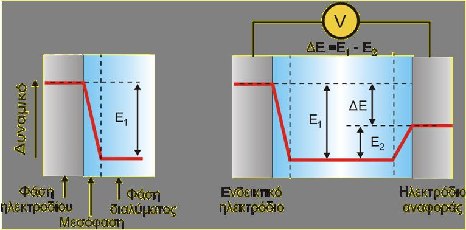
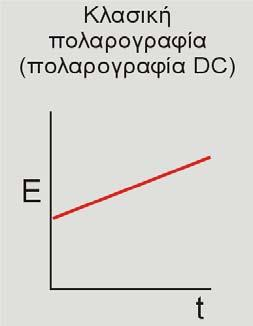

# Ηλεκτροαναλυτικές Τεχνικές

## Εισαγωγή

Γενικά οι ηλεκτροαναλυτικές τεχνικές πλεονεκτούν γιάτι το μικρό τους κόστος των οργάνων, το μηδαμινό κόστρος μετρήσεων, πετυχαίνουν πολύ χαμηλά όρια, επιτρέπουν τον προσδιορισμό μεγάλης ποικιλίας ενώσεων και σε αρκετές περιπτώσεις με μη καταστροφικό τρόπο. Τα κυριότερα μειονεκτήματα τους είναι οι σημαντικές παρεμποδίσεις για κάποιες, η αστάθεια του αναλυτικού σήματος και η περίπλοκη θεωρία.

|||
----|-----
**Δυναμικές Ισορροπίας** (Ποτενσιομετρία, αγωγιμόμετρία)|Μηδενική ροή ρεύματος, μετρήσεις μη καταστρεπτικές
**Δυναμικές Τεχνικές** (Ηλεκτροσταθμική ανάλυση, κουλομετρία, βολταμετρικές, πολαρογραφία, αναδιαλυτικές, αμπερομετρία)|Μη μηδενικό ρεύμα, ηλεκτροδιακές αντιδράσεις, καταστροφικές μετρήσεις στο δείγμα
*Βασική Κατάταξη Ηλεκτροαναλυτικών Τεχνικών*

|Τεχνική|Ελεγχόμενη Παράμετρος|Μετρούμενη Παράμετρος|Καταστρεπτική
:------:|:------:|:-------:|:----------:|:----------:|:-----:
||**Τεχνικές**| **Ισορροπίας**||
**Ποτενσιομετρία**|i=0|$E_{ref}$|
Άμεση Ποτενσιομετρία|i=0|$E_{ref}$|Μη καταστροφική
Ποτενσιομετρικές Τιτλοδοτήσεις|i=0|$E_{ref}$ όγκο τιτλοδότη|Καταστρεπτική
**Αγωγιμομετρία**|$E_{_{applied}}^{AC}$|$S=\frac 1R$|
Άμεση Αγωγιμομετρία|$E_{_{applied}}^{AC}$|$S=\frac 1R$|Μη καταστρεπτική
Αγωγιμομετρικές Τιτλοδοτήσεις|$E_{_{applied}}^{AC}$|S, όγκου τιτλοδότη|Καταστρεπτική
||**Δυναμικές**|**Ηλεκτροαναλυτικές**|
Ηλεκτροσταθμική Ανάλυση|$Ε_{_{applied}}$ ή $E_{_{working \;electrode}}$|m|Καταστρεπτική
|**Κουλομετρία**||
Ελεγχμόμενου Δυναμικού|$E_{_{working}}$|$q=\int_{0}^{\infty}t\;dt$|Καταστρεπτική
Ελεγχόμενου Ρεύματος|$i_cell$|$q=i\;t$|Καταστρεπτική
**Βολταμετρία**|||
Άμεση Βολταμετρία|$E_{_{working}}$ σταθερό|$i_{cell}$|Μη καταστρεπτικό
Αναδιαλυτικές Τεχνικές|$E_{_{working}}$|$i_{cell}$ ως προς $E_{_{working}}(t)$|Μη καταστρεπτικές
**Αμπερομετρία**|||
Άμεση|$E_{_{working}}$|$i_{cell}$|Μη καταστρεπτικό
Αμπερομετρικές Τιτλοδοτίσεις|$E_{_{working}}$|$i_{cell}$ ως προς όγκο τιτλοδότη|Καταστρεπτική
*Διάφορες Ηλεκτροαναλυτικές Τεχνικές*

## Ποτενσιομετρία

Τα ποιό απλά είδη ηλεκτροδίου είναι τύπου $M|M^{n+}$, δηλαδή ηλεκτρόδια μετάλλου σε επαφή με διάλυμα κατιώντων του ίδιου μετάλλου. Τότε, το δυναμικό ισορροπίας θα δίνεται από την εξίσωση Nernst:
$$
E_{_{equilibrium}}=E^0_{_{M^{n+},M}}-\frac{RT}{nF}\;ln(\frac {a_M}{a_{_{M^{N+}}}})=E^0_{_{M,M^{n+}}}-\frac{RT}{nF}\;ln(\frac 1{a_{_{M^{n+}}}})
$$

\
*Διαδικασία Δυναμικών σε Ηλεκτρόδιο*

Δεν είναι δυνατόν να μετρήσουμε απευθείας το δυναμικό με ένα ηλεκτρόδιο σε διάλυμα. Η τάση είναι *διαφορά δυναμικού* δηλαδή πρακτικά *διαφορά δυναμικής ενέργειας*. Αν λοιπόν από ένα ενεργειακό επίπεδο στην ηλεκτροδιακή φάση μεταβαίνουμε σε ένα διαφορετικό της φάσης διαλύματος, διαμέσου της μεσόφασης, τότε χρειαζόμαστε και ένα δεύτερο επίπεδο ώστε να νοήται διαφορά. Αυτή τη δεύτερη τιμή τη δίνει ένα δεύτερο ηλεκτρόδιο, γνωστής τιμής, το *ηλεκτρόδιο αναφοράς*. Επομένως:

$$
\text{Συνθήκη μετρήσεων: }\Delta\Epsilon = E_1-E_2=E_{ind}-E_{ref}\equiv E_{_{working}}-E_{ref}
$$

## Τύποι Ηλεκτροδίων

Τα ηλεκτρόδια που χρησιμοποιούμε στις μετρήσεις μπορούμε να τα διακρίνουμε σε 4+1 κατηγορίες

1. $1^{ου}$ είδους
2. $2^{ου}$ είδους
3. Redox
4. Μεμβράνης
5. Εκλεκτικά Ηλεκτρόδια Ιόντων

### Ηλεκτρόδια $1^{ου}$ Είδους

Αυτά είναι τα ηλεκτρόδια γενικού τύπου $(M|M^{n+})$ δηλαδή μετάλλου σε επαφή με διάλυμα κατιώντων του ίδιου μετάλλου. Σχετικά με τα δυναμικά, θα εργαζόμαστε βάση της κατάστασης ισορροπίας, που δίνεται από την εξίσωση Nernst. Σημειώνουμε ότι στη φάση ηλεκτροδίου πρακτικά δεν έχουν ιδιαίτερο νόημα οι έννοιες συγκέντρωσης και ενεργότητας. Τότε θέτουμε $a_{\;Ag^{\;0}}=1$ και επομένως είναι:

|||
:-----:|------|
|$(M$\|$Μ^{n+})\\$ $[E_{ref}=E^0_{Ag^+,Ag}-\frac {RT}{1F}\;ln(\frac 1{a_{AG^+}})]$

Γενικά είναι $M=Ag,Cd,Pb,Bi,Hg$ και ακόμη καλύτερα, αμαγάλματα με υδράργυρο, γενικού τύπου $M(Hg)$.

### Ενδεικτικά Ηλεκτρόδια Δεύτερου Είδους

Προφανώς με τα άνω ηλεκτρόδια είμαστε ιδιαίτερα περιορισμένοι, γιατί αυτά δεν αποκρίνονται ούτε σε μη μεταλλικά κατιώντα, ούτε σε ανιόντα. Αυτή τη δεύτερη περίπτωση τη καλύπτουμε τα ηλεκτρόδια δεύτερου είδους που αποκρίνονται σε *ανιόντα*. Για να συμβεί αυτό χρησιμοποιούμε μεταλλικό άλας με κατάλληλο ανιόν.Xρησιμοποιούμε σώμα από κάποιο μέταλλο επιφανειακά κεκαλυμένο με το άλας σε επαφή με διάλυμα με δυσδιάλυτο άλας. Τελικά αυτά είναι ηλεκτρόδια γενικής μορφής: $\;\;\bold{M}|\bold{MX},X^{n-}$. Τότε:
$$
\def\arraystretch{2.5}
\begin{array}{lc}
E_{ref}=E^0_{Ag^+,Ag}-\frac {RT}{1F}\;ln(\frac 1{α_{Ag^+}})&&
\iff \\
E_{ref}=E^0_{Ag^+,Ag}-\frac {RT}{1F}\;ln(\frac {α_{Cl^-}}{K_{sp}})&&\iff\\
E_{ref}=(E^0_{Ag^+,Ag}-\frac {RT}{F}\;ln({K_{sp}}))\;-\frac {RT}{1F}\;ln(\alpha_{Cl^-})&&\iff\\
\bold{E_{ref}=(E^0_{Ag^+,Ag}-\frac {RT}{F}\;ln(\alpha_{Cl^-}))}\\
X^{n-}=Cl^-,Br^-,SCN^-&&M^{n+}=Ag^+,Hg_2^{2+}\\
X^{n-}=SO_4^{2-}&&M^{n+}=Pb^{2+},Hg_2^{2+}
\end{array}
$$

### Redox

Τα ηλεκτρόδια *Redox* βασίζονται σε οξειδοαναγωγικά ζεύγοι σε διάλυμα. Το ίδιο το ηλεκτρόδιο είναι κατασκευασμένο από αδρανές μέταλλο που παραμένει πρακτικά αμετάβλητο και ο ρόλος του είναι απλή παροχή ηλετρονίων. Η γενική μορφή είναι $\bold{Pt}$|$\bold{Ox},Red$, με την οξειδωμένη μορφή να είναι αδιάλυτη. Τα ηλεκτρόδια αυτά αποκρίνονται **μόνο** σε **αντιστρεπτά ζέυγοι** και ποτέ μη αντιστρεπτά ζεύγοι. Τέτοια είναι αυτά που περιέχουν οξυγονούχα ιόντα, όπως πχ τα $AsO_3^{3-}/AsO_4^{3-}, Cl^-/ClO_3^-$ και $Mn^{2+}/MnO_4^-$. Ορισμένα αντιστρεπτά ζεύγοι είναι τα $I^-/I_3^-,Ce^{3+}/Ce^{4+}$ και$Fe(CN)_6^{4-}/Fe(CN)_6^{3-}$.

### Ενδεικτικά Ηλεκτρόδια Μεμβράνης

Η τελευταία κατηγορία ηλεκτροδίων είναι τα *ηλεκτρόδια μεμβράνης*, με κάπως ιδιαίτερη αρχή λειτουργίας. Όταν υπάρχει διαφορά συγκέντρωσης εληκτρενεργού ουσίας εκατέρωθεν ημιπερατής μεμβράνης, η μεμβράνη θα αναπτύξει μια διαφορά δυναμικού δια μήκους της. Αν το ένα διάλυμα είναι γνωστής συγκέντρωσης ηλεκτρενεργού ουσίας και το δεύτερο άγνωστης, τότε το δυναμικό της μεμβράνης εξαρτάται άμεσα από την ενεργότητα του αγνώστου. Αυτά τα ηλεκτρόδια είναι είδους $(\alpha_A||\alpha_A^{\prime})$. Η σχέση που συνδέει τα μεγέθοι είναι:

$$
\Delta\Epsilon_{ref} = \frac {RT}{zF}\;ln(\frac {\alpha_{A}} {\alpha_{A}^{\prime}})
$$
Όπου $z$ είναι το φορτίο του ιόντος όχι ο αριθμός ηλεκτρονίων του. Προφανώς είναι $z>0$ για κατιόντα και $z<0$ για ανιόντα.

>**Προσοχή:**\
Η ανάπτυξη δυναμικού μεμβράνης οφείλεται σε διαβάθμιση συγκέντρωσης και δεν συνδέεται με οξειδοαναγωγικά φαινόμενα. Γενικότερα δεν συνδέεται με διακίνηση ηλεκτρονίων.

>**Παρατήρηση:**\
\
\
\

>$$
\Delta\Epsilon_{\mu}=(\Epsilon_{HA_2}-\Epsilon_{HA_1})+\frac{RT}{zF}\;ln(\frac{\alpha_A}{\alpha_{A^{\prime}}})\iff\\
(\Epsilon_{HA_2}-\Epsilon_{HA_1}-\frac{RT}{zF}\;ln(\alpha_{A^{\prime}}))+\frac{RT}{zF}\;ln(\alpha_A)\iff\\
\bold{\Delta\Epsilon=\Epsilon^{\prime}+\frac{RT}{zF}\;ln(\alpha_A)}
>$$

## Ηλεκτρόδια Αναφοράς

Σκοπός των ηλεκτροδίων αναφοράς είναι να δίνουν μια τιμής αναφοράς δυναμικού, επιτρέποντας της μετρήσεις δυναμικού. Αφού όλες οι μετρήσεις δυναμικού όπως δείξαμε είναι κατ' αρχή σχετικές, πρέπει να ορίσουμε ένα σημείο αναφοράς. Αυτό το ρόλο παίζει το *Κανονικό Ηλεκρτόδιο Υδρογόνου*. Αυτό το ηλεκτρόδιο όμως είναι εξαιρετικά δύσχρηστο για περιπτώσεις ρουτίνας. Γι αυτό το λόγο χρησιμοποιούμε άλλα, δευτερεύονται ηλεκτρόδια αναφοράς όπως το *Κανονικό Ηλεκτρόδιο Καλομελανος* για μετρήσεις ρουτίνας. Το δυναμικό αυτών των ηλεκτροδίων μετριέται από τον κατασκευαστή σε σχέση με αυτό του κανονικού ηλεκτροδίου υδρογόνου και είναι γνωστό.

### Κανονικό Ηλεκτρόδιο Υδρογόνου (NHE)

Το ηλεκτόδιο αυτό αποτελείται από μεταλλικό ηλεκτρόδιο $Pt_{(s)}$ σε ατμόσφαιρα αερίου $H_{2_{(g)}}$ σε πίεση $1.00\;\;(atm)$. Το άνω είναι βυθισμένο σε διάλυμα κατιόντων $Η^+$ σε ενεργότητα $1,000$. Για κλείση το κύκλωμα θα χρειστούμε και γέφυρο ηλεκτρολύτη όπως $sat.\;\;KNO_{(aq\; 1\%\;agar-agar)}$ και κάποιο αντιηλεκτρόδιο. 

\
*Κανονικό Ηλεκτρόδιο Υδρογόνου*

Έχει εξ ορισμού δυναμικό 0 σε κάθε θερμοκρασία και καμία αναλυτική εφαρμωγή γιατί είναι εξαιρετικά δύσχρηστο. Αντίθετα, χρησιμοποιείται από κατασκευαστές για την μέτρηση δυναμικών άλλων ποιό εύχρηστων ηλεκτροδίων αναφοράς. Πρακτικά, κανονικό ηλεκτρόδιο υδρογόνου δεν μπορεί να κατασκευαστεί, παρά μόνο κατά σύμβαση.

### Κορεσμένο Ηλεκτρόδιο Καλομέλανος (SCE)

Ένα ποιό πρακτικό ηλεκτρόδιο αναφοράς είναι το *κορεσμένο ηλεκτρόδιο καλομέλανος (SCE)*. *Καλομέλανος* ονομάζεται για ιστορικού λόγους ο υδράργυρος στην οξειδωτική βαθμίδα +1, δηλαδή ο $Hg_{\;2}^{\;+}$. Η βασική μορφή του ηλεκτροδίου είναι ($\bold{{Hg}}|\bold{Hg_2Cl_2},\;KCl\;4.2\;M||$). Πρακτικά αποτελείται από έναν εσωτερικό σωλήνα πάστας υδραργύρου και χλωριδίου υφυδραργύρου σε κορεσμένο διάλυμα χλωριδίου του καλίου. Αυτό ο σωλήνας βρίσκεται μέσα σε έναν μεγαλύτερο σωληνα με κορεσμένα διάλυμα χλωριδίου του καλίου. Τα δύο διαλύματα επικοινωνούν από μία οπό στο τέρμα το μικρού εσωτερικού σωλήνα. Στο τέλος του εξωτερικού σωλήνα υπάρχει μια οπή με βύσμα θερμοσυσσωματωμένης πορσελάνης, πορώδους ίνας, ή (συνιθέστερα) περίβλημα εσμωρισμένης ύαλου. Αυτή η οπή επιτρέπει τη επαφή του ηλεκτροδίου με το διάλημα ενδιαφέροντος. Είναι ένα ηλεκτρόδιο γενικά εύχρηστο, εύκολο στη κατασκευή, ακόμη και στο εργαστήριο.

\
*Κορεσμένο Ηλεκτρόδιο Καλομέλανα*

**Τ, $^oC$**|$\bold{Hg_2Cl_2\vert\;KCl\;0.1\;M}$|$\bold{Hg_2Cl_2\vert\;KCl\;sat.}$|$\bold{Ag\vert AgCl\;KCl\;3.5\;M}$|$Ag\vert AgCl\;KCl\;sat.\;4.2\;M$
:-----:|:------:|:-------:|:------:|:------:
10|||0.216|0.214
12|0.3362|0.2528||
15|0.3362|0.2511|0.212|0.209
20|0.3359|0.1479|0.208|0.204
25|0.3356|0.2444|0.205|0.199
30|0.3351|0.2411|0.201|0.194
35|0.3344|0.2376|0.197|0.189
38|0.3338|0.2355|||
40|||0.193|0.184

### Ποτενσιομετρία και το Πρόβλημα του Υγρου Συνδέσμου $E_j$

Στις επαφές κάθε μορφές, όπως συνδέσμους, ηλεκτρολυτικές γέφυρες και κάθε άλλο μέσο που συνδέει δύο διαφορετικά διαλύματα ηλεκτρολυτών υπάρχει ένα παράσιτο δυναμικό που ονομάζεται *δυναμικό υγρού συνδέσμου (liquid junction potential)* και συμβολίζεται $E_j$. Αυτό προσμετριέται στη συνολική διαφορά δυναμικού του στοιχείου και εισάγει έναν αστάθμητο παράγοντα στη ποτενσιομετρική μέτρηση και επομένος περιορίζει την συνολική ακρίβεια.

Το δυναμικό υγρού συνδέσμου γίνεται ιδιαίτερα σημαντικό (της τάξεως 1-2 mV) εάν υπάρχει σημαντική διαφορά στις ευκινησίες ανιόντων και κατιόντων. Τα ιόντα $K^+$ και $Cl^-$ έχουν παραπλήσιες ευκινησίες. Γι αυτό το $KCl$ το προτιμάμε ως ηλεκτρολύτη για τη σύζευξη διαφορετικών διαλυμάτων.

\
*Το δυναμικό υγρού συνδέσμου. Λόγο διαφοράς ευκινησίας τα περισσότερο ευκίνησα ιόντα σχηματίζουν πλεόνασμα φορτίου άρα και διαφορά δυναμικού*

**Τυπικές τιμές ευκινισίας (m) ιόντων σε υδατικά ($\frac {cm}S$) ($\frac V{cm}$)**

Κατιόντα|Ευκινισία|Ανιόντα|Ευκινισία
------|-------|-------|------
$H^+$|$36.3 \cdot 10^{-4}$|$OH^-$|$20.5\cdot 10^{-4}$
$K^+$|$7.6 \cdot 10^{-4}$|$SO_4^{-2}$|$8.3\cdot 10^{-4}$
$Na^+$|$5.2 \cdot 10^{-4}$|$Cl^-$|$7.9\cdot 10^{-4}$
$Li^+$|$4.0 \cdot 10^{-4}$|$NO_3^-$|$7.4\cdot 10^{-4}$

Δύο διαλύματα των οποίων το άθροισμα γινομένων συγκέντρωσης ανιόντων με τη ευκινισία είναι ίσο με το άθροισμα γινομένων συγκεντρώσεων κατιόντων επί την ευκινισία τους, θα ονομάζονται ***ισομεταφορικά***. Προτιμούνται ως ηλεκτρολύτες σε υγρούς συνδέσμους.

>**Παράδειγμα:**\
Έστω διάλυμα $KCl\;1.0\;M$. Τότε αυτό θα είναι σχεδόν *ισομεταφορικό* γιατί:\
$(m_{K^+})(C_{K^+})=7.6\cdot10^{-4}\cdot1.0=7.6\cdot10^{-4}\\$
$(m_{Cl^-})(C_{Cl^-})=7.9\cdot10^{-4}\cdot1.0=7.9\cdot10^{-4}\\$
Ακόμη καλύτερο θα είναι μικρο διάλυμα $0.93\;M\;KNO_3-0.07\;M\;NaCl$ διότι 
$\\(m_{K^+})(C_{K^+})=7.6\cdot 10^{-4}\cdot 0.93+5.2\cdot10^{-4}\cdot0.07=7.43\cdot10^{-4}$
$(m_{Cl^-})(C_{Cl^-})=7.9\cdot 10^{-4}\cdot 0.93+5.2\cdot10^{-4}\cdot0.07=7.43\cdot10^{-4}$

### Χαρακτηριστικά Ποιότητα Εκλεκτικών Ηλεκτροδίων Ιόντων

#### Καμπύλη Αναφοράς

|||
------|-------
|$\bold{E}=\bold{{E^{\prime}}}+\frac {2.3RT}{z_AF}\;log(\alpha_A)$
Η καμπύλη αναφοράς πρέπει να είναι γραμμική όπως φάινεται και από την εξίσωση Nernst. Ωστόσο εμφανίζονται απόκλίσεις σε πολύ χαμηλές τιμές ενεργότητας. Παρ' όλα αυτά όμως η γραμμικότητα γενικά διατηρείται σε μεγάλη περιοχή ενεργοτήτων (4-5 **τάξεις** μεγέθους). Η καμούλη συνολικά αλλά και τα διάφορα επιμέρους χαρακτηριστικά της είναι βασικό χαρακτηριστικό ποιότητας μιας ηλεκτροαναλυτικής τεχνικής.

#### Όριο Ανίχνευσης (LOD)

Στις ηλεκτροαναλυτικές τεχνικές το όριο ανίχνευσης ορίζεται λίγο διαφορετικά από τις υπόλοιπες τεχνικές. Ορίζεται ως

|||
:-----:|:-----:
|*Όριο ανίχνευσης* είναι η ενέργοτητα αυτή για την οποία η καμπύλη αναφοράς στη πράξη απέχει κατά $\frac{18}{z_A}\;(mV)$ από την προέκταση του ευθύγραμμου τμήματος της.

Το όριο ανίχνευσης προφανώς είναι σημαντικό ποιοτικό χαρακτηριστικό και με σωστή βελτιστοποίηση είναι πολύ χαμηλό για πολλές τεχνικές.

#### Συντελεστής Κλίσης ή Κλίση ή Ευαισθησία

Είναι πραφανώς ο παράγωντας $\frac {2.303RT}{z_AF}$ της θεωρητικές εξίσωσης, δηλαδή
|||
-------|---------
$z_A=1$|$\frac {59,1}{log\alpha_\Alpha}\;(mV)$
$z_A=2$|$\frac {28.6}{log\alpha_{\Alpha}}\;(mV)$

#### Ποτενσιομετρικός Συντελεστής Εκλεκτικότητας ($K_{A,B}^{pot}$)

Ένα εξειδικευμένο μέγεθως στις ηλεκτροαναλυτικές είναι ο ποτενσιομετρικός συντελεστής εκλεκτικότητας, ο οποίος ορίζεται για ποτενσιομετρικές τεχνικές προφανώς. Εκφράζει την εκκλεκτικότητα της μεθόδου και προκύπτει **προσεγγιστικά** από την *εξίσωση Nikolskii*

$$
E=E^{\prime}+S\;log\big[ \alpha_{\Alpha}+K_{A,B}^{pot} \;\alpha_B^{\frac{Z_A}{Z_B}}\;+ K_{A,C}^{pot}\;\alpha_C^{\frac {Z_A}{Z_C}}+\dots \big]
$$

Τότε:
Τιμές Συντελεστή|Ερμηνεία
-----|------
$K_{A,B}^{pot}<<1$|Μικρή παρεμπόδιση από το Β στη μέτρηση του Α
$K_{A,B}^{pot}=1$|Τα δύο έχουν όμοια απόκριση
$K_{A,B}^{pot}>>1$|Μεγάλη παρεμπόδιση από το Β ή ισοδύναμα, μεγαλύτερη εκλεκτικότητα ως προς το Β

Επειδή είναι προσεγγιστική δεν θα πρέπει να την χρησιμοποιήσουμε για ακριβείς διορθώσεις. Τη χρησιμοποιούμε κυρίως για να εκτιμήσουμε την τάξη μεγέθους του αναμενόμενου αναλυτικού σφάλματος

#### Δυναμικά Χαρακτηριστικά Ποιότητας

Σημασία έχουν και τα διάφορα *δυναμικά* χαρακτηριστικά ποιότητας, δηλαδή η επαναληψιμότητα, ή ταχύτητα απόκρισης και εξέρτηση από τη θερμοκρασία.

|||
-----|--------
**Επαναληψιμότητα**|
**Ταχύτητα Απόκρισης**|
**Θερμοκρασιακή Εξάρτηση**|

### Εκλεκτικά Ηλεκτρόδιο Ιόντων

Σήμερα ως ηλεκτρόδια εργασίας χρησιμοποιούνται συνήθως *εκλεκτικά ηλεκτρόδια ιόντων*, για τα οποία υπάρχουν διάφορες τεχνολογίες.

#### Ηλεκτρόδια Στερεάς Μεμβράνης

Τα ηλεκτρόδια στερεάς μεμβράνης βασίζονται σε στερεό κρύσταλλο στην επαφή μεταξύ ηλεκτροδίου και διαλύματος εργασίας.

Μία εκδοχή του ηλεκτροδίου αυτού έχει εσωτερικό ηλεκτρόδιο αναφοράς ενσωματωμένο. Για παράδειγμα αποτελείται από σωλήνα εντός του οποίου υπάρχει διάλυμα άλατος ιόντος Α ενδιαφέροντος κορεσμένο σε $AgCl$. Στο διάλυμα βρίσκεται βυθισμένο ηλεκτρόδιο $\bold{Ag}|\bold{AgCl}$. Στην άκρη του σωλήνα βρίσκεται η στερεά μεμβράνη.

Μια εναλλακτική εκδοχή έχει μεταλλικό αγωγό σε επαφή με την μεμβράνη απευθείας (*στερεά επαφή*) ανώ άλλα αποτελούν συνδιασμό των δύο άνω (*ηλεκτρόδια συνδιασμού*).

\
*Τρεις τύποι ηλεκτροδίων στερεάς μεμβράνης*

Προσδιοριζόμενο Ιόν|Υλικό Μεμβράνης|Περιοχή Λειτουργίας|Παρεμποδίσεις
------|---------|-------|--------
$\bold{F^-}$|μονοκρυσταλλικό $LaF_3$|$1\cdot10^{-6}$|$0.1\;M\;OH^-$ προκαλλεί <10% παρεμπόδιση όταν $[F^-]=10^{-3}\;M$
$\bold{Cl^-}$|$AgCl+Ag_2S$|$1-5\cdot 10^{-5}$|Διάφορα
$\bold{Br^-}$|$AgBr+Ag_2S$|$1-5\cdot 10^{-6}$|Διάφορα
$\bold{I^-}$|$AgI+Ag_2S$|$1-5\cdot 10^{-8}$|Διάφορα
$\bold{SCN^-}$|$AgSCN+Ag_2S$|$1-5\cdot 10^{-6}$|Διάφορα
$\bold{CN^-}$|$AgI+Ag_2S$|$10^{-2}-5\cdot 10^{-6}$|Διάφορα
$\bold{Ag^+/S^{-2}}$|$Ag_2S$|$1-5\cdot 10^{-7}$|Ο $Hg^{2+}$ πρέπει να είναι κάτω από $10^{-7}\;Μ$
$\bold{Cd^{+2}}$|$CdS+Ag_2S$|$10^{-1}-\cdot 10^{-7}$|Τα $Fe^{2+}$ και $Pb^{2+}$ μπορεί να παρεμποδίζουν τον  $Cu^{2+}$
$\bold{Cu^{2+}}$|$CuS+Ag_2S$|$10^{-1}-10^{-8}$|Υψηλά επίπεδα $Fe^{2+}$ $Cd^{2+}$, $Br^-$, $Cl^-$ ενώ τα $Hg^{2+},Ag^+,Cu^+$ θα πρέπει να απουσιάζουν εντελώς
$\bold{Pb^{2+}}$|$PbS+Ag_2S$|$10^{-1}- 10^{-6}$|Τα $Hg^{2+},Ag^+,Cu^{2+}$ θα πρέπει να λείπουν εντελώς

#### Ηλεκτρόδια Τύπου Υάλινης Μεμβράνης

Αυτή η παραλλαγή ηλεκτροδίων βασίζεται σε σύρμα $Ag$ βυθισμένο σε διάλυμα $HCl\;0.1\;M\;sat.\;AgCl$. Τα διάλυμα είναι σε επαφή με υάλο που είναι παχύτοιχη στα τοιχώματα και λεπτότοιχη στο σημείο επαφής με το διάλυμα ενδιαφέροντος. Σε αυτό το σημείο, ανάμεσα σε κάθε διάλυμα και τη ξηρά υάλο $(SiO_2)_x$ υπάρχει μια διακριτή φάση ένυδρης υάλου. Αυτή η ενδιάμεση φάση έχει μορφή gel ουσιαστικά και συμπεριλαμβάνει και κατιόντα.

\
*Ηλεκτρόδια Υάλου*

Αυτή η ενδιάμεση φάση είναι υπεύθυνη όμως για την εμφάνιση και ενεπιθύμητων σφαλμάτων που εξαρτόνται από την σύνθεση της υάλου και το pH.

\
*Φάση Υάλου*

Σε υψηλές τιμές pH τα κατιόντα $H^+$ "σπανίζουν" και σε τόσο χαμηλές συγκεντρώσεις το ηλεκτρόδιο αρχίζει τώρα να αποκρίνεται και σε ιόντα $Na^+$. Αποτέλεσμα αυτού είναι η εμφάνιση μικρότερης τιμής από την πραγματική, φαινόμενο που ονομάζεται ***αλκαλικό σφάλμα***. Ας δούμε ένα αριθμητικό παράδειγμα:
$$
\text{Για } \;K_{H^+,Na^+}^{pot}=10^{10}\;,\alpha_{Na^+}=0.1\;M\; \text{και εφ όσον }\\ 
Ε=Ε^{\prime}+Slog\big[ \alpha_{H^+}+10^{-10}\cdot 0.1 \big]\\
\text{από την εξίσωση Nikolskii προκύπτουν τα εξής:}
$$

Πραγματικό pH|Λογαριθμικό Όρος|Μετρούμενο pH|Αλκαλικό Σφάλμα
-----|------|------|------|----
9,00|$10^{-9}+10^{-10}\cdot 0.1=1.01\cdot 10^{-9}$|9.00|0.00
10,00|$10^{-10}+10^{-10}\cdot 0.1=1.1\cdot 10^{-10}$|9.96|-0.04
11,00|$10^{-11}+10^{-10}\cdot 0.1=2.0\cdot 10^{-11}$|10.70|-0.30
12,00|$10^{-12}+10^{-10}\cdot 0.1=1.1\cdot 10^{-11}$|10.95|-1.05
13,00|$10^{-13}+10^{-10}\cdot 0.1=1.01\cdot 10^{-11}$|11.00|-2.00

\
*Επίδραση Σύνθεσης Υάλου Στα Σφάλματα*

Σύνθεση Υάλου|Συνθέκεσ Μέτρησης|Αλκαλικό Σφάλμα
--------|-------|--------
$72\%\;SiO_2-22\%Na_2O-6\%CaO$|$pH=12.0$ παρουσία $0,1\;Μ\; Na^+$|-0.3
$72\%\;SiO_2-22\%Na_2O-6\%CaO$|$pH=12.0$ παρουσία $1.0\;Μ\; Na^+$|-1.0
$72\%\;Li_2O-22\%\;Na_2O-6\%\;CaO$|$pH=12.0$ παρουσία $0.1\;Μ\; Na^+$|-0.1

#### Ηλεκτρόδια Τύπου Υγρής Μεμβράνης

Μια εναλλακτική προσέγγιση είναι το ηλεκτρόδια *υγρής μεμβράνης*. Εδώ η υγρή φτιάχνεται από ειδικό υλικό όπως οξική κυτταρίνη, PVC, ή PVC και ιονανταλλάκτη. Τα ηλεκρτόδια περιέχει συνήθως υγρό ιονανταλλάκτη, δηλαδή υγρή διάλυμα ηλεκτρενεργού ουσίας. Ως ηλεκτρενεργό ουσία, νοείται ιοντική ένωση αποτελούμενη από το μετρούμενο ιόν και κάποιο ογκώδες, λιπόφιλο και δυσκίνητο αντισταθμιστικό ιόν. Ο δε διαλύτης πρέπει να είναι οργανικός, αδιάλυτος σε νερό και μη πτητικός. 

Ένας παλαιός τύπος αποτελούνταν από σωλήνα μέσα σε σωλήνα στο ηλεκτρόδιο. Ο μικρότερος σωλήνας έχει εσωτερικό ηλεκτρόδιο αναφοράς τύπου $\bold{Ag}|\bold{AgCl}$ σε εσωτερικό διάλυμα αναφοράς μετρούμενου ιόντος Α κορεσμένου σε $AgCl$. Το διάλυμα είναι σε επαφή με την υγρή μεμβράνη που βρίσκεται στην άκρη του σωλήνα. Στη πλάγια περιοχή μεταξύ των δύο σωλήνων βρίσκεται ο υγρός ιονανταλλάκτης, επίσης σε επαφή με τη μεμβράνη. Μια μοντέρνη παραλλαγή έχει το εσωτερικό ηλεκτρόδιο σαν έμβολο με ελατήριο στο άνω μέρος του εσωτερικού σωλήνα και αντί για σκέτο ιονανταλλάκτη έχει σπογγώδες υλικό με ποτισμένο με τον ιονανταλλάκτη.

##### Βαθμονόμηση Πεχάμετρου

Τα πεχάμετρα ή *πιονόμετρα* βασίζουν τη λειτουργία τους σε ηλεκτρόδια υάλινης μεμβράνης και απαιτούν *βαθμονόμηση*. Γενικά pH διαλύματος δεν μπορεί να μετρηθεί με ακρίβεια καλύτερη από $\pm(0.001-0.02)$ εκτός εάν μετράμε **μεταβολές** του οπότε η ακρίβεια μπορεί να φτάσει έως $\pm(0.002-0.002)$.

Εάν θέλουμε να μετρήσουμε σε περιοχή $\pm 1$ αρκεί η βαθμονόμηση ενός σημείου με πρότυπο στο κέντρο της περιοχής. Για μετρήσεις σε ευρύτερη περιοχή η βαθμονόμηση γίνεται με δύο σημεία στα άκρα περίππου. Γενικότερο τιμές άνω του 11-12 θα πρέπει να τις θεωρούμε αβέβαιες ανάλογα με το ηλεκτρόδιο υάλου που χρησιμοποιήθηκε.

|||
------|--------
|Βαθμονόμηση pHμετρου δύο σημείων

### Μοντέρνες Εκδοχές

Διάφορες μοντέρνες εκδοχές ηλεκτροδίων έχουν αναπτυχθεί όπως διάφορα μικροηλεκτρόδια με ιονανταλλάκτη κάλιο, μεγέθους 50 (μm). Έχουν φτιάξει πολυστοιβαδικά ηλεκτρόδια με ιονανταλλάκτη κατάλληλα για ηλεκτροχημικοί αισθητήρες.

\

Τα ηλεκτρόδια αερίων είναι ηλεκτρόδια μεμβράνης που περιλαμβάνουν αέρια σε ισορροπία με κάποιο διάλυμα.

Τα ηλεκτρόδια αυτά μοιάζουμε με τα προηγούμενα με δύο σωλήνες, ο ένας μέσα στον άλλο. Στο τέρμα του σωλήνα βρίσκεται η μεμβράνη, που είναι διαπερατή από το αέριο υδρόφοβη και έχει πόρους με αέρια φάση μέσα τους. Από τη μία πλευρά βρίσκεται το μετρούμενο διάλυμα και από την άλλη (στο εσωτερικό του ηλεκτροδίου) βρίσκεται ένα λεπτό στρώμα εσωτερικού διαλύματος. Από την άλλη πλευρά βρίσκεται μεμβράνη υάλου και εσωτερικό ηλεκτρόδιο ύαλου. Η διάταξη εμπεριέχει επίσης εσωτερικό διάλυμα $NaCl-NaHCO_3$ στο οποίο βυθίζεται εσωτερικό ηλεκτρόδιο αναφοράς $\bold{Ag}|\bold{AgCl}$. Αυτή εσωτερική διάταξη βρίσκεται στα πλάγιο του εξωτερικού σωλήνα.

Είναι δύσκολο να δώσουμε μια πολύ γενική περιγραφή αυτών των ηλεκτροδίων, οπότε θα δώσουμε ένα τυπικό παράδειγμα, το ηλεκτρόδιο $CO_2$

$$
\def\arraystretch{2.5}
\begin{array}{lll}
CO_{_2\;(ext)}\rightleftharpoons& CO_{_2\;(g)} \rightleftharpoons& CO_{_2\;(int)} \\
\text{Εξωτερικό Μετρούμενο Διάλυμα}&\text{Πόροι μεμβράνης}&\text{Εσωτερικό διάλυμα}\; NaHCO_3/NaCl\\
CO_{_2(int)}+H_2O\rightleftharpoons& H^+_{int}+HCO_{_3int}^- 
\end{array}
$$

Ισχύει:
$$
\frac {(\alpha_{H^+})_{(internal)}\;\;(\alpha_{HCO_3^-})_{(internal)}} {(\alpha_{CO_2})_{ext}} =\Kappa
$$
Για ουδέτερο μόριο όπως το $CO_2$ ισχύει ότι $\alpha_{CO_2}=\big[ CO_2 \big]$ οπότε:

$$
\frac {(\alpha_{H^+})_{(internal)}\;\;(\alpha_{HCO_3^-})_{(internal)}} {\big[ CO_2 \big]} =\Kappa
$$

$$
\frac {(\alpha_{H^+})_{int}}{\big[ CO_2 \big]}=\frac{\Kappa}{(\alpha_{HCO_3^-})_{int}}
$$
$$
(\alpha_{H^+})_{int}=\alpha_1=\Kappa_g\;\big[ CO_2 \big]
$$
$$
\Epsilon_{ind}=\Epsilon^{\prime}+0.059\;log\big( \Kappa_g\; \big[ CO_2 \big]_{ext} \big)=\Epsilon^{\prime\prime}+0.059\;log\big[ CO_2 \big]_{ext}
$$

Αέριο|Ισορροπία Εσωτερικού Διαλύματος|Ηλεκτρόδιο-Αισθητήρας
-------|--------|--------
$NH_3$|$NH_3+H_2O \rightleftharpoons NH_4^++OH^-$|$pH$ ύαλου 
$CO_2$|$CO_2+H_2O \rightleftharpoons HCO_3^-+H^+$|$pH$  ύαλου 
$HCN$|$HCN \rightleftharpoons H^++CN^-$|$pCN\;(Ag_2S+AgI)$ 
$HF$|$HF \rightleftharpoons H^++F^-$|$pF\;(LaF_3)$ 
$H_2S$|$H_2S \rightleftharpoons 2H^++S^{2-}$|$pS\;(Ag_2S)$ 
$SO_2$|$SO_2+H_2O \rightleftharpoons HSO_3^-+H^+$|$pH$  ύαλου 
$NO_2$|$2NO_2+H_2O \rightleftharpoons NO_2^-+NO^-_3+2H^+$|$pNO_3\;\text{PVC-ιονανταλλάκτη}$ 

#### Παράδειγμα - Προσδιορισμός Φθοριούχων Σε Φυσικά Ύδατα

Η μεθοδολογία έχει ως εξής:

1. Παρασκευάζουμε σειρά προτύπων $10^{-3},10^{-4},\dots,10^{-6}\;M$
2. Τόσο τα πρότυπα όσο και τα δείγματα αναμιγνύονται $1:1$ με διάλυμα **TISAB**
3. Μετρώνται τα πρότυπα και κατασκευάζεται η καμπύλη αναφοράς
4. Μετράμε τα άγνωστα δείγματα

Κρατάμε κατά νου ότι αποκλίσεις θα οφείλονται σε:
|||
------|-------
Όξινη Περιοχή|$H^++F^-\rightleftharpoons HF$
Αλκαλική Περιοχή|$\bold{LaF_3}+OH^-\rightleftharpoons \bold{La(OH)F_2}+F^-$

>**TISAB (Total Ionic Strength Adjusting Buffer)**\
Είναι μίγμα που παίζει ρόλο ρυθμιστή ιοντική ισχύος και ρυθμιστικού διαλύματος και χρησιμοποιείται ευρύτατα. Αποτελείται από:\
$0,50\;M\;NaCl$ Για τη ρύθμιση ιοντικής ισχύος\
$0,10\;M\;CH_3COOH/Na$ Για τη ρύθμιση του pH στο 5\
$0,0010\;M\;DCTA^*$ ή κιτρικό $Na$ για αποδέσμευση των φθοριούχων\
$DCTA^{4-}+\big[ MF \big]^{2+} \longrightarrow \big[ DCTA-M \big]^{2+}+F^-\;(M:Al,Fe)$

## Βολταμετρία

Στις δυναμικές τεχνικές το δυναμικό ισορροπίας δίνεται από την γνωστή εξίσωση Nernst ως εκ διαφοράς δεξίου και αριστερού ηλεκτροδίου. Για παράδειγμα:

Τότε:
$$
\Epsilon_{Zn^{2+},Zn}=\Epsilon_{Zn^{2+},Zn}^0-\frac {0.05916}{n}log\frac 1{\alpha_{Zn^{2+}}}=-0.763
$$

$$
\Epsilon_{Cu^{2+},Cu}=\Epsilon_{Cu^{2+},Cu}^0-\frac {0.05916}{n}log\frac 1{\alpha_{Cu^{2+}}}=+0.337
$$
$$
\Delta\Epsilon=\Epsilon_\delta-\Epsilon_\alpha=0.337-(-0.763)=1.1
$$
|||
------|-------
Δεξιό Ημιστοιχείο|$Cu^{2+}+2e^-\longrightarrow \bold{Cu}$
Αριστερό Ημιστοιχείο|$Zn^{2+}+2e^-\longrightarrow \bold{Zn}$
Συνολί Αντίδραση| $\bold{Cu^{2+}+Zn}\longrightarrow \bold{Cu+Zn^{2+}}$

## Ιδιότητες Ηλεκτροδίου Εργασίας

Τα δυναμικά εργασίας των ηλεκτροδίων προβλέπονται από την εξίσωση Nernst. Με κατάλληλη εξωτερική ρύθμιση του ηλεκτροδίου εργασίας το μετατρέπουμε κατά βούληση σε αναγωγικό (δηλαδή σε αλγεβρικώς μικρότερα δυναμικά) ή οξειδωτικό (αλγεβρικώς μεγαλύτερα δυναμικά), ανάλογα με τη φύση των χημικών σωματιδίων που υπάρχουν στο διάλυμα.

Η εξάρτηση μετρούμενου ρεύματος από το εφαρμωζόμενο δυναμικό παρέχει ποιοτικές πληροφορίες (δυναμικό) και ποσοτικές (το ρεύμα) αναλυτικές πληροφορίες.

Το ηλεκτρόδιο εργασίας θα πρέπει να παρέχει μόνο ηλεκτροδιακές και όχι χημικές αντιδράσεις, δηλαδή αν είναι χημικώς αδρανές στις μετρήσεις. Γι αυτό οι αγωγοί $Pt$ και $C$ είναι τόσο συχνοί. Πρέπει να έχει μικρή επιφάνεια σε σχέση με το αντιηλεκτρόδιο ώστε να είναι ο καθοριστικός παράγωντας για το ρεύμα που διαρρέει την κυψελίδα. Πρέπει επίσης να χαρακτηρίζεται από κατά το δυνατόν μεγαλύτερη περιοχή δυναμικών πόλωση (μηδενικού ρεύματος) ώστε να μπορούμε να μετρήσουμε μεγαλύτερη ποικιλία ηλεκτρενεργών σωματιδίων. Αυτά τα σωματίδια δρουν ως αποπολωτές.

### Υπερδυναμικά Ηλεκτροδίων

Τα ηλεκτρόδια εμφανίζουν ένα επιπρόσθετο και ανεπιθύμητο δυναμικό, που ονομάζεται *υπερδυναμικό ηλεκτροδίου*. Πρέπει να λάβουμε επίσης υπ όψιν ότι το διάλυμα έχει μια μη αμελητέα τάση που ονομάζεται *ωμική αντίσταση*. Αυτά τα δύο μας οδηγούν στις εξής σχέσεις:
$$
\Epsilon_{applied}=(\Epsilon_\alpha-\Epsilon_\kappa)+iR\\
\Epsilon_{applied}=(\Epsilon_\alpha+\Epsilon_\alpha^{overp})-(\Epsilon_\kappa+\Epsilon_c^{overp})+iR\\
\Epsilon_{applied}=(\Epsilon_\alpha^{equilib}-\Epsilon_\kappa^{equilib})+(\Epsilon_{\alpha}^{overp}-\Epsilon_{kappa}^{overp})+iR
$$

Εδώ ο παράγοντας $(\Epsilon_\alpha^{equilib}-\Epsilon_\kappa^{equilib})$ ονομάζεται και *θεωρητική τάση διάσπασης* και οι επί μέρους τιμές της δίνονται από την εξίσωση Nernstz και ο παράγοντας $(\Epsilon_{\alpha}^{overp}-\Epsilon_{\kappa}^{overp})$ είναι συνολικά η *υπερταση*. Η υπέρταση δεν μπορεί καθόλου να υπολογιστεί θεωρητικά παρά εκτιμάται από πειραματικές μετρήσεις.

Οι σημαντικότεροι παράγωντες που καθορίζουν τα υπερδυναμικά είναι:

1. **Είδος Ηλεκτροδίου:** Τα υπερδυναμικά αυξάνουν κατ' απόλυτη τιμή με το πόσο μαλακό είναι το μέταλλο. Γι αυτό ιδιαίτερα μεγάλες τιμές αναμένονται για τον $Hg$
2. **Ηλεκτροδιακή Αντίδραση:** Ιδιαίτερα μεγάλα υπερδυναμικά εμφανίζονται κατ' απόλυτη τιμή όταν εκλύονται αέρια
3. **Πυκνότητα Ρεύματος:** Τα υπερδυναμιά αυξάνονται με τη πυκνότητα ρεύματος

***Τυπικά Παραδείγματα Υπερδυναμικών***
||||||
------|--------|--------|--------|--------
||Υπερδυναμικά|(πειραματικές|τιμες)|$V$
||Πυκνότητα |Ρεύματος $0.010\; \frac A{cm^2}$|Πυκνότητα |Ρεύματος $1.0\; \frac A{cm^2}$|
Υλικό Ηλεκτροδίου|$H^+\rightarrow H^0$|$O^{2+}\rightarrow O^0$|$H^+\rightarrow H^0$|$O^{2+}\rightarrow O^0$
$Pt\;\text{λείος}$|-0,068|+0,85|-0,676|+1,49
$Pt\;\text{μαύρος}$|-0,030|+0,52|-0,048|+0,76
$Αu$|-0,39|+0,96|-0,80|+1,63
$Hg$|-1.1|-|-1.1|-
$Bi$|-1.05|-|-1.23|-

### Δυναμικές Τεχνικές - Πόλωση Ηλεκτροδίων

Ένα ηλεκτρόδιο ονομάζεται *πολωμένο* όταν για κάποιο διάστημα τιμών δυναμικού δεν διαρρέεται από ρεύμα. Όταν για κάποιες (πολύ κοντινές, σχεδόν μία) τιμές δυναμικού το ηλεκτρόδιο αυξάνει την ένταση ρεύματος του πολύ απότομα ονομάζεται *αποπολωμένο*.
$$
(\forall i\in \mathbb{R})(\forall E\in \mathbb{I}\subset\mathbb{R})\Big[ i(E)=0 \iff \bold{Πολωμένο} \Big]
$$

Για πολωμένο ηλεκτρόδιο πρακτικώς έχουμε πολλαπλές θέσεις ισορροπίας, γι αυτό παρατηρούμε μηδενικό ρεύμα σε ευρεία περιοχή δυναμικού. Τα δυναμικά σε αυτή τη κατάσταση **δεν υπακούν** στην εξίσωση Nernst. Ισοδύναμα μικρές μεταβολές ρεύματος οδηγούν σε μεγάλες μεταβολές δυναμικού και επίσης ισοδύναμε μεταβολλές δυναμικού **δεν** συνεπάγωνται μεταβολές ρεύματος.

Υπάρχουν διάφορα είδη πόλωσης ανάλογα με το αίτιο που τα προκαλεί. Τα κυριότερα είναι η *πόλωση ενεργοποίησης* που οφείλεται σε δυναμικό που **δεν** είναι ικανό να πυροδοτήσει ηλεκτροδιακή αντίδραση και η *πόλωση συγκεντρώσεως*, όπου η μεταφορά μάζας είναι ανεπαρκής για να προκαλέσει αντίδραση και ροή ρεύματος (η ηλεκτρενεργός ουσία κοντά στο ηλεκτρόδιο έχει εξαντληθεί).

*Αποπόλωση* επέρχεται όταν ξεκινάει η ηλεκτροδιακή αντίδραση, οπότε δίνεται η δυνατότητα εισόδου και εξόδου ηλεκτρονίων από τα ηλεκτρόδια. Για να συμβεί αποπόλωση θα πρέπει να υπάρχει αρκετή ποσότητα ηλεκτρενεργού ουσίας κοντά στο ηλεκτρόδιο ώστε να συντηρήται η ζητούμενο ροή ρεύματος. Τα ηλεκτρόδια αναφοράς είναι σχεδόν ιδανικά μη πολώσιμα για μικρά ρεύματα, γιατί δαιτηρούν σταθερό πρακτικά το δυναμικό τους, κάτι που είναι απαραίτητο για να επιτελέσουν το ρόλο τους.

Τα ηλεκτρόδια υδραργύρου χρησιμοποιούνται για τον προσδιορισμό ενώσεων που υπόκεινται σε αναγωγικές αντιδράεις, και τα ηλεκτρόδια ευγενών μετάλλων είναι καταλληλότερα για τον προσδιορισμό ενώσεων που οξειδώνονται ηλεκτροδιακά. Ζητάμε πάντα μια εύρεία περιοχή πόλωσης του ηλεκτροδίου εργασίας ώστε να έχουμε ευρή παράθυρο παρατήρησης και να προσδιορίσουμε μεγαλύτερη ποικιλία ιόντων που είναι ικανές να προκαλέσουν αποπόλωση σε βολταμετρικές τεχνικές.

>**Παρατήρηση:**\
Μια ειδική μορφή βολταμμετρία είνια η *πολαρογραφία* που είναι βολταμμετρία με σταγονικό ηλεκτρόδιο υδραργύρου, με ανανεούμενη σταγόνα.

### Ποτενσιοστατικός Έλεγχος

Αν κάνουμε βολταμμετρία με σταθερή εφαρμοζόμενη τάση αλλά χωρίς κάποιο ποτενσιοστατικό έλεγχο, η τεχνική ονομάζεται *brute force electrolysis*.

\
*Τα υπερδυναμικά μεταβάλλονται χωρίς ποτενσιοστατικό έλεγχο*

$$
\begin{array}{l}
\text{Ισχύει πάντοτε: }&&E_{applied}=(E_{anode}-E_{cathode})+iR\\
\text{Εδώ: }&&E_{applied}=(E_{A/H}-E_{HE})+iR
\end{array}
$$

Αν $Ε_{applied}$ είναι σταθερό τότε το ρεύμα μεταβάλλεται κατά την ηλεκτρόλυση και τα επιμέρου δυναμικά ηλεκτροδίων $E_{A/H},E_{HE}$ δεν είναι σταθερά και χάνεται η εκλεκτικότητα της αντίδρασης απόθεσης. Η αναγωγική ισχύς σταδιακά αυξάνεται, οπότε ξεκινούν και αποθέσεις άλλων ιόντων εφ όσο υπάρχουν. Η διαδικασία μοιάζει ως εξής:

||||
:------:|:-------:|:--------:
||
||
*Καθώς το ρεύμα μειώνεται στο παράδειγμα, λόγο σταθεράς εφαρμωζόμενης τάσεως, τα επιμέρους υπερδυναμικά αυξάνονται κατ' απόλυτη τιμή. Τα ηλεκτρόδια μεταβάλλουν τη τάση τους και επομένως μπορεί να ξεκινήσει απόθεση άλλων ηλεκτρενεργών ουσιών. Χάνεται η εκκλεκτικότητα*

Όταν όμως χρησιμοποιήσουμε ένα επιπλέον βοηθητικό ηλεκτρόδιο αναφοράς, αντί σταθερού εφαρμωζόμενου δυναμικού μπορούμε να κρατάμε σταθερό ρεύμα (ποτενσιοστατικό έλεγχος). Τότε:

$$
\begin{array}{l}
\text{Ισχύει πάντοτε: }&&E_{applied}=(E_{anode}-E_{cathode})+iR\\
\text{Εδώ: }&&E_{applied}=(E_{ΒΗ}-E_{ΗΕ})+iR
\end{array}
$$

Ο ποτενσιοστάτης δρα μεταβάλλοντας την $E_{applied}$ έτσι ώστε το δυναμικό ηλεκτροδίου εργασίας να παραμένει σταθερό. Στο άνω παράδειγμα ηλεκτρόδιο εργασίας είναι η κάθοδος, η τιμή της οποίας παραμένει σταθερή, άρα και αναγωγική ισχύς και με αυτό το τρόπο η εκκλεκτικότητα δαιτηρείται. Η ακριβής οργανολογία του ποτενσιοστάτη δεν θα μας απασχολίσει.

### Πολαρογραφία

Στη παραλλαγή της πολαρογραφίας εφαρμόζουμε μια τάση μορφής $E=E(t)$ και μετράμε μια απόκριση $i=i(t)$ ή $i=i(E)$. Αυτή η παράμετρος φέρει ποιοτικές και ποσοτικές πληροφορίες για τις ενώσεις ενδιαφέροντος.

|||
--------|----------
|Σταθερό, Αμπερομετρία
|Παλμική Αμπερομετρία
|Παλμική Αμπερομετρία
|Κλασική Πολαρογραφία DC
|Ημιτονικού Σήματος ή AC
|Παλμική
|Διαφορική
|Τετραφωνικού Κύματος
|Κυκλική Βολταμετρία (CV)

### Ηλεκτροδιακές Διεργασίες

Σε ένα ηλεκτρόδιο γίνονται παράλληλα διάφορες διαδικασιές και η μάζα των ιόντων ενδιαφέροντος είναι κατανεμημένη σε διάφορες ισορροπίες παράλληλα. Η κυρίοτερες είναι η *μεταφορά μάζας* ή *ηλεκτροδιακή αντίδραση*, οι αντίρροπες διεργασίες *προσρόφησης* και *εκρόφησης* στην επιφάνεια του ηλεκτροδίου και η *μεταφορά ηλεκτρονίων*. Κάθε μία από αυτές αφορά και το αντιδρόν και το προϊόν.
|||
-------|-------
|Διάφορες ισορροπίες εξελίσσονται παράλληλα κατά μια ηλεκτροδιακή αντίδραση

Επειδή η ταχύτητα αντιδράσεως σχετίζεται με το παρατηρούμενο ρεύμα, κατ΄ επέκταση, όποια διαδικασία καθορίζει την ταχύτητα της αντίδρασης, θα καθορίζει και το ρεύμα.Η βραδύτερη διαδικασία πάντα καθορίζει τη συνολική ταχύτητα άρα και το ρεύμα. Επομένως ανάλογα με το ποιά διαδικασία γίνεται καθορίστική για το ρεύμα έχουμε περιπτώσεις

* Ρεύματος καθοριζόμενο από μεταφορά μάζας
* Ρεύματος καθοριζόμενο από την ταχύτητα αντίδρασης ή κινητικό ρεύμα
* Ρεύματος καθοριζόμενο από την ταχύτητα προσροφήσεως ή ρεύματα προσρόφησης
* Ρεύματος καθοριζόμενο από τη μεταφορά ηλεκτρονίων

### Μηχανισμοί Μεταφοράς Μάζας

Η μεταφορά μάζας είναι ένα πολύπλοκο φαινόμενο με τρεις παράλληλους μηχανισμούς.
*Όδευση* ή *μετανάστευση* είναι η κίνηση υπό την επίδραση ηλεκτρικού πεδίου και εμφανίζεται για ιόντα μόνο.
*Διάχυση* είναι η κίνηση υπό την επίδραση βαθμίδωσης συγκέντρωσης και
*Μηχανική Μεταφορά* είναι η κίνηση λόγο μηχανικής ανάδευσης, δονήσεως, βαθμίδων πυκνότητας, και θερμοκρασίας. 

Από αυτούς, θέλουμε μόνο μεταφορά μάζας με διάχυση. Μηχναική μεταφορά δεν γίνεται γενικά αν δεν τη προκαλέσουμε εσκεμένα και η όδευση μπορεί να αποφευχθεί με τη χρήση *ρυθμιστή ιοντικής ισχύος* όπως το **TISAB**.

#### Νόμοι Διάχυσης

Σχετικά με τη μεταφορά μάζας με διάχυση ισχύουν οι *νόμοι Fick* από τη φυσικοχημεία ως εξής:

##### $1^{ος}$ Νόμος Fick
$$
J_A=-D_A\Bigg( \frac {\partial C_A}{\partial x} \Bigg)
$$
Όπου:
|||
------|------
$J_A$|Η ροή μάζας (*flux*) σε $(\frac{mol}{cm^2\cdot s})$
$\frac{\partial C_a}{\partial x}$|Η βαθμίδωση συγκέντρωσης σε $(\frac{\frac{mol}{cm^2}}{cm})$
$D_A$|Ο συντελεστής διάχυσης σε $(\frac{cm^2}{s})$

Το αποτέλεσμα αυτού στις ηλεκτροδιακές διεργασίες είναι ρεύμα που ονομάζεται *Φαρανταϊκό Ρεύμα* διότι οφείλεται σε ηλεκτροδιακές διεργασίες και υπακούει στο νόμο Faraday:
$$
i_F=n\;J_A\;A\;F
$$
όπου:
|||
------|-------
n|Είνια ο αριθμός των ηλεκτρονίων ( $\frac {eq}{mol}$ )
A|Η επιφάνεια του ηλεκτροδίου
F|η γνωστή σταθερά Faraday ( $96485\frac C{eq}$ )

##### $2^{ος}$ Νόμος Fick

$$
\frac {\partial C_A}{\partial t}=D_A\frac{\partial^2C_A}{\partial x^2}
$$
Ο δεύτερος νόμος Fick εισάγει τη διάσταση του χρόνου στις ηλεκτροδιακές διεργασίες
|||
-----|:-------:
|$\frac {\partial C_A}{\partial t}=D_A\frac{\partial^2C_A}{\partial x^2}$

Για βηματικές μεταβολές δυναμικού ισχύει η *εξίσωση Cottrell*

$$
i_F=\frac{n\;A\;D_A^{\frac 12}\;C_a^{\prime\prime}}{\pi^{\frac 12}\;t^{\frac 12}}
$$

Η φυσική ερμηνεία της εξισώσεως έχει ως εξής. Αρχικά υπάρχει ηλεκτρενεργή ουσία σε επαφή με το ηλεκτρόδιο. Με τον βηματισμό του δυναμικού σε δραστική τιμή η ποσότητα της ουσίας αυτής καταναλώνεται ακαριαία οπότε και εμφανίζεται μεγάλο, ρεύμα, θεωρητικά άπειρο για $t=0$. Έτσι δημιουργείται μια περιοχή φτωχή σε αναλύτη, κοντα στο ηλεκτρόδιο, με τη περιοχή αυτή να διαχέεται σταδιακά προς τα έξω, προς τη κύρια μάζα του διαλύματος (*στοιβάδα διάχυσης*) και η βαθμίδα συγκεντρώσεως της ουσίας σταδιακά μειώνεται. Επομένως και η ροή της ουσία προς το ηλεκτρόδιο σταδιακά μειώνεται ($1^{ος}$ νόμος Fick). Εφόσο μειώνεται η ροή ηλεκτρενεργού προς το ηλεκτρόδιο, θα μειώνεται και το ρεύμα  αφού ισχύει ότι $i\propto t^{^\frac 12}$.

Οι βολταμετρικές κορυφές κατά τη σάρωση επίσης εξηγούνται από τους άνω νόμους ως εξής. Αρχικά υπάρχει ηλεκτρενεργός ουσία σε επαφή με το ηλεκτρόδιο, αλλά το δυναμικό του δεν έχει φτάσει ακόμη σε τιμέ ικανή να ξεκινήσει την ηλεκτροδιακή αντίδραση $E_\alpha$. Καθώς το δυναμικό πλησιάζει αυτή τη τιμή, αρχίζει η αντίδραση, αρχικά με μικρή ταχύτητα. Κοντά στη τιμή αυτή η αντίδραση πραγματοποιείται με τη μέγιστη ταχύτητα και το ρεύμα έχει φτάσει επίσης στο μέγιστο. Ακολούθως, παρότι το δυναμικό βρίσκεται σε τιμή κατάλληλη για να γίνει η αντίδραση, έχει σχηματιστεί η περιοχή φτωχή σε ηλεκτρολύτη, οπότε όλο και λιγότερο ποσότητα ουσίας βρίσκεται στο ηλεκτρόδιο για αντίδραση. Λόγο της διευρυνόμενης στοιβάδας διάχυσης παρατηρούμε μια συνεχή και σταδιακή μείωση του ρεύματος.

Για το σταγονικό ηλεκτρόδιο υδραργύρου τώρα, το ρεύμα κατά την ανάπτυξη της σταγόνας δίνεται από την εξίσωση Ilkovic και την αντίστοιχη μέση τιμή:
$$
i_d=708\;n\;D_A^{\frac 12}\;m^{\frac 23}\;C_A\;t^{\frac 16}\\
\bar{i_d}=607\;n\;D_A^{\frac 12}\;m^{\frac 23}\;C_A\;\tau^{\frac 16}
$$
Όπου:
|||
------|------
$i_d$|Ρεύμα διάχυσης ($μA$)
$n$|Αριθμό σωματιδίων ($\frac {eq}{mol}$)
$D_A$|Συντελεστής διάχυσης ουσίας $\frac {cm^2}{s}$
$m$|ροή $Hg\;(\frac {mg}s)$ 
$C_A$|Συγκέντρωση της ουσίας $\frac {mmol}{L}$
$\tau$|χρόνος ζωής της σταγόνας $Hg\;(s)$

#### Χωρητικό Ρεύμα

Ένα μεγάλο πρόβλημα στις βολταμετρικές τεχνικές είναι το λεγόμενο *χωρητικό ρεύμα ($i_c$)*. Κάθενα ηλεκτρόδιο εμφανίζει μια *ηλεκτρική διπλοστοιβάδα* φορτισμένων σωματιδίων η οποία έχει κάποια χωρητικότητα και δρα ως πυκνωτής. Κατά τη φόρτηση αυτόυ του "πυκνωτή" εμφανίζεται ένα μη Φαρανταϊκό ρεύμα που είναι το *χωρητικό ρε΄ύμα*:
$$
i_C=\frac{dq}{dt}=\frac{d(CV)}{dt}=C\frac{dV}{Dt}+V\frac{dC}{dt}
$$

Η παρουσία αυτού το ρεύματος είναι ενοχλητική γιατί μόνο το Φαρανταϊκό ρεύμα είναι φορέας πληροφορίας και χωρητικό παρεμποδίζει τη μέτρηση του, ώστε το ολικό παρατηρούμενο ρεύμα θα είναι:
$$
i_{total}=i_C+i_F
$$

Μεγάλο χωρητικό εμφανίζεται στη βολταμετρία γιατί μεταβάλλεται το δυναμικό του ηλεκτροδίου και γιατί επίσης μεταβάλλεται η επιφάνεια του ηλεκτροδίου, κάτι που πράγματι συμβαίνει στη πολαρογραφία.

|||
-----|------
|Στη πολαρογραφία εμφανίζεται πάντα ένα βασικό ρεύμα από τη φόρτιση των σταγόνων

Υπάρχουν διάφορες μορφές πολαρογραφίας ανάλογα με το μορφή του εφαρμωζόμενου δυναμικού:

Ονομασία|Κυματομορφή Σάρωσης|Ταχύτητα Σάρωσης ($\frac {mV}{s}$)|Ελάχιστος Διαχωρισμός ($mV$)|Κατώτερα Όριο Προσδιορισμού ($M$)|Τυπική Μορφή Πολαρογραφήματος
------|-------|--------|----------|--------|-------
Κλασσική Πολαρογραφία||$2-10$|$200$|$10^{-5}$|
Tαχύας Σάρωσης||$0,1-1$|$50$|$10^{-7}$|
Πολαρογραφία AC||$2-10$|$40$|$10^{-6}$|
Πολαρογραφία Tast||$2-10$|$100$|$10^{-6}$|
Πολαρογραφία Τετραγωνικού Παλμού||$2-10$|$50$|$10^{-7}$|
Διαφορική Παλμική Πολαρογραφία||$2-10$|$50$|$10^{-8}$|

##### Τυπικά Πολαρογραφήματα

|||
------|-------
|Κλασσική πολαρογραφία DC
|Δειγματοληπτική Πολαρογραφία Tast
|Κανονικού Παλμού NP
|Διαφορική Παλμική DP
*Σε πολαρογραφήματα διαλυματος* $Cd^{2+},\;Pb^{2+}$ *σε* $HCl\;1\;M$ *που λήφθηκαν με διάφορες τεχνικες η υπεροχή της διαφορικής παλμικής είναι εμφανής*

### Επίδραση Συμπλεκτικών Μέσων

Εάν για το ελεύθερο $Μ^{2+}$ το κύμα εμφναίζεται στο $Ε_{\frac 12}$, τότε παρουσία $L$ συμπλεκτικού το κύμα μετατοπίζεται στο δυναμικο $(E_{\frac 12})_C$ και ισχύει η σχέση:
$$
(E_{\frac 12})_C-E_{\frac 12}=\frac{0.0592}{n}logK_{inst}-\frac{0.0592}nplog([L])
$$

Μάλιστο αυτό το φαινόμενο μπορούμε να το χρησιμοποιήσουμε για να πετύχουμε διαχωρισμό κορυφών που επικαλύπτονται, δοκιμάζοντας διάφορους φέροντες ηλεκτρολύτες με συμπλεκτικές ιδιότητες.

### Οργανική Πολαρογραφία

Για να ανιχνεύσουμε οργανικά με την τεχνική της πολαρογραφίας, θα πρέπει να υπάρχει κάποια ηλεκτρενεργή ομάδα στο μόριο του αναλύτη. Μερικά τυπικά παραδείγματα είναι:

$$
\def\arraystretch{2.5}
\begin{array}{l}
>C=C<+2H^++2e^-\longrightarrow >CH-CH<\\
R-X(X:Cl^-,Br^-,I^-)+2H^+\longrightarrow R-H+X^-\\
>C=O+2H^++2e^i\longrightarrow >CH-OH\\
R-NO_2+4H^++4e^-\longrightarrow R-NHOH+H_2O\\
R-NHOH+2H^++2e^-\longrightarrow R-NH_2+H_2O
\end{array}
$$

Γενικά το είδος της ομάφες καθορίζει την τιμή $E_{\frac 12}$ ενό το υπόλοιπο μόριο έχει ελάχιστη επίδραση στη τιμή αυτή. Σε όλες τις αντιδράσεις αυτές μετέχουν και κατιόντα υδρογόνου οπότε η τιμή $E_{\frac 12}$ θα εξαρτάται από το $pΗ$ και επομένως ο φέρον ηλεκτρολύτης θα πρέπει να έχει ικανότητα ρύθμισης του $pH$. Τα προϊόντα αναγωγής, άρα και η μορφή του πολαγραφήματος συχνά εξαρτόνται άμεσα από το $pH$, ως προς τη μορφή και τον αριθμό των κυμάτων.

## Αμπερομετρική Ανίχνευση

Οι αμπερομετρικοί ανιχνευτές έχουν γενικά μικρό κόστος και μεγάλη ευαισθησία με πολές φορές μόλι ς μερικά ($pg$) να δίνουν χρήσιμο σήμα ($10^{-12}$). Ωστόσο αποκρίνονται μόνο σε ηλεκτρενεργές ουσίες και η επιφάνεια του ηλεκτροδίου σταδιακά δηλητηριάζεται από το προϊόντα των ηλεκτροδιακών, αντιδράσεων οδηγώντας σε εμφάνηση *ολίσθησης σήματος*. Πρέπει επομένος να καθαρίζουν μηχανική την επιφάνεια του ηλεκτροδίου. Συνήθως εφαρμώζουμε παλμικό δυναμικό με 2 ή 3 επίπεδα ώστε αφενός να μπορούμε να προσδιορίσουμε τυπικώς μη ηλεκτρενεργές ενώσεις και εφεταίρου ώστε το ηλεκτρόδιο συνεχώς να αυτόκαθαρίζεται και επανενεργοποιείται.

## Αναδιαλυτική Βολταμετρία

Στην αναδιαλυτική βολταμετρία υπάρχουν δύο στάδια μετρήσεων. Στο αρχικό στάδιο της *προσυγκέντρωησης* οι αναλύτες εναποτίθενται στο ηλεκτρόδιο, οπότε κατά κάποιο τρόπο αυτό εμπλουτίζεται από αυτές. Στο δεύτερο στάδιο της *αναδιάλυσης* η πρυσγκεντρωμένη ουσία ανάγεται ή οξειδώνεται με κατάλληλη βολταμετρική σάρωση.
Γενικά ως τεχνική έχει υψηλή ευαισθησία και χαμηλά όρια ανίχνευσης, και επιτρέπει πολυστοιχειακή ανάλυση. Ο εξοπλισμός είναι φθηνός και το κόστος λειτουργίας μικρότ συγκριτικά με άλλε μη ηλεκτροαωαλυτικές τεχνικές, η τεχνική είναι γρήγορα και επιτρέπει ακόμη ανάλυσης των διαφόρων χημικών μορφών των στοιχείων (*speciation*). Δεν εφαρμώζεται παντού όμως και υπάρχουν συχνά παρεμβολές, δηλαδή φυσικές ή χημικές επιδράσεις που μεταβάλουν το σήμα όταν η συγκέντρωση της ουσία παραμένει σταθερή.

Κατάλληλα ηλεκτρόδια είναι τα ηλεκτρόδια υδραργύρου, στερεά κατάστασης και διάφορα τροποποιημένα. Από τα ηλεκτρόδια υδραργύρου χρησιμοποιούνται κυρίως το κρεμαστής σταγόνας και το ηλεκτρόδιο λεπτού στρώματος. Όμως ο $Hg$ σχηματίζει εύκολα αμαλγάματα, προσροφά οργανικά, εμφανίζει μεγάλο καθοδικό υπερδυναμικο, είναι τοξικός και το ηλεκτρόδια του είναι κατάλληλα μόνο για την αναγωγική περιοχή δυναμικών, όχι την οξειδωτική. Παρ' όλα αυτά χρησιμοποιήθηκε ευρύτατα κάποτε γιατί είναι διαθέσιμος σε μεγάλη καθαρότητα.

Τα εναλλακτικά ηλεκτρόδια στερεά κατάστασης μπορεί να είναι διάφορες μορφές άνθρακα (υαλώδης, πάστας πυρολυτικού γραφίτη, κηρώδη γραφίτη, ή ίνες άνθρακα) ή ηλεκτρόδια από ευγενοί μέταλλα (όπως $Pt,Au,\text{και }Ag$). Τα τροποιημένο ηλεκτρόδια έχουν επιφάνειες κεκαλυμένες με συμπλεκτικά αντιδραστήρια και ημιπερατές μεμβράνες.

Το στάδιο της προσυγκέντρωσης μπορεί να γίνει με ηλεκτρόλυση ή και με προσρόφηση.

##### Μέταλλα σε $Hg$
$$
\begin{array}{ll}
M^{n+}+ne^-\longrightarrow M(Hg)&\text{Προσυγκέντρωση}\\
M(Hg)\longrightarrow M^{n+}+ne^-&\text{Αναδιάλυση}
\end{array}
$$

##### Μέταλλα Σε Στερεά Ηλεκτρόδια
$$
\begin{array}{ll}
M^{n+}+ne^-\longrightarrow M&\text{Προσυγκέντρωση}\\
M\longrightarrow M^{n+}+ne^-&\text{Αναδιάλυση}
\end{array}
$$
##### Αλογονοιόντων και Θειόυχων σε Υδράργυρο
$$
\begin{array}{ll}
2Hg+2X^-\longrightarrow Hg_2X_2+2e^-\\
Hg+2RSH\longrightarrow (RS)_2Hg+H^++2e^-&&\text{Προσυγκέντρωση}\\
Hg_2X_2+2e^-\longrightarrow 2Hg+2X^-\\
(RS)_2Hg+2H^++2e^-\longrightarrow Hg^0+2RSH&&\text{Αναδιάλυση}
\end{array}
$$

##### Προσρόφηση Μετάλλων
$$
\begin{array}{ll}
M^{n+}+nL_{sol}^-\longrightarrow (ML_{n})_{sol}&\text{}\\
(ML_n)_{sol}\longrightarrow (ML_n)_{ads}\\
(ML_n)_{ads}+ne^-\longrightarrow M+nL^-_{sol}
\end{array}
$$
Οι ηλεκτρενεργές ενώσεις διαθέτουν τασενεργές ομάδες και μπορούν να προσροφηθούν απευθείας πάνω στο ηλεκτρόδιο χωρίς άλλη προκατεργασία.

>**Παράμετροι Βελτιστοποίησης:**
>* Ηλεκτρόδιο
>* Δυναμικό Προσυγκέντρωσης
>* Χρόνος Προσυγκέντρωσης
>* Φέρον Ηλεκτρολύτης
>* Μεταφορά Μάζας
>* Κυματομορφές Σάρωσης
>* Παρεμβολές (διαμεταλλικές ενώσεις, αλληλεπικάλυψη κορυφών ή τασενεργές ουσίες)