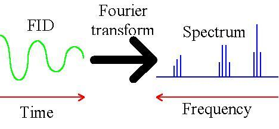

# Φασματοσκοπία NMR

## Εισαγωγή

Ο όρος ***Φασματοσκοπία*** αναφέρεται σε μια οικογένεια αναλυτικών τεχνικών που συμπεριλαμβάνουν την αλληλεπίδραση φωτός (οχι κατ' ανάγκην ορατού) με την ύλη, με ταυτόχρονη μεταφορά ενέργειας από τα φωτόνια στην ύλη. Διαφέρει από την *φασματομετρία* (πχ μαζών).

Μια ***φασματική γραμμή*** χαρακτηρίζεται από τρία βασικά μεγέθη:

* Το **εύρος** που συνήθως εκφράζεται ως *εύρος στο μισό τους ύψους*(FWHH?)
* Το **ύψος** της γραμμής
* Το "σήμα" της γραμμής. Ως σήμα για μια γραμμή μπορεί να ληφθεί το ύψος (παλαιότερα) ή (αποκλειστικά πλέον) το **εμβαδόν** κάτω από τη γραμμή, που λαμβάνεται με τεχνικές *αριθμητικής ολοκλήρωσης* με υπολογιστή

Η διεύρυνση μιας φασματικής γραμμής προέρχεται από την ύπαρξη πολλών δυνατών μεταπτώσεων, γύρω από μια κύρια. Δηλαδή πρόκειται για μια *κατανομή* μεταπτώσεων. Η κατανομή αυτή προέρχεται από διάφορους παράγωντες μια "αυστηρότερο", την κβαντομηχανική **Αρχή της Αβεβαιότητας**. Αυτή ορίζει:

$$
ΔΕ Δν \ge \hbar
$$

Η ακριβής κατανομή αυτών των καταστάσεων δίδεται από την γνωστή κατανομή *Stefan-Boltzmann* ως εξής:
$$
\frac {N_1} N_0 = e^{-\frac {ΔΕ} {kT} }
$$

Το *εύρος* της κατανομής σχετίζεται άμεσα με την απορροφούμενη ενέργεια. Επομένως η φασματοσκοπία UV για παράδειγμα έχει πολύ μεγαλύτερο εύρος κορυφών σε σχέση με την φασματοσκοπία NMR.

Μεταπτώσεις NMR αντιστοιχούν σε φωτόνια ενέργειας που αντιστοιχει στα *ραδιοκύμματα (RF)*. Έτσι για παράδειγμα το εύρος των γραμμών είναι μεγαλύτερο σε σχέση με της φασματοσκοπίες *υπερύθρου (IR)* ή του *υπεριώδους (UV)*.

Επιπλέον σε αυτές τις φασματοσκοπίες (IR και UV) η αυξημένη ενέργεια των μεταπτώσεων οδηγεί σε *αυθόρμητες* αποδιεγέρσεις οι οποίες είναι και σημαντικά ταχύτερες. Στη φασματοσκοπία NMR οι μεταπτώσεις είναι μικρότερων ενεργειών και χρειάζονται "υποβοήθηση" ώστε οι πυρήνες να επιστέψουν στη θεμελιώδη κατάσταση.

## Θεωρητικό Υπόβαθρο
Η φασματοσκοπία NMR βασίζεται σε μια καταστατική ιδότητα της ύλης που ονομάζεται *ιδιοπεριστροφή (spin)*. Για τα σωματίδια απ' τα οποία απαρτίζεται ο πυρήνας ισχύουν τα εξής: 

1.  Ένα φορτίο που περιστρέφεται παραγει μαγνητικό πεδίο. Τότε ο "μαγνήτης" spin έχει μια μαγνητική διπολική ροπή (**μ**).  
2. Παρουσία εξωτερικού μαγνητικού πεδίου ($Β_0$), δύο καταστάσεις είναι επιτρεπτές: ${+\frac 1 2}$ και ${-\frac 1 2}$.

Συγκεκριμένα, το "διάνυσμα" του spin μπορεί να έχει οποιαδήποτε γωνία (*δ.δ.* προσανατολισμό). Εντός κάποιου εξωτερικού μαγνητικού πεδίου όμως, μόνο δύο γωνίες / προσσανατολισμοί είναι κβαντομηχανικά επιτρεπτοί. Η κατάσταση 'παράλληλα' $+\frac{1}{2}$ ή συμβολικά, `α` και η κατάσταση 'αντιπαράλληλα' $-\frac{1}{2}$ ή  συμβολικά `β`.

1. Η διαφορά στην ενέργεια μεταξύ δύο καταστάσεων εξαρτάται άμεσα (δηλαδή γραμμικά) από το εξωτερικό μαγνητικό πεδίο. Συγκεκριμενα $Ε = \frac {μΒ_x}{Ι}$

2. Για τους ποιό κοινούς πυρήνες

Πυρήνας | Μαγνητική διπολική ροπή (**μ**)
-------- | ---------------------------------
${{}^{1}Η}$ | 2,72927
${{}^{19}F}$ | 2.6273
${{}^{31}P}$ | 1.1305
${{}^{13}C}$| 0.7022

Επειδή είναι
$$
ν = \frac {μΒ_0}{hI}
$$

Ο κάθε πυρήνας συντονίζεται σε μια **πολύ** διαφορετική ιδιοσυχνότητα. Με τον όρο *πυρήνας* νοήται όχι απλώς το κάθε στοιχείο αλλά το κάθε ισότοπο του στοιχείου.

Ενδεικτικά $ν=\frac {4.68}{h}$ όταν $Β_0=2,34Τ$. Τότε:

Τα όργανα διαθέτουν *κανάλια* που είναι ικανά να στείλουν συχνότητες που διεγείρουν τους πυρήνες. Σε όργανο με ένα κανάλι διεγείρεται ένας πυρήνας τη φορά, δηλαδή πχ μόνο ο ${{}^{1}Η}$ . Σε ένα όργανο με δύο κανάλια θα μπορούν να διεγερθούν δύο πυρήνες τη φορά όπως πχ ${{}^{13}C}$ και ${{}^{1}H}$.

> Η διαπερατότητα ορίζεται ως $T = \frac {I} {I_0} * 100\%$  ενώ η απορρόφηση είναι $Α = -log(T)$ .Αυτά τα μεγέθοι δεν εφαρμόζονται στη φασματοσκοπία NMR γι αυτό και αντικαθίστανται με άλλα (βλέπε παρακάτω)

## Βασική Οργανολογία

### Γενικά
Η παραγωγή συχνοτήτων βασίζεται σε ένα σύστημα πολύ παρόμοιο με αυτό των ράδιων και των πομπών. Στη καρδιά του συστήματος ανιχνευτή και πομπού βρίσκεται ένα βασικό κύκλωμα αποτελούμενο από πηνίο και πυκνοτή:

 

Στα πρώτα όργανα NMR γινόταν "σάρωση" συχνοτήτων με τον ανιχνευτή να λαμβάνει σήμα αποδιέγερσης από τους πυρήνες. Φτάνοντας στον ανιχνευτή, η ραδιοσυχνότητες οδηγούν στην παραγωγή ρεύματος (σήματος).

> *Σήμα στο domain του χρόνου*

>

Πλέον ο πομπός διεγήρει όλες τις συχνότητες ταυτόχρονα. Καθώς αποδιεγείρεται ο πυρήνας, καταγράφουμε το σήμα (συναρτήση του χρόνου). Δηλαδή λαμβάνουμε μια εικόνα τύπου $I = I(t)$ εικόνα που ονόμαζεται *free induction decay* (**FID**). Το σήμα φθίνει ως προς την ένταση με τον χρόνο, διότι, όλο και λιγότεροι πυρήνες αποδιεγείρονται. Αυτό το σήμα υπόκεινται σε μαθηματικό μετασχητισμό που ονομάζεται ***μετασχηματισμός Fourier***. Αυτή ο μαθηματική κατεργασία μετασχηματίζει την εικόνα ως εξής
$I=I(t) \rightarrow I = I(f)$. 
Αυτή η γραφική παράσταση ονομάζεται *φάσμα* και είναι ποιό ευανάγνωστη από τον άνθρωπο. Ουσιαστικά η αρχική εικόνα είναι ένας περίπλοκος συνδιασμός πολλαπλών συναρτήσεων και συχνοτήτων. Ο μετασχηματισμός διαχωρίζει αυτές τις συναρτήσεις.

> *Πολλαπλές ιδιοσυχνότητες απαρτίζουν το συνδιασμένο σήμα όπως λαμβάνεται άμεσα από το όργανο*

> *Εικόνα σήματος Free Induction Decay*

> *Σήμα και δείγμα*

>
### Ποιοτικά Χαρακτηριστικά Φασματοσκόπου NMR

Ένα όργανο NMR αξιολογείται βάση δύο κύριων κριτηρίων

* *Διακριτική ικανότητα (R)* που ως μέγεθως εκφράζει την ικανότητα του οργάνου να διακρίνει αποτελεσματικά δύο γειτονικές κορυφές. Ως γειτονικές νοούνται δύο κορυφές που επικαλύπτονται κατά ακριβώς 10%. Εκφράζεται ως εύρος κορυφής στο μισό του ύψους
* Ευαισθησία που σχετίζεται με την ένταση του σήματος

Κυριότερος παράγωντας στα άνω χαρακτηριστικά είναι η *ένταση του μαγνητικού πεδίου $Β_0$*.

## Το δείγμα

Τα δέιγματα στη φασματοσκοπία ΝΜR είναι γενικά υγρά (υπό προυποθεσεις **και** στερεά (*solid state NMR ssNMR*) ). Οι σωλήνες τους δείγματος πρέπει να είναι ομοιγεννοίς με τέλειο τρόπο αλλιώς δημιουργούνται ανομοιογένεις στο φάσμα. 

Στο ${}^{1}H$-NMR οι διαλύτες θα πρέπει να είναι δευτεριωμένοι αλλιώς θα παράξουν μεγάλο σήμα που θα αποκρύψει τα επιθυμητά σήματα (ο διαλύτης είναι σε πολύ μεγαλύτερη ποσότητα). Η οι μαγνήτες στο NMR πρέπει να είναι γενικά φτιαγμένοι από *υπεραγώγημα υλικά* δηλαδή υλικά που εμφανίζουν πρακτικά μηδενική αντίσταση. Αυτά τα υλικά εμφανίζουν τις υπεραγώγημες ιδιότητες σε θερμοκρασίες κοντά στο μηδέν. Αυτό επιτυγχάνεται με τον *κρυοστάτη*. Σε αυτή τη διάταξη η θερμοκρασία μειώνεται κοντά στο μηδέν (~4Κ) με τη χρήση *υγρού ηλίου*. Για να προστατευθεί το ακριβό Ήλιο, προστατευεται θερμικά με υγρό άζωτο.

>Είναι επιθυμητό να έχουμε όσο το δυνατόν μεγαλύτερο μαγνητικό πεδίο γιατί:
>1. Αυξάνεται η ***διακριτική ικανότητα*** διότι οι ιδιοσυχνότητες συντονισμού γειτονικων κορυφών αυξάνεται με την ένταση του μαγνητικού πεδίου
>2. Αυξάνεται ο πληθυσμός διεγερμένων ατόμων $N_1$ άρα και το σήμα και η ***ευαισθησία***.

Η φασματοσκοπία NMR δίνει πλούσιες δομικές πληροφορίες γιατί η ιδιοσυχνότητες εξαρτόνται από την παρουσία γειτονικών φορτίων (ακριβέστερα *ηλεκτρονιακής πυκνότητας*). Αυτά τα ηλεκτρόνια παράγουν τοπικά μαγνητικά πεδία που μπορούν να μειώσουν (*προσασπίσουν*) η να αυξήσουν (*αποπροασπίσουν*) τους πυρήνες, μεταβάλλοντας την *ιδιοσυχνότητα* τους.

Η ακριβής συχνότητα εξαρτάται από το $B_0$ και επομένως εξαρτάται από το όργανο. Για να γίνουν τα αποτελέσματα συγκρίσημα απαιτήται κάποια μορφή *κανονικοποίησης*. H διαδικασία έχει ως εξής:

Ορίζουμε ένα καινούργιο μέγεθως που θα καλούμε ***χημική μετατόπηση***.Ειναι η διαφοροποίηση συχνοτήτων με τη διαφοροποίηση του *χημικού περιβάλλοντος* του πυρήνα. Αυτή η κλίμακα χρησημοποιήται στα όργανα NMR. Για περεταίρω απλοποίηση το μέγεθως $10^{-6}$ θα σημειώνεται ώς ***μέροι ανά εκατομύριο ή ppm***.

#### Βασικά Μεγέθοι - Χημική Μετατόπηση

>$δ = \frac {v_{sample} - v_{ref}}  {v_{ref}} * 10^{-6} $

Το $v_{ref}$ αναφέρεται σε μια ουσία αναφοράς. Εξαρτάται από την ουσία προς προσδιορισμό. Για υδρογονάνθρακες είναι το *τετραμέθυλοσιλοξάνιο* ή **TMS**. Αυτή η ουσία γίνεται το μηδέν της νέας, κανονικοποιημένης κλίμακας και αντί για συχνότητες των υπολοίπων δίνονται *μετατοπήσεις συχνοτήτων σε σχέση με το υλικό αναφοράς*. 

>**Παρατήρηση:** Το "βήμα" στη κλίμακα ως Ηz εξαρτάται από το μαγνητικό πεδίο του οργάνου. 

>Σημειώνεται επίσης, οτι το ύψος δεν θεωρείται αντιπροσοπευτικό του σήματος. Αντί αυτού ως 'σήμα' θεωρείται το εμβαδόν κάτω από την καμπύλη που προκύπτει με **ολοκλήρωση (integration)**.

### Spin- Coupling Splitting

Παρουσία γειτονικών πυρήνων με spin, το σήμα κάποιου πυρήνα διαχωρίζεται σε επιμέρους σήματα, φαινομενο που ονομάζεται **σύζευξη (coupling)**. 

Ένας απλός κανόνας ορίζει:

>Έστω πυρήνας με Ν γειτονικούς πυρήνες που δίνει σήμα στο NMR. Τότε το σήμα θα διαχωριστεί σε Ν+1  επιμέρους σήματα (κορυφές)

### Ερμηνία Φάσματος

Λαμβάνουμε δύο κύριες πληροφορίες ανά κορυφή:

>Η *χημική της μετατόπηση*: Σχετίζεται με τη παρουσία γειτονικών ομάδων

> Η *πολλαπλότητα*: Δίνει πληροφορίες για τα γειτονικά υδρογόνα
* Αν έχω χ υδρογόνα στην ένωση τότε αυτά τα χ υδρογόνα "διαμοιράζονται" μεταξύ όλων των κορυφών. Οι αναλογίες εμβαδών κορυφών θα πρέπει αντικατροπτίζουν τις αναλογίες υδρογόνων στα διάφορα δομικά μέρη της ένωσης. Για παράδειγμα για αναλογία κορυφών 1:2:3 και 6 υδρογόνα, η πρώτη θα αντιστοιχεί σε *δομικό στοιχείο* με **ένα** υδρογόνο, η δεύτερη σε στοιχείο με **δύο** υδρογόνα και η τρίτη σε δομικό στοιχείο με **τρία** υδρογόνα.
* Για κάθε κορυφή, η προσεγγιστική θέση της ως ppm σχετίζεται με την ομάδα στην οποία συμμετέχει (πχ $-CΟΗ$ vs $-CO_2H$).
* Η πολλαπλότητα της κορυφής δίνει πληροφορία για την παρουσία ***γειτονικών υδρογόνων*** (πχ για εξαπλή κορυφή, υπάρχουν 5 γειτονικά υδρογόνα)

#### Παρατηρήσεις

* Τα υδρογόνα διπλα σε διπλους δεσμούς εμφανίζονται στα 4.5 - 6.5 ppm κοντά.

## Εφαρμογές Σε Φάσματα

#### Πρώτο 
Στο παράδειγμα παραηρούμε τρεις κορυφές άρα τρία δομικά στοιχεία που εμπεριέχουν υδρογόνα. Η πρώτη βρίσκεται κοντά στο 1 ppm άρα πρόκειται για έντονα προασπισμένα υδρογόνα (*upfield*) και πιθανότατα αντιπροσωπεύουν μια ομάδα ($-CH_3$, $-CH_2CH_3$). Λόγο πολλαπλότητας βρίσκεται δίπλα σε 2 υδρογόνα. Η δεύτερη βρίσκεται σε περίππου ανάλογα ppm και έχει πολλαπλότητα 6 (βρίσκεται δίπλα σε 5 υδρογόνα). Η τρίτη βρίσκεται σχετικά *downfield* και είναι αποπροασπισμένα. Συνεπώς βρίσκονται σε κοντά σε έντονα πυκνό ηλεκτρονιακό νέφος. Έχει πολλαπλότητα 3 άρα βρίσκεται κοντά σε δύο υδρογόνα. Οι δύο πρώτες θυμίζουν το δομικό μοτίβο $-CH_2CH_3$. Η πολλαπλότητα του πρώτου ικανοποιήται ενώ στο δεύτερο λείπου αλλά δύο υδρογόνα. Αυτά συμπληρώνονται με τα δύο υδρογόνα της τρίτης που είναι δύο και αποπροασπισμένα διότι βρίσκονται κοντά σε νιτροομάδα $CH_3CH_2NO_2$.

#### Δεύτερο

Οι κορυφές Α και C όπως άνω αντιπροσωπεύουν ως άνω το δομικό μοτίβο $CH_3CH_2-$

