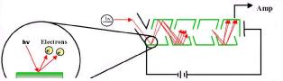
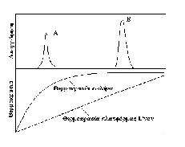

# Ατομική Φασματοσκοπία

## Εισαγωγή

Στις τεχνικές *Ατομικής Φασματομετρίας (AAS)* έχουμε αλληλεπίδραση ηλεκτρομαγνητικής ακτινοβολίας με *άτομα*. Είναι ιδιαίτερα χρήσιμη για *στοιχειακή ανάλυση*.

>**Στοιχειακή Ανάλυση:**\
Είναι ο προσδιορισμός της συγκέντρωσης (σε διάλυμα) ή της περιεκτικότητας (σε στερεό δείγμα) στοιχείων - συχνά μετάλλων, όπως πχ $Ca^{+2}, Zn^{+2}$ κλπ

Σε κάθε περίπτωση το δείγμα θα πρέπει υποχρεωτικά να υποστεί δύο διαδικασίες, *εξαέρωση*(μετατροπή σε αέριο) και *ατομοποίηση*(μετατροπή σε άτομα). Αυτό επαιτεί δαπάνη ενέργειας, η οποία μπορεί να είναι *θερμική* ή *ηλεκτρική*.

Υπάρχουν τρεις υπο-τεχνικές, Ατομική φασματομετρεία *εκπομπής (AES)* (χαρακτηριστηκής), *απορρόφησης (AAS)*(μονοχρωματική) και *εκπομπή φθορισμού (AFS)*.

## Ατομική Φασματοσκοπία

Απλοϊκά μιλώντας, η ατομική φασματοσκοπία βασίζεται σε απορρόφηση Η/Μ ακτινοβολίας σύμφωνα με τον τύπο:
$$
E_1-E_0=hf=\frac {hc}{\lambda}
$$

Τα φάσματα που λαμβάνουμε, τα διακρίνουμε σε τρεις τύπους:

* Γραμμωτά Φάσματα (για διέγερση ατόμων)
* Ταινιωτά Φάσματα (για διέγερση μικρών μορία & ριζών)
* Συνεχή Φάσματα (για ακτινοβολία μέλανος σώματος)

------

----

Τα *γραμμωτά φάσματα* μας ενδιαφέρουν κυρίως στη φασματοσκοπία (AAS) και αποτελούνται από διάφορες ατομικές γραμμές. Όπως και σε άλλες περιπτώσεις είναι επιθυμητό αυτές οι γραμμές να είναι όσο ποιό στενές είναι δυνατό.
Επιγραμματικά, η διεύρυνση ατομικών γραμμών οφείλεται σε τέσσερα φαινόμενα:

* Φυσική Διεύρυνση (οφείλεται στην αρχή απροσδιοριστίας)
* Φαινόμενο Doppler (ορισμένα άτομα τυχαία έχουν κατευθυνση προς, αντίθετα ή ενδιάμεσα σε σχέση με την πηγή)
* Φαινόμενο Lorentz (επίδραση πίεσης και συγκρούσεων)
* Φαινόμενο Zeeman (επίδραση μαγνητικού πεδίου)

### Φυσική Διέυρυνση

Σύμφωνα με την αρχή απροσδιοριστίας Heisenberg:
$$
\def\arraystretch{1.5}
\begin{array}{cc}
(1)&&\Delta t \Delta v \ge \frac {\hbar} 2\\
(2_i)&&v=\frac c \lambda \implies\\
(2_ii)&& \partial v = -c\frac {\partial\lambda}{\lambda^2}\\
(3)&& \partial v \approx\Delta v&& \partial\lambda\approx\Delta\lambda_{\frac 12}
\end{array}
$$

### Διεύρυνση Φαινομένου  Doppler

Σε περίπτωση εκπομπής το άτομο μπορεί να θεωρηθεί ως πηγή ακτινοβολίας. Τα άτομα σε δείγμα κινούνται με μια κατανομή ταχυτήτων, και αυτή η κατανομή έχει συνολική γραμμική ταχύτητα $\bar v$ μηδέν, αλλιών η συνολική μάζα θα πρέπει να κινείται. Μεμονομένα άτομα έχουν μη-μηδενική ταχύτητα αλλά για μία τέτοια ταχύτητα υπάρχει μια ίση και αντίθετη. Οι κινούμενες πηγές εμφανίζουν *φαινόμενο Doppler* όπου η γραμμική ταχύτητα της πηγής προστίθεται στην ταχύτητα των μετώπων (αλγεβρικά). Ισχύει:
$$
\frac{\Delta\lambda}{\lambda_o}=\frac vc
$$
Αφού επιπλέον:
$$
\lambda f = v
$$
Τότε λόγο φαινομένου Doppler θα αλλάζει μαζί με την ταχύτητα των μετρώπων και η συχνότητα και το μήκος κύματος τους.

### Φαινόμενο Lorentz

Τα άτομα είναι πηγές εκπομπής που συγκρούονται μεταξύ τους. Αυτές οι κρούσεις (*πίεση*) προκαλούν μικρές μεταβολλές στην ενέργεια των βασικών ενεργειακών καταστάσεων. Η διεύρυνση είναι της τάξης των μερικών pm. Ιδαιτέρως για την AAS, σε φλόγα, τα άτομα του αναλύτη συγκροούονται με διάφορα προϊόντα καύσης, ενώ σε λυχνίες HCL και EDL έχουμε συγκρούσεις μεταξύ ομοίων ατόμων. Σε λυχνίες $Xe$ και $Hg$ υψηλής πίεσης το φαινόμενο είναι τόσο ισχυρό, ώστε το φάσμα γίνεται συνεχές για την περιοχή $UV-Vis$.

## Επίδραση Της Θερμοκρασίας Στα Φάσματα - Κατανομή Stefan-Boltzmann

Η θερμοκρασία είναι συνηφασμένη με ενέργεια (*εσωτερική ενέργεια*) και επομένως είναι ικανή να προκαλέσει διέγερση.  Αυτό το φαινόμενο περιγράφεται από την κατανομή Stefan-Boltzmann:
$$
\frac {N_j} {N_o}=\frac{g_i}{g_o}e^{-\frac{\Delta\Epsilon_j}{kT} }
$$
Όπου:

* $N_j$ ο πληθυσμός των διεγερμένων ατόμων
* $N_ο$ ο πληθυσμός ατόμων σε θεμελιώδη

Ποιοτικά, ο λόγος $\frac {N_j}{N_o}$ αυξάνεται με αύξηση της θερμοκρασίας και μειώνεται *εκθετικά* με ελάτωση του $\lambda$.

>**Παρατηρήσεις:**
>* Είναι πάντα $N_j<<N_o$. Στην AES βασιζόμαστε στα διεγερμένα ($N_j$) ενώ στις AAS και AFS εργαζόμαστε με τον πληθυσμό θεμελιώδων $N_o$ που απορροφούν
>* Κάθε μεταβολή της θερμοκρασίας $T$ επιρρεάζει την ισχύ της AES διότι $N_j\propto T$. Μάλιστα αυτή η επίδραση είναι σημαντική, πχ για το $Na$ $\Delta T=10K\rightarrow\Delta N_j=+4\%$

Στις τεχνικές AES πρέπει η θερμοκρασία να είναι υπό αυστηρό έλεγχο κατά τη διαδικασία της ατομοποίησης. Αυτό δεν είναι ιδιαίτερα σημαντικό στις τεχνικές AAS, AFS αυτές βασίζονται στο $>99,9\%$ των ατόμων και τυχόν μεταβολλές, λόγο θερμοκρασίας είναι αμελητέας επίδρασης στα αποτελέσματα.
Θεωρητικά αναμένουμε οτι μια τεχνική απορρόφησης θα είναι περισσότερο αυαίσθητη από μια τεχνική εκπομπής, λόγο της μεγάλης διαφοράς στους ατομικού πληθυσμούς. Ωστόσο αυτό το φαινόμενο αντισταθμίζεται από τις διαφορετικές ματρήσεις που λαμβάνουν χώρα ($A=logI_0-logI$). Οπότε αναμένονται μεγαλύτερα σχετικά αναλυτικά σφάλματα. Πρακτικά, οι τεχνικές AAS και AES είναι συμπληρωματικές, ενώ η AFS η πλέον ευαίσθητη.

## Πηγές Ατομοποίησης

Υπάρχουν διάφορες πηγές που μπορούν να χρησημοποιηθούν στην ατομοποίηση:

* Φλόγα
* Ηλεκτρικά Θερμονόμενος Φούρνος Γραφίτη
* Επαγωγικά Συζευγμένο Πλάσμα Αργού
* Ηλεκτρικό Τόξο
* Σπινθήρας Εκκένωσης (συνεχούς ή εναλλασσόμενου)
* Πλάσμα Εκκένωσης Λάμψης

Και οι αντίστοιχες τεχνικές είναι:

* Φασματομετρία Ατομικής Απορρόφησης (AAS)
    * FAAS
    * HGAAS
    * CVAAS
    * ETAAS
* Φλογοφωτομετρία Ατομικής Απορρόφησης (FAES)
* Ατομικός Φθορισμός (AFS)
* Φασματομετρία Ατομικής Εκπομπής Σε Επαγωγικά Συζευγμένο Πλάσμα (ICS-OES)
* Φασματομετρία Ατομικών Μαζών Σε Επαγωγικά Συζευγμένο Πλάσμα (ICP-MS)

## Φασματομετρία Ατομικής Εκπομπής

Περιγράφεται βασικά από τον τύπο:
$$
Ι_{em} = A_{ji}\;h\;v_{ji}\;N_j
$$
Όπου:
* $Ι_{em}$ η ένταση της εκπεμπόμενης ακτινοβολίας
* $Α_{ji}$ η πιθανότητα μετάπτωσης
* $h$ σταθερά Plank
* $ν_{ji}$ η συχνότητα της ακτινοβολίας
* $N_j$ ο αριθμός ατόμων στη διεγερμένη κατάσταση
  
// Τυποι

## Φασματομετρία Ατομική Απορρόφησης

Ισχύει ο νόμος του Beer:
$$
A=-logT=-log(\frac II_0)=0.434k_vb=k^{\prime}bN_o=k^{\prime\prime}c
$$
Όπου, $k_v$ είναι ένας συντελεστής ανάλογος του αριθμού ατόμων ανά μονάδα όγκου

## Φασματομετρία Ατομικού Φθορισμού

Ισχύει:
$$
I_F = k\;\Phi\;I_o\;C
$$
Όπου $k$ σταθερά, $\Phi$ είναι η *κβαντική απόδοση* (λόγος αριθμού ατόμων που φθορίζουν προς αυτώνσ τη θεμελιώδη), $I_o$ η ένταση της προσπίπτουσας, και $C$ ή συγκέντρωση ατόμων στο *ατομικό νέφος*.

### Οργανολογία

### Πηγές Ακτινοβολίας AAS

#### Λυχίες Κοίλης Καθόδου (HCL)

Μπορούν να είναι μονοστοιχειακές ή πολυστοιχειακές. Αποτελούνται από μία κοίλη κάθοδο επικαλυμένη με κάποιο στοιχεία (ή στοιχεία). Εφαρμώζοντας διαφορά δυναμικού μεταξύ ανόδου και καθόδου ορισμένα ότομα διεγείρονται και εκπέμπουν. Στο εσωτερικό της υπάρχει αέριο $Ne$ ή $Ar$ σε πίεση $1-5\;tor$.

Υπάρχουν επίσης και οι *λυχνίες εκκενώσεως άνευ ηλεκτροδίων (EDL)*. Η διέγερση προέρχεται από πηνίο RF, και σε κάθε περίπτωση η ακτινοβολία εξέρχεται από παράθυρο χαλαζία ή pyrex (διότι αυτά τα υλικά δεν απορροφούν στην επιθυμητή περιοχή).

*Λυχνία Κοίλης Καθόδου (HCL)*

*Λυχία ανευ Ηλκετροδίων (EDL)*
### Μονοχρωμάτορες

Ο μονοχρωμάτωρας είναι είδος επιλογέα μήκους κύματος. Διαχωρίζεται την ακτινονολία στις συνιστώσες της και επιλέγει μία (στην πραγματικότητα μια στενή ζώνη). Συχνά λειτουργούν με *φράγμα περίθλασης*.
Τα βασικά στοιχεία ενός τέοιου μονοχρωμάτωρα είναι:

1. Σχισμή Εισόδου
2. Κατευθυντικός Φακός
3. Φράγμα Περίθλασης
4. Φακός Εστίασης
5. Σχισμή Εξόδου

>**Παρατήρηση:**\
Στους μονοχρωμάτορες με φράγμα περίθλασης, η ανάκλαση μπορεί να γίνεται στη στενή πλευρά των χαραγών, οπότε έχουμε φράγμα τύπου *echelle* ή στην ευρεία, οπότε έχουμε φράγμα *echellete* ή *κλιμακοτό*.
Τα σημαντικότερα ποιοτικά χαρακτηριστικά φράγματος περίθλασης έιναι:

* Η φασματική καθαρότητα
* Η αντίστροφη γραμμική διασπορά $D^{-1}(nm/mm)$
* Η **διακριτική ισχύς**

Η δε διακριτική ισχύς ορίζεται ως:
$$
R = \frac\lambda{\Delta\lambda}=nN
$$
Όπου Ν είναι οι χαραγές ανά mm

\
\

### Μεταλλάκτες - Φωτοπολλαπλασιαστές (PMT's)

*Mεταλλάκτης* είναι μια διάτταξη ικανή να μετατρέψει το εκάστοτε αναλυτικό σήμα σε ηλεκτρικό σήμα, που μπορούμε να επεξεργαστούμε σε υπολογιστή. Ένας κατάλληλος μεταλλάκτης για ακτινβολία είναι ο *φωτοπολλαπλασιαστής*.
Η λειτουργία του βασίζεται στο *φωτοηλεκτρικό φαινόμενο*. Είναι το φαινόμενο κατά το οποίο πρόσπιψη ακτινοβολίας σε κατάλληλη επιφάνεια προκαλλεί εκπομπή ηλεκτρονίων.
Τη πλάκα αυτή ακολοθούν μια σειρά από πλάκες σε διαδοχικά αυξανόμενη διαφορά δυναμικού, πλάκες που ονομάζονται *δυνοδοι*. Σε κάθε δύνοδο, η πρόσπιψη ηλεκτρονίων οδηγέι σε έκλυση ακόμη περισσότερων ηλεκτρονίων. Αποτέλεσμα της επαναλαμβανόμενης αυτής διαδικασίας είναι μια δραμματική αύξηση του αριθμού των ηλεκτρονίων φαινόμενο που ονομάζεται *καταρράκτης ηλεκτρονίων*.
Οι φωτοπολλαπλασιαστές χαρακτηρίζονται από υψηλή ευαισθησία, μεγάλη ταχύτηα απόκρισης και επιτρέπουν την μέτρηση ακτιβολίας UV χαμηλής ισχύος (*φωτοστεγανό διαμέρισμα*).

\
*Καταρράκτης Ηλεκτρονίων*\
\
*Φωτοπολλαπλασιαστής (PMT)*

### Βελτιστοποίηση στη ποσοτική AAS

Στη διαδικασία βελτιστοποίησης για τεχνικές AAS οι παράμετροι που θα πρέπει να μας απασχολίσουν είναι το ρεύμα της λυχνίας, η προθέρμανση της λυχνίας, η ευθυγράμμηση της λυχνίας, και ο χρόνος ζωής της.
Εάν το ρεύμα της λυχνίας είναι εξαιρετικά υψηλό, τότε θα παρατηρηθέι μείωση της απορρόφησης λόγο *αυτοαπορρόφησης*. Σε πολύ χαμηλά ρεύματα χειροτερεύει ο λόγος σήμα προς θόρυβο, άρα χειροτερεύουν και τα LOD LOQ RSD. Προθέρμανση της λυχνίας απαιτήται διότι κατά την θέρμανση έχουμε ολίσθηση και διεύρυνση της γραμμής, άρα γενικά μείωση του σήματος.
Γενικές ενδείξεις φθοράς της λυχνίας είναι μειωμένη ενέργεια, αύξηση RSD προτύπου, και αύξηση LOD (λόγο αύξησης θορύβου).

#### Έλεγχος Καταλληλότητας

Πριν τη χρήση των οργάνων καταγράφονται οι αρχικές φιάλες των αερίων και κάνουμε ευθυγράμμηση και προθέρμανση των λυχνιών. Καταγράφουμε επιπλέον την ενέργεια του PMT, SSD.

### FAAS

Για ατομοποιητές φλόγας, η διαδικασία εξαρτάται από τη θερμοκρασία αλλά και το χημικό περιβάλλον της φλόγας. Όταν το καύσιμο είναι σε έλειμμα έχουμε *οξειδωτική φλόγα*, ενό αν το καύσιμο είναι σε περίσσεια η φλόγα ονομάζεται *αναγωγική φλόγα*. Η θερμοκρασία και το περιβάλλον εξαρτόνται από τα συστατικά του καυσιμου και της αναλογία τους.
>**Προσοχή:**\
Η ταχύτητα ροής της φλόγας θα πρέπει να είναι μεγαλύτερη από τη ταχύτητα καύσης. Διαφορετικά, θα έχουμε *flashback* όπου η φλόγα μπαίνει στη φιάλη καυσήμου, προκαλώντας έκκρηξη.

Οι συνηθέστερες φλόγες, ως προς τη σύσταση τους είναι
* Φλόγα Ακετυλενίου-Αέρα\
 Είναι η συχνότερα χρησημοποιούμενη φλόγα και δεν απορροφά πάνω από τα 230nm. Κυριότερο πρόβλημα είναι το οτι σχηματίζονται δύστηκτα οξείδια για 30 στοιχεία

* Φλόγα Ακετυλενίου - Υποξειδίου Αζώτου\
Έχει υψηλότερη θερμοκρασία και χρησιμοποιείται περισσότερο σε αναγωγικό περιβάλλον. Δεν σχηματίζονται οξείδια αλλά πολλα στοιχεία ιοντίζονται και εμφανίζει ισχυρή εκπομπή σε πολλές περιοχές (335,350,390nm).
* Φλόγα Υδρογώνου - Αέρα\
Εμφανίζει υψηλότερη ευαισθησία για αλκάλια και για κασσίτερο. Εμφανίζει υψηλή διαπερατότητα έως τα 200nm. Όμως εμφανίζει χαμηλή θερμοκρασία, υψηλή ταχύτητα καύσης (άρα υψηλή κατανάλωση αερίου) και γενικά έντονες παρεμποδίσεις.

\
*Θερμοκρασιακό Προφίλ Φλόγας* *Θέση φλόγας σε σχέση με τη σχισμή εισόδου*

### Καυστήρας Προναμίξεως

??

### Βελτιστοποίηση Ποσοτικής FAAS

Στη βελτιστοποίηση ποσοτικής FAAS έχουμε δύο κατηγορίες παραμέτρων που βελτιστοποιούμε, παραμέτρους του ατομοποιητή και παραμέτρους του μονοχρωμάτορα.

Παράμετροι Καυστήρα:

* Τύπος Καυστήρα
* Φράξιμο Κεφαλής
* Χρόνος Προθέρμανσης
  
Παράμετροι Μονοχρωμάτορα:

* Βαθμονόμηση
* Επιλογή μήκους κύμματος
* Εύρος Σχισμής Εισόδου
* Λόγος $\frac S N$

### Παρεμποδίσεις στην FAAS

Όπως και σε κάθε άλλη τεχνική, διακρίνουμε τρεις τύπους παρεμποδίσεων, *φυσικές*, *χημικές* και *φασματικές*.

#### Φυσικές Παρεμποδίσεις

Κυριότερες φυσικές παρεμποδίσεις που μπορούν να προκύψουν είναι αλλαγές των φυσικών ιδιοτήτων του διαλύματος όπως ιξώδες, επιφανειακή τάση, ή πυκνότητα, παρουσία αλάτων ή οργανικών διαλυτών, και μεταβολές της ταχύτητας εκνέφωσης ή της διαμέτρου των σωματιδίων του αερολύματος. **Προβλήματα φυσικών παρεμποδίσεων επιλύονται με της τεχνικές προσαρμωγής στη μήτρα του δείγματος ή  σταθερών προσθηκών ή συνδιασμό τους**.

#### Χημικές Παρεμποδίσεις

Οι χημικές παρεμποδίσεις μπορούν να οφείλονται σε τρια βασικά αίτια, σχηματισμό ενώσεων χαμηλής πτητικότητας, αντιστρεπτές ισορροπίες διάστασης και παρεμποδίσεις ιοντισμού.
Ο σχηματισμός ενώσεων χαμηλής πτητικότητας μπορεί να αντιμετοπιστεί με υψηλότερες θερμοκρασίες φλόγας, με εισαγωγή αντιδραστηρίων αποδέσμευσης, και με προστατευτικά αντιδραστήρια.
Τα *αντιδραστήρια αποδέσμευσης* είναι κατιόντα που αντιδρούν εκλεκτικά με τους παρεμποδιστές και του "απομακρύνουν" (με την έννοια οτι αυτοί δεν δεσμεύουν πλέον τον αναλύτη).
Τα *προστατευτικά αντιδραστήρια* είναι ουσίες που σχηματίζουν προϊόντα με τον αναλύτη που είναι ταυτόχρονα σταθερά και πτητικά (οπότε μετράμε αυτά αντί απευθείας τον αναλύτη).
>**Παράδειγμα:**\
Τα φωσφορικά ($PO_4^{3-}$) παρεμποδίζουν την μέτρηση ασβεστίου, ως $Ca^{2+}$. Η παρεμπόδιση μπορεί να αντιμετοπιστεί με προσθήκη $La^{3+}$, $Sr^+$ ή $EDTA$.
Παρεμποδίσεις μπορεί ακόμη να εμφανιστούν όταν ο αναλύτης συμμετέχει σε αντιστρεπτές ισορροπίες διάστασης. Για παράδειγμα:
$$
\def\arraystretch{1.5}
\begin{array}{cc}
(1_i)&&M(OH)_2DM+2OH^-\\
(1_{ii})&&MO+D\rightarrow DM+O\\
(2)&&HCl_{(g)}\rightarrow H+Cl\\
(3)&&NaCl_{(g)}\rightarrow DNa+Cl\\
(4)&&VO_x+D\rightarrow DV+xO\\
(5)&&AlO_x+D\rightarrow DAl + xO
\end{array}
$$

Όπου στις περιπτώσεις $(2),(3)$ θα έχουμε μείωση του σήματος του $Na$ λόγο του $Cl$ και στις περιπτώσεις $(4),(5)$ θα έχουμε αύξηση του σήματος $V$ λόγο του $Al$. [??]

Οι παρεμποδίσεις χημικού ιοντισμού αφορούν τα αλκάλια και αλκαλικές γαίες, όπου ο βαθμός ιοντισμού του μπορεί να δημιουργήσει αποκλίσεις στη καμπύλη αναφοράς. Δηλαδή:
$$
M\rightarrow M^++e^-
$$
Μετατόπιση της ισορροπίας προς το ιον θα προκαλέσει θετική απόκλιση στην καμπύλη αναφοράς. Αυτό το φαινόμενο το αντιμετοπίζουμε με προσθήκη κάποιου *ρυθμιστή ιοντισμού*. Ένα παράδειγμα ρυθμιστή ιοντική ισχύος είναι το $K$ σε προσδιορισμό $Sr$. Τότε:
$$
\begin{array}{c}
K^0\rightarrow K^++e^-\\
e^-+Sr^+\rightarrow Sr^0
\end{array}
$$

#### Φασματικές Παρεμποδίσεις

Φασματικές παρεμποδίσεις λόγο αλληλοεπικάλυψης γραμμών είναι σχετικά σπάνιες και τις αντιμετοπίζουμε απλά επιλέγοντας διαφορετικά γραμμή (πχ $V$ στο $Al$). Κάποιες φορές μπορεί να έχουμε παρεμπόδιση λόγο απορρόφησης ή/και εκπομπής *μορίων*. Τέλος άλλες παρεμποδίσεις οφείλονται στη σκέδαση της ακτινοβολίας από σωματίδια, κάτι που αντιμετοπίζεται με τη διαδικάσία της *διόρθωσης υποβάθρου*.

### Ηλεκτροθερμενόμενος Φούρνος Γραφίτη (ETAΑS)

Η τεχνική βασίζεται στον *φούρνο γραφίτη*, έναν κύλινδρο από ηλεκτρογραφίτη επικεκαλύμένο από πυρολυτικό γραφίτη. Ο κύλιδρος έχει μια οπή στη μία πλευρά απ' όπου εισάγουμε το δείγμα ενώ ή οπτική διαδρομή προς τον μονοχρωμάτορα είναι κατά μήκος του κυλίνδρου. Ο ηλεκτρογραφίτης όταν εφαρμωστεί διαφορά δυναμικού στα άκρα του θερμαίνεται και εξατμίζει το δείγμα μέσα του.

Η διάταξη φούρνου γραφίτη έχει γενικά αυξημένη ευαισθησία γιατί το δείγμα παραμένει περισσότερο στην οπτική διαδρομή και ατομοποιείται ολόκληρη η μάζα που εισέρχεται στον γραφίτη. Επιπλέον μπορούμε με αυτή διάταξη να αναλύσουμε μικρά δείγματα (της τάξεως των 10-50 μL) καθώς και στερεών δειγμάτων. Κύριο μειονέκτημα είναι χαμηλή επαναληψημότητα του (~5%) που οφείλεται κυρίως στην διαδικασία ατομοποίησης.
Κύριο πρόβλημα είναι η άνιση θέρμανση κατά μήκος του φούρνου. Για να αντιμετοπιστεί αυτό το πρόβλημα αναπτύχθηκε η *πλατφόρμα L'vov* μια απλή πλατφόρμα μέσα στο φούρνο.

Με τη πλατφόρμα L'vov μειώνουμε τη συμπήκνωση του ατομικού ατμού στα άκρα του γραφίτη και των παρεμποδίσεων λόγο σχηματισμού αερίων μορίων. Ωστόοσ η επαφή της πλατφόρμας με τον φούρνο είναι γενικά προβληματική.
Μια εναλλακτική προσέγγιση είναι η ενσωμετομένη πλατφόρμα *integrated platform*, όπου η πλατφόρμα είναι ομόκεντρος κύλιδρος φτιαγμένος από το ίδιο υλικό σε σχέση με τον φούρνο. Αυτός ο σχεδιασμός καθιστά τον φούρνο μηχανική σταθερό, και ελαχιστοποιεί την επαφή με τον σωλήνα. Η διαδικασία της θέρμανσης γίνεται με *επαγωγή* (μεταφέρεται θερμότητα από τον κύριο σωλήνα στην πλατφόρμα).
Μια διαφορετική τεχνολογία είναι ο *ισόθερμος ατομοποιητής (THGA)*. Η λειτουργία του βασίζεται σε θέρμανση του φούρνου κάθετα στην οπτική διαδρομή και έχει σχήμα πεπλατισμένο με τον κύλιδρο μέσα, κάθετα στο μήκος του. Με αυτή τη τεχνολογία αποφεύγουμε τον επανασχηματισμό μορίων στην αέρια φάση ενώ ο συγκεκριμένος φούρνος είναι κατάλληλος για όλα τα στοιχεία. Η τεχνολογία αυτή αυξάνει τον χρόνο ζωής του γραφίτη και μειώνει τα *φαινόμενα μνήμης*.

>**Φαινόμενο Μνήμης:**\
Ορισμένες φορές στοιχεία του προηγούμενου δείγματος, προσρροφόνται στην φούρνο και ελευθερώνονται σε επόμενες μετρήσεις, δίνοντας σήματα. Αυτό ονομάζεται *φαινόμενο μνήμης* και προσπαθούμε να το αποφύγουμε. Για να μειώσουμε τέτοια φαινόμενα χρησημοποιούμε υψηλής ποιότητας πυρολυτικό γραφιτη, γιατί μειώνονται οι αλληλεπιδράσεις μετάλλων με τον γραφίτη. Επιπλέον χρησιμοποιούμε μια συνεχή ροή $Ar$ την οποία διακόπτουμε κατά τη διάρκεια της ατομοποίησης.

\
\
\
*Ισόθερμος Ατομοποιητής (THGA)*\
\
Οι φούρνοι γραφίτη λειτουργούν σε STPF συνθήκες, όπου η ατομοποίηση γίνεται σε πλατφόρμα L'vov ή THGA. Απαιτεί ταχύτητα ηλεκτρονικά για την καταγραφή του σήματος, και η ποσοτική ανάλυση γίνεται με μέτρηση του εμβαδού. Μπορούμε να προσθέσουμε χημικούς τροποποιητές ενώ η μέγιστη ταχύτητα θέρμανσης είναι στο στα΄διο της ατομοποίησης. Διόρθωση του υποβάθρου γίνεται με το *φαινόμενο Zeeman*.

#### Πρόγραμμα Θερμοκρασιών Φούρνου Γραφίτη

Η θερμοκρασία σε φούρνο γραφίτη μεταβάλλεται σε 5 διακριτά στάδια:

1. Ξήρανση
2. Πυρόλυση
3. Ψύξη
4. Ατομοποίηση
5. Καθαρισμός

Στο στάδιο της *ξήρανσης* απομακρύνεται ο διαλύτης, γι αυτό και απαιτούμενη θερμοκρασία και ο χρόνος εξαρτάται από τον διαλύτη και τον όγκο του δείγματος. Στο στάδιο της *πυρόλυσης* γίνεται διάσπαση ουσιών του αναλύτη και εξαρτάται από την πτητικότητα του. Στο στάδιο της ατομοποίησης ανεβάζουμε αργά την θερμοκρασία ή βάζουμε τη μέγιστη ισχύ, για να διασπαστούν τα συστατικά του δείγματος στα άτομα τους. Συνήθως υπάρχει και ένα ενδιάμεσο στάδιο ψύξης μεταξύ πυρόλυσης και ατομοποίησης. Τέλος υπάρχει και ένα τελικά στάδιο καθαρισμού του φούρνου (παρόμοιο με τις χρωματογραφίες).
Κατασκευάζουμε διαγράμματα θερμοκρασιών πυρόλυσης-ατομοποίησης. Σημαντικά σημεία είναι:

* Μέγιστη $T_{pyr}$ 
* Θερμοκρασία ποσοτική εξαέρωσης αναλύτη
* Θερμοκρασία εμφάνισης
* Βέλτιστη Θερμοκρασία
  
>**Παρατήρηση:**\
Ο φούρνος σταδιακά φθείρεται γι αυτό και πρέπει να καταγράφουμε την ιστορία του.

#### Διόρθωση Υποβάθρου - Μέθοδος Δύο Γραμμών

Ένας απλός τρόπος να διορθώσουμε το υπόβαθρο είναι επιλέγοντας μια δεύτερη γραμμή αναφοράς της πηγής. Αυτή μπορεί να οφείλεται σε πρόσμιξη ή στο αέριο που υπάρχει μέσα στη λυχνία, και δεν θα πρέπει να απορροφάται από τον αναλύτη ενδιαφέροντος. Τότε μπορούμε να υποθέσουμε ότι κάθε μείωση της έντασης αυτής της γραμμής κατά τη διέλευση φωτός από δείγμα οφείλεται σε υπόβαθρο και επομένος μπορούμε να τη μετρήσουμε χωρίστα από τη "κύρια" μέτρηση και την αφαιρέσουμε από αυτή. Είναι όμως συχνά δύσκολο να βρούμε κάποια κατάλληλη δεύτερη γραμμή.

#### Διόρθωση Υποβάθρου - Μέθοδος Δεύτερης Λυχνίας

Σε αυτή τη προσέγγιση εκτός της βασικής λυχίας HCL, χρησιμοποιούμε και μια δέυτερη λυχία συνεχούς, γενικά μια λυχνία $D_2$. Ένας τεμαχιστής οδηγεί ακτιβολία εναλλάξ από την μία λυχνία ή την άλλη. Η απορρόφηση του δείγματος όλα αυτό ακτιβολείται από τη λυχνία $D_2$ θεωρούμε οτι οφείλεται στο υπόβαθρο μόνο, ενώ η απορρόφηση από τη λυχνία HCL οφείλεται στην αναλυτικά χρήσιμη απορρόφηση και το υπόβαθρο. Από την απορρόφηση της δεύτερης αφαιρούμε αυτή την πρώτης και παίρνουμε ένα
(θεωρητικά τουλάχιστον) διορθωμένο σήμα. Στη πραγματικότητα το σήμα από την ακτιβολία της λυχνίας δευτερίου εμπεριέχει και κάποια μικρή απορρόφηση του δείγματος εκτός από το υπόβαθρο. Γι αυτό και επιλέγουμε μεγάλο εύρος σχισμής εισόδου, ώστε αυτή η απορρόφηση να είναι ένα πολύ μικρό ποσοστό σχετικά με αυτή του υποβάθρου. Αυτή η τεχνική εμφανίζει προβλήματα γιατί οι λυχίες δευτερίου δίνουν πολύ μικρή ένταση κάτω από τα 350 (nm) ενώ το υπόβαθρο των δύο λυχνίων δεν είναι πάντα ίδιο, οδηγώντας σε *υπο-* και *ύπερ-* διόρθωση. Τέλος η εισαγωγή τόσο της δεύτερης λυχνίας, όσο και του τεμαχιστή μειώνει τον λόγο $^S/_N$. Σε κάθε περίπτωση οι δύο λυχνίας θα πρέπει να είναι προσεκτικά ευθυγραμμισμένες.

#### Διόρθωση Υποβάθρου - Φαινόμενο Zeeman

Εκτός μαγνητικού πεδίου πολλαπλές ενεργειακές καταστάσεις που εμπλέκονται σε μια μετάπτωση είναι ενεργειακά ισοδύναμες (*εκφυλισμένες*). Εντός μαγνητικού πεδίου όμως, αυτές παύουν να είναι ενεργειακά ισοδύναμες και διακρίνονται. Επομένος εκεί που εκτός μαγνητικού πεδίου παρατηρήσουμε μία γραμμή, δηλαδή μία μετάπτωση, εντός μαγνητικού πεδίου θα εφαρμώζονται πολλαπλές (για τα πλέον άνισα ενεργειακά επίπεδα). Αυτή η σχάση μίας γραμμής σε πολλαπλές εξαρτάται από τις ενεργειακές καταστάσεις, και εμφανίζει διάφορες μορφές. 
Η απλούστερη περίπτωση είναι αυτή όπου η αρχική γραμμή σχάζεται σε μία κεντρική στο ίδιο μήκος κύματος ($\pi$) και δύο δορυφορικές, μία σε μεγαλύτερο και μία σε μικρότερο μήκος κύματος ($\sigma^{\pm}$). Οι δορυφορικές απορροφούν μόνο ακτινοβολίες *κάθετες* στη διεύθυνση του μαγνητικού πεδίου, και η κεντρική μόνο σε ακτιβολία παράλληλη στη διεύθυνση του μαγνητικού πεδίου.
Το φαινόμενο είναι χρήσιμο στη διόρθωση υποβάθρου γιατί αυτές οι γραμμές εμφανίζουν ακόμη μία ιδιότητα, στην παράλληλη διέυθυνση απορροφά ο αναλύτης και εμφανίζεται και το υπόβαθρο (μοριακή απορρόφηση, σκέδαση κ.α.) ενώ στη κάθετη διέυθυνση δεν απορροφά καθόλου ο αναλύτης αλλά απορροφά το υπόβαθρο.
Επομένος ο φούρνος έχει ένα μόνιμο μαγνιτικό πεδίο, και από την πηγή απομονόνεται εναλλάξ φως πολωμένο παράλληλα, και κάθετα στη διέυθυνση του μαγνητικού πεδίου. Το σήμα της δεύτερης περιόδου αφαιρείται ηλεκτρονικά από αυτό της δεύτερης, οπότε και διορθώνουμε το υπόβαθρο. Για να γίνει αυτή η διόρθωση πρέπει να χρησιμοποιούμε λυχίες συνεχούς ακτινοβολίες (πχ $D_2$).
Μπορούμε ισοδύναμα να εφαρμώσουμε το μαγνητικό πεδίο στη πηγή, αντί του δείγματος. Αυτή η περίπτωση ονομάζεται *άμεσο φαινόμενο Zeeman* ενώ αυτή που περιγράψαμε άνω *αντίστροφο φαινόμενο Zeeman*.
Με τι φαινόμενο Zeeman μπορούμε να διορθώσουμε σήματα μέχρι 2 Α, και τα όργανα είναι απλή δέσμης. Αν η διάτταξη είναι διαμήκης, τότε δεν χρειάζεται πολωτής φωτός. Όμως γενικά με αυτή τη τεχνική αυξάνονται οι φασματικές παρεμποδίσεις, μειώνεται η ευαισθησία και η γραμμική περιοχή και τα όργανα είναι ακριβότερα σε σχέση με τις άνω δύο μεθόδους.

#### Διόρθωση Υποβάθρου - Μέθοδος Smith - Hieftje

Μια άλλη προσέγγιση βασίζεται στην εξής παρατήρηση *"σε υψηλής εντάσεως ρεύματα εμφανίζεται πολύ ισχυρή **αυτοαπορρόφηση** ακτινοβολίας από ουδέτερα άτομα οπότε το αναλυτικά ενδιαφέρον σήμα εξαφανίζεται και μόνο το υπόβαθρο επιβιώνει"*. Τότε μπορούμε να διορθώσουμε το υπόβαθρο κάνοντας δύο μετρήσεις, μία σε χαμηλή ένταση πηγής (σήμα και υπόβαθρο) και μία σε υψηλή (μόνο υπόβαθρο). Τότε η διαφορά τους θα είναι το διορθωμένο σήμα.
Η τεχνική αυτή μπορεί να διορθώσει μέχρι και 1 Α υπόβαθρο και είναι φθηνότερη του Zeeman αλλά έχει μειωμένη ευαισθησία, και κάπως αυξημένο κόστος σε σχέση με άλλες προσεγγίσεις γιατί απαιτεί ειδικές, παλμικές λυχνίες. Τέλος δεν μπορεί να εφαρμωστεί για όλα τα στοιχεία (ιδιαιτέρος για τα $V$ $Mo$).

### Παρεμποδίσεις στην ETAAS

Οι παρεμποδίσεις της ETAΑS είναι κυρίως χημικές. Οφείλονται στην στερεά φάση (την επιφάνεια του γραφίτη), στην αέρια φάση, στο σχηματισμό σταθερών δύστηκτων ενώσεων, ή σταθερών πτητικών και μπορούν εμφανιστούν τόσο κατά την πυρόλυση, όσο και κατά την ατομοποίηση. Για να τις αντιμετοπίσουμε, καταφεύγουμε σε προσεκτική επιλογή θερμοκρασιακού προγράμματος, σε απομάκρυνση μήτρας με κατάλληλες προκατεργασίες ή - για STPF συνθήκες - με την χρήση πλατφόρμας και τροποποιητών.

>**Χημικοί Τρόποποιητές:**\
Είναι ουσίες που μεταβάλλουν επι τόπου (*in situ*) τη θερμοχημική συμπεριφορά του αναλύτη, της μήτρα ή/και της επιφάνειας του γραφίτη και της αέριας φάσης, πριν και κατά τη διάρκεια της ατομοποίησης. Γενικά
>* Αυξάνουν την σταθερότητα του αναλύτη κατά την πυρόλυση
>* Αυξάνουν την πτητικότητα του αναλύτη κατά την ατομοποίηση
>* Εξισώνουν σήματα διαφορετικών μορφών του ίδου αναλύτη
>* Μετατρέπουν τυχόν παρεμποδιστές σε λιγότερο δραστηκά προϊόντα
>* Μεταβάλλον τη δραστηκότητα αέρια φάσης ή επιφάνειας γραφίτη

### Αναλυση Στερεών

Όπως είπαμε με φούρνο γραφίτη μπορούμε να αναύσουμε και απευθείας στερεά δείγματα (1-2mg). Αν και μπορούμε να αναλύσουμε δύσκολα δέιγματα (όπως Ti) ή πτητικά (όπως Hg) με τέτοιο τρόπο ώστε να αποφύγουμε τυχόν μολύνσεις του δείγματος, υπάρχουν γενικά δυσκολίες στη σωστή βαθμονόμηση και η επανληψημότητα είναι προβληματική (~10%). Μια εναλλακτική προσέγγιση είναι η χρήση εναιωρήματος (slurry sampling)

#### Εισαγωγή Αιωρήματος (Slurry Sampling)

Είναι μια τεχνική ανάλυσης που στοχεύει να ελαχιστοποιήσει τη κατεργασία του δείγματος. Η διαδικασία έχει γενικά ως εξής:

1. 2-20 (mg) στερεού σε σκόνη (διαμέτρου κόκκων <10 (μm) ) ομογενοποιούνται σε 1-3 (mL) κάποιου διαλύτη. Συχνά για διαλύτη χρησημοποιούμε 5% HNO_3 με 1% Triton X-100 (επιφανειοδραστηκό)
2. Ομογενοποιούμε με υπερήχους
3. Εισάγουμε το εναιώρημα (4-400 (mg) μητρικού υλικού) στον φούρνο γραφίτη - συχνά με χημικούς τροποποιητές

## Σχηματισμός Υδριδίων (HGAAS)

Είναι μια ιδαίτερη τεχνική που αφορά ορισμένα μέταλλα, συγκεκριμένα, τα: $Se,Te,As,Sb,Bi,Ge,Sn,Pb,Zn$ και $Cd$. Ιδαιτέρως για τον υδράργυρο χρησιμοποιούμε μια ποιό εξειδικευμένη τεχνική (CVAAS). 
Αυτά τα μέταλλα αντιδρουν με $NaBH_4$ και σχηματίζουν υδρίδια:
$$
3BH_4^-+3H^++4H_3AsO_3\rightarrow 3H_3BO_3 + 4AsH_3 +3H_2O
$$
Τα παραγώμενα υδρίδια παρασέρνονται από αδρανές φέρον αέριο και οδηγούνται σε φούρνο χαλαζία προς ατομοποίηση.
Γενικά η διαδικασία μπορεί να γίνει σε συνεχή ροή (*bath mode*) ή με έκχυση σε ροή (*FIA*). Με αυτό το τρόπο πετυχαίνουμε μεγαλύτερη ευαισθησία και αποτελεσματικό διαχωρισμό από τη μήτρα.

### Παρεμποδίσεις

Σπάνια αντιμετοπίζουμε φασματικές παρεμποδίσεις στη τεχνική αυτή αλλά συχνά αντιμετοπίζουμε χημικές παρεμποδίσεις. Αυτές μπορεί να εμφανίζονται στο στάδιο σχηματισμού υδριδίων (λόγο αριθμού εξείδωσης ή επίδρασης άλλων συστατικών του δείγματος) ή στη διαδικασία ατομοποίησης (λόγο άλλων συστατικών που επίσης σχηματίζουν υδρίδια). Σε κάθε περίπτωση μπορούμε αντιμετοπίζουμε τέτοια προβλήματα με κατάλληλα καλυπτικά αντιδραστήρια.

>**Φασματομετρία Ταυτόχρονης Ατομικής Απορρόφησης (*SIMAA*):**\
Είναι μια παραλλαγή της THGA που επιτρέπει ταυτόχρονο προσδιορισμό 4-6 στοιχείων. Βασίζεται σε συνδιασμό φωτός από πολλαπλές λυχνίες, διαχωρισμό της ακτινοβολίας εξόδου μέ μονοχρωμάτωτα echelle και ανιχνευτή στερεάς κατάστασης με 60 φωτοδιόδους. Αυτός ο ανιχνευτής επιτρέπει μέτρηση διαφορετικών σημάτων παράλληλα, διακρίνοντας τας (αντίθετα με έναν φωτοπολλαπλασιαστή).

>**Φασματομετρία Ατομικής Απορρόφησης με Πηγή Συνεχούς (CSAAS):**\
Χρησημοποιεί THGA λάμπα $Xe$ ανιχνευτή CCD και υψηλής διακριτικής ισχύος διπλό μονοχρωμάτορα.

>**FI-HG-ETAAS:**\
Συνδιάζοντας τεχνικές φούρνου γραφίτη, παραγωγής υδριδίων και έγχυσης σε ροή μπορούμε να πετύχουμε μεγάλη ευαισθησία, χαμηλά όρια ανίχνευσης και αποτελεσματική απομάκρυνση της μήτρας πριν από την ατομοποίηση. Τα υδρίδια συλλέγονται σε ειδικό στρώμμα από PGM (βάση $Ir$).

## Αναλυτική Μεθοδολογία AAS

>**Χαρακτηρηστική Μάζα:**\
Μπορούμε να ορίσουμε ένα βασικό ποιοτικό μέγεθως της τεχνικής που ονομάζεται *χαρακτηριστική μάζα ($C_o$ ή $m_o$)*. Είναι η μάζα ή η συγκέντρωση του στοιχέιου που δίνει 1% απορρόφηση ή $Α=0,0044$.

Για την FAAS:\
Αν $5(\frac {mg}{mL})$ δίνουν Α=0,260, τότε για την χαρακτηριστική συγκέντρωση θα είναι:
$$
\def\arraystretch{2.5}
\begin{array}{cc}
\frac{5\frac{mg}{mL}}{C_o} = \frac{0.260}{0.0044}& \iff \\
C_o = \frac {5*0.0044}{0.260}=&0.085 (\frac{mg}{L})
\end{array}
$$

Για την ETAAS:\
Έστω 20(μL) δείγματος, 1μg/L συγκέντρωσης Cd που δίνει απορρόφηση Α=0,075. Τότε:
$$
\def\arraystretch{2.5}
\begin{array}{c}
20(\mu L)*1(\frac{\mu g}{L})=20 (pg)\\
\frac {20 (pg)}{m_o}=\frac{0.075}{0.0044} \iff\\
m_o=\frac{20*0.0044}{0.075}=1.17\;(pg)
\end{array}
$$

Η γενική αναλυτική μεθοδολογία λοιπόν έχει τα εξής βήματα:

* Επιλογή μήκους κύμματος (άρα και λυχνίας)
* Επιλογή Εύρους Σχισμής
* Έλεγχος Ατομοποιητή & Οπτική Παρατήρηση
* Έλεγχος Καταλληλότητας με Πρότυπα
* Βαθμονόμηση

Ο έλεγχος καταλληλότητας γίνεται με μέτρηση λευκού (1-3 φορές γιαέλεγχο επιμολύνσεων ή 6-10 φορές για το LOD ΤΟΥ οργάνου) και με μέτρηση πρότυπου 3-5 φορές για το $C_o$ ή $m_o$ ή το %RSD των μετρήσεων.

>**Παρατήρηση:**\
Γενικά το LOD σε τεχνικές AAS προκύπτει από μετρήσεις λευκού και τυπικής απόκλισης:
>$$
LOD=\frac{C_{_{Blank}}+3SD_{_{Blank} }}{w_1}\\
>$$
>$$
S_i = w_0+w_1C_i
>$$

## Παρεμποδίσεις Στην AAS

Οι παρεμποδίσεις στην AAS γενικά, είναι συνήθως φυσικές (εκτός από αυτές που έχουμε αναφέρει στις επιμέρους τεχνικές). Συνοπτικά είναι αλλάγή φυσικών ιδιοτήτων διαλύματος (ιξώδες, επιφανειακή τάση, πυκνότητα), σχηματισμός αλάτων, επίδραση οργανικών διαλυτών, μεταβολή ταχύτητας εκνέφωσης ή διαμέτρου σωματιδίων (στον αερόλυμα ή/και την ατομοποίηση). Υποπτευόμαστε παρεμποδίσεις όταν δούμε μεταβολές στη κλίση της καμπύλης αναφοράς.\
\
Για να τις αντιμετοπίσουμε μπορούμε να:

* προσαρμώσουμε στη μήτρα
* αραιώσουμε το δείγμα
* κάνουμε σταθερές προσθήκες
* χρησημοποιήσουμε σταθερές προσθήκες
* προσθέσουμε επιφανειοδραστηκά
  
Για να κάνουμε *προσαρμωγή στη μήτρα του δείγματος* παρασκευάζουμε πρότυπα και δείγματα ελέγχου στο ίδιο μέσο (πχ με την ίδια συγκέντρωση οξέων και αλάτων) με αυτό των δειγμάτων. Εναλλάκτικά μπορούμε να αραιώσουμε τα δείγματα, κάνοντας τα έτσι ομοιότερα με τα πρότυπα. Σε κάθε περίπτωση πρέπει να προσέχουμε να μην εισάγουμε επιμολύνσεις με αυτή τη διαδικασία, ενώ σε πολλές περιπτώσεις μπορούμε να χρησιμοποιήσουμε *πιστοποιημένο υλικό αναφοράς* μήτρας για να κάνουμε βαθμονόμηση. Αν χρησημοποιήσουμε οξύ, τότε το είδος και η συγκέντρωση του θα έχει γενικά μεγάλη επίδραση στην αποτελεσματικότητα της εκνέφωσης, τη θερμοκρασία τη φλόγας και τη θερμοκρασία πυρόλυσης, και γενικότερα στην αποτελεσματικότητα της μεθόδου.
Επομένως θα πρέπει η συγκέντρωση του να είναι παρόμοια σε πρότυπα και δείγματα. Για απαιτητικής ακρίβειας μετρήσεις, η προσαρμωγή της μήτρας θα πρέπει να γίνεται σε σχετικό ποσοστό $\pm 1\%$. Για παράδεγμα, ένα διάλυμα $5\%\;^V/_V\;ΗΝΟ_3$ θα πρέπει να παρασκευαστεί με ακρίβεια $5.00\pm\;0.05\%$. Τα ίδια ισχύουν και για τα υπόλοιπα αντιδραστήρια που χρησιμοποιούμε κατά την προτετοιμασία του δείγματος.
Η *μέθοδος εσωτερικού προτύπου* χρησιμοποιεί μια δεύτερη ουσία της οποίας το σήμα πρέπει να μετρηθεί ταυτόχρονα και ανεξάρτητα από την ουσία ενδιαφέροντος. Επομένως μπορεί να εφαρμωστεί μόνο σε **πολυδιαυλικά** όργανα. Γενικά, θα καταφύγουμε σε αυτήν όταν τα δείγματα και τα πρότυπα έχουν πολύ διαφορετική σύσταση και ή προσαρμωγή στη μήτρα είναι δύσκολη ή πολύπλοκη. Το *εσωτερικό πρότυπο (IS)*  είναι ένα στοιχείο που προσομοιάζει σε συμπεριφορά τον αναλύτη, δεν υπάρχει καθόλου στα δείγματα και το οποίο προσθέτουμε στα πρότυπα, στα λευκά αλλά και τα άγνωστα, στην ίδια συγκέντρωση, και πάντα στην αρχή της πορείας. 
Τότε μπορούμε να θεωρήσουμε ότι κάθε επίδραση της μήτρας θα είναι ίδια στον αναλύτη και στο εσωτερικό πρότυπο και θα έχει μορφή αναλογίας. Μετράμε ως απόκριση, όχι το σήμα αυτό καθ' εαυτό του αναλύτη αλλά το λόγο του σήματος το του προς αυτό του προτύπου. Τότε:

$$
\frac {S_{analyte}^{\prime}}{S_{IS}^{\prime}} = \frac{\cancel{a}\;S_{analyte}}{\cancel{a}\;S_{IS}}=\frac {S_{analyte}}{S_{IS}}
$$

Αυτή τη γραμμικότητα τη σχέση απλής αναλογίας μας την εξασφαλίζει ο *νόμος Beer*, και το οτι ο συντελεστής είναι κοινός, μας το εξασφαλίζει το οτι εργαζόμαστε στη *γραμμική περιοχή*.
>**Νόμος Beer:**
>$$
Α = -log(T)=-log(\frac PP_0)=0.434k_vb=k^{\prime}bN=k^{\prime\prime}c \iff \\
S = a c
$$
Επιπλέον, πρέπει να στοχεύουμε η συγκέντρωση του προτύπου στα δείγματα και στα πρότυπα να δινει σήμα όσο και συγκέντρωση του αναλύτη στο *κεντροειδές* της καμπύλης αναφοράς. Εκτός από την επίδραση της μήτρας, ένα προσεκτικά επιλεγμένο εσωτερικό πρότυπο αντισταθμίζει και τα σφάλματα λόγο οργανολογικής αστάσθειας και γενικότερα τυχαίων και συστηματικών.
Για να επιλέξουμε ένα σωστό εσωτερικό πρότυπο θα πρέπει να βεβαιωθούμε οτι αυτό απουσιάζει από το δείγμα, είναι διαλυτό σε δείγματα αλλά και πρότυπα, είναι διαθέσημο σε υψηλή καθαρότητα και δεν εμφανίζει φασματικές παρεμποδίσεις. είτε με το να εμφανίζεται στις αναλυτικές γραμμές των στοιχείων είτε με το να εμφανίζονται αναλύτες στην γραμμή του εσωτερικού προτύπου.

Στη τεχνική γνωστής προσθήκης, εμβολιάζουμε τα πρότυπα με $V_{spike}$ όγκο αναλύτη $C_{spike}$ συγκέντρωσης, δηλαδή $C_{spike}V_{spike}$ συνολική ποσότητα. Μπορούμε να κάνουμε μία ή πολλαπλές τέτοιες γνωστές προσθήκες, αλλά σε κάθε περίπτωση σε προκαθορισμένο τελικό όγκο. 

\
Τότε η καμπύλη αναφοράς μας μπορεί να σχεδιαστεί ως απόκριση συνάρτηση προσθήκης αντί ποσότητας, οπότε η προέκταση της ευθείας που τέμνει τον άξονα απόκρισης θα αντιστοιχεί στο δείγμα και το σημείο τομής με τον οριζόντιο άξονα των προσθηκών θα αντιστοιχεί στη συγκέντρωση του δείγματος:
$$
S= w_0+w_1\Delta C \implies\\
(S=0)\;\;[C_{sample}=\frac {|-w_0|}{w_1}]
$$

Καταφεύγουμε σε αυτή τη τεχνική όταν η μήτρα των δειγμάτων ποικίλει σημαντικά με απρόβλεπτο τρόπο. Μπορούμε επίσης να τη συνδιάσουμε με αυτή του εσωτερικού προτύπου για να επιβεβαιώσουμε την αποτελεσματικότητα του προτύπου. Αν και γενικά χρονοβόρα, για εντελώς άγνωστες μήτρες είναι η γρηγορότερη συνολικά.
>**Παρατηρήσεις:**\
Σε κάθε περίπτωση πρέπει να προσέξουμε τα εξής:
>* Θα πρέπει να βρισκόμαστε πάντα μέσα στη γραμμική περιοχή
>* Αρχικά πρέπει να κάνουμε ημιποσοτικές μετρήσεις για να δούμε περίππου τη συγκέντρωση αναλύτη στο άγνωστο που θα περιμένουμε
>* Οι πρσθήκες είναι συνήθως κλάσματα της άνω συγκέντρωσης, δηλαδή : $0,5C_x,\;1C_x,\;1.5C_x,\;[\;\dots]$
>* Οι όγκοι εμβολιασμού πρέπει να είναι μικροί (πχ ~100μL)
>* Η μέθοδος μπορεί να διορθώσει επιδράσεις μήτρας, όχι όμως ολίσθηση οργάνου, ούτε την επιρροή υποβάθρου. Επομένως είναι καλό όταν αντιμετοπίζουμε εντελώς άγνωστα δείγματα να μετράμε σε δύο μήκοι κύμματος (εφ' όσον υπάρχουν) και να διασταυρώνουμε τα αποτελέσματα