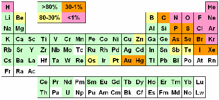

# Φασματομετρία Μαζών Επαγωγικά Συζευγμένου Πλάσματος

## Εισαγωγή

Η τεχνική αυτή μοιάζει με την τεχνική ICP-MS αλλά πρειλαμβάνει ιόντα, ούτε άτομα, ούτε μόρια.

>**Βαθμός Ιονισμού:**\
Ο βαθμός ιοντισμού στοιχέιου, είναι το κλάσμα της αρχικής ποσότητας του, που βρίσκονται ως ιόντα σε πλάσμα Ar\
$[\frac {M^+}{M^++M}]*100\%$\
>Στοιχεία με βαθμό ιοντισμού, λιγότερο του 1% δύσκολα αναλύονται με αυτή τη τεχνική.

>**Ατομική Μάζα:**\
Μετριεται σε (amu) και αναφέρεται στο άθροισμα πρωτονίων και νετρονίων στον πυρήνα.

>**Ισότονα:**\
Είναι πυρήνες (νουκλεόνια) με τον ίδιο αριθμό νετρονίων αλλά διαφορετικό αριθμό πρωτονίων (άρα και μάζας).

>**Ισότοπα:**\
Είναι νουκλεόνια με τον ίδιο αριθμό πρωτονίων (άρα το ίδιο στοιχέιο) και διαφορετικό αριθμό νετρονίων.

>**Ισοβαροί:**\
Νουκλεόνια με την ίδια μάζα, αλλά διαφορετικό αριθμό πρωτονίων και νετρονίων.

Οι μέθοδος εισαγωγής δείγματος στο ICP-MS είναι παρόμοιοι με αυτούς στην τεχνική ICP-MS

Μέθοδος|Τύπος Δείγματος
-------|------------
Πνευματική Εκνέφωση| Διαλύματα και εναιωρήματα
Υπερηχητική Εκνέφωση| Διαλύματα
Ηλεκτροθερμική Εξαέρωση|Στερεά, υγρά και δείγματα
Παραγωγή Υδριδίου| Διαλύματα λίγων όμως στοιχείων
Απευθείας εισαγγωγή| Στερεά, σκόνες και υγρά
Θερμική Αποσύνθεση με LASER| Στερεά και κράματα
Θερμική Αποσύνθεση με τόξο ή σπινθήρα|  Αγώγιμα στερεά
Ψεκασμός με Εκκένωση λάμψης| Αγώγιμα Στερεά
Χρωματογραφικές Τεχνικές| Αέρια (GC) και υγρά (LC)

Οι κυριότεροι πνευματικοί εκνεφωτές, οι θάλαμοι ψεκασμού, οι γενήτριες συχνοτήτων λειτουργούν όπως και στο ICP-OES. Ιδιαίτερο ενδιαφέρον έχει το σημείο διασύνδεσης των ICP και MS, γιατί γενικότερα ή σύνδεση LC και MS έχει υπάρξει δύσκολη και προβήματική.
Το σύστημα ICP βρίσκεται σε ατμοσφαιρική πίεση, ενώ το σύστημα MS βρίσκεται σε πολύ υψηλό κενό. Ο σωλήνας του πυρσού βρίσκεται προσαρτισμένος σε δύο ομόκεντρους κώνους. Ο πρώτος είναι ο *κώνος δειγματοληψίας* και είναι φτιαγμένος από Ni ή Pt. Το αέριο υφίσταται *διαστολή* καθώς μειώνεται η πιέση του προς το υψηλό κενό.
Ο δεύτερος κώνος ονομάζεται *αποκορυφωτής* και σκοπός του είναι κυρίως να απομακρύνει τα ανεπιθύμητα προϊόντα του ιοντισμού (όπως ουδέτερες απώλειες/ρίζες, ιόντα αντίθετου από το επιλεγμένο φορτίου κ.α.). Τα με ηλεκτρόνια απομακρύνονται από τη διαφορά δυναμικού που έχει ο κώνος. Είναι αρνητικά φορτισμένος και απωθεί τα ηλεκτρόνια, σταμετώντας τα από να μπουν στο σύστημα , ενώ προσελκύει τα θετικά φορτισμένα ιόντα. Στη περιοχή μεταξύ των δύο κώνων, υπάρχει ροή αδρανούς αερίου, που απομακρύνεται από μηχανική αντλία. Αυτή η αντλία παρασέρνει και απομακρύνει τα ουδέτερα μόρια, οπότε εν τέλη τα επιθημητά ιόντα σχεδόν αποκλειστικά εισέρχονται στο σύστημα. Υπάρχουν όμως και φωτόνια τα οποία πρέπει να απομακρυνθούν. Αυτό το πετυχαίνουμε με τους ιοντικού φακούς. Η πορεία εντός του οργάνου δεν είναι ευθεία, αλλά για να φτάσουν στον ανιχνευτή, τα ιόντα πρέπει να εκτραπούν από την ευθεία σε κάποια καθορισμένη τροχειά (*σύστημα εκτός άξονα*). Αυτό γίνεται με ηλεκτρομαγνητικες διατάξεις, που ονομάζονται ιοντικοί φακοί. Τα φωτόνια δεν εκτρέπονται από ηλεκτρομαγνητικά πεδία, οπότε δεν ακολουθούν τη σωστή πορεία και δεν φτάνουν στον ανιχνευτή, τα ιόντα όμως καθοδηγούνται. Αφού εισέλθουν στον σύστημα, τα ιόντα μειώνουν τη πίεση τους μέχρις το υψηλό κένο εντός του συστήματος. Αυτό το υψηλό κενό, δεν μπορούμε να το πετύχουμε με απλές μηχανικές αντλίες, αλλά με *τούρμπομοριακές αντλίες*.

>**Ιοντικοί Φακοί:**\
Υπάρχουν διάφοροι τύποι ιοντικών φακών. Εκτός από την προσέγγιση εκτροπής άξονα, υπάρχει και η τεχνολογία *σταμταήματος φωτονίων*. Εδώ υπάρχει εμπόδιο στο ευθύ μονοπάτι της δέσμης αλλά τα ιόντα της εκτρέπονται γύρω από το εμπόδιο και ξαναενώνονται πίσω από αυτό. Το φωτόνια δεν εκτρέπονται και πέφτουν πάνω στο εμπόδιο. Οι φακοί μπορεί να αποτελούντια από πολλούς επιμέρους φακούς (multicomponent lens), φακοί τετραπόλων απόκρουσεις ιόντων (κάμπτουν τη δέσμη ιόντων $90^ο$) ή καθρέπτες ιόντων.

## Αναλυτές Μαζών

### Διακριτική Ικανότητα

Η κυριότερη ποιοτική παράμετρος του αναλυτή μαζών είναι η ικανότητα του να διακρίνει λόγους $\frac mz$ που έχουν κοντινές τιμές. Για ορίσουμε ένα τέτοιο μέγεθως θα πρέπει να λάβουμε υπ' όψιν τον βαθμό επικάλυψης μεταξύ κοντινών κορυφών, και τη σχετική μεταξύ τους ένταση.
Ορίζουμε ως *διακριτική ισχύ ($\Delta m$)* την απόσταση, μονάδες μάζας δύο γειτονικών κορυφών. Αυτές θα πρέπει να έχουν περίππου ίση σχετική ένταση και να αλληλοπικαλύπτονται στο 10% του ύψους.
Αυτός ο ορισμός όμως είναι δυσχρηστος, οπότε πρακτικά θεωρούμε ως $\Delta m$ τι εύρος μια κορυφής στο μισό του ύψους της (*Full Width at Half Maximum, FWHM*).
Τότε διακριτή ικανότητα θα είναι η "σχετική εκδοχή" του άνω μεγέθους, την οποία ονομάζουμε *διακριτική ικανότητα* (*Resolution*):
$$
R=\frac{m}{\Delta m}
$$

>**Παρατήρηση:**\
Στη πραγματικότητα, ο ακριβής ορισμός του $\Delta m$ διαφέρει ανάλογα με τον αναλυτή μάζας. Ο άνω ορισμός της 10% επικάλυψης, αφορά το όργανα *μαγνητικού τομέα* που θα εξαιτάσουμε παρακάτω.

### Τετραπολικός Αναλυτής (Quadrupole)

Τα τετράπολα είναι από τους ποιό διαδεδομένους αναλυτές μαζών με σχετικά απλή λειτουργία και φθηνοί. Ένα τετράπολο αποτελείται από τέσερεις κυλίνδρους τοποθετημένους σε διάταξη τετραγώνων. Οι απέναντι ράβδοι έχουν πάντα το ίδιο φορτίο, και σε αυτά εφαρμώζεται ρεύμα με δύο συνηστώσες, συνεχείς τάσεις (DC) και υψίσυχνες (RF). 
Λέγεται και *φίλτρο μαζών* λόγο του τρόπου λειτουργίας τους. Καθώς τα ιόντα διέρχονται στην περιοχή ανάμεσα στις ράβδους, λόγο του μαγνητικού πεδίου, μόνο ένας λόγος $\frac mz$ διατηρεί σταθερή τροχεία. Οι υπόλοιποι λόγοι είναι ασταθείς και τελικά εκτρέπονται από τη διάταξη. Ο λόγος $\frac mz$ που έχει σταθερή τροχεία καθορίζεται από τις ηλεκτρικές παραμέτρους του τετραπόλου (δυναμική ενέργεια, τάση κλπ). Στη πραγματικότητα όταν λέμε "μια τιμή του λόγου" εννοούμε ένα στενό εύρος τιμών, ανάλογα με τη διακριτική ικανότητα του οργάνου (~1 amu).
Το απλό τετράπολο έχει τρείς λειτουργίες

* SIM (Single Ion Monitoring,ένας λόγος διέρχεται)
* RF-only (όλες οι μάζες διέρχονται)
* MIM (Multiple Ion Monitoring) - καταχραστικά, πολλαπλά $\frac mz$, διαδοχικά όμως, όχι ταυτόχρονα
* Full Scan - Όλα τα $\frac mz$ **διαδοχικά** όχι ταυτόχρονα

Συχνότερη είναι η διάταξη *τριπλού τετραπόλου (QqQ)*. Εδώ το μεσσαία τετράπολο είναι μόνιμα σε RF-only λειτουργία. Υπάρχουν οι εξείς δυνατότητες:

Q|q|Q|Περιγραφή
-----|------|-----|------
RF-only|RF-only| RF-only| Δεν έχει ιδιαίτερο ενδιαφέρονΛαμβάνουμε *συνολικό ρεύμα ιόντων (Total Ion Current, TIC)*
RF-only|RF-only|Full Scan| Επακριβώς όμοιο με το Full Scan ενός τετραπόλου
RF-only|RF-only|SΙΜ| Παρόμοιο με μονό τετράπολο
RF-only|RF-only|ΜΙΜ| Παρόμοιο με μονό τετράπολο
Full Scan|RF-only|RF-only|Παρόμοιο με μονό τετράπολο
SIM|RF-only|RF-only|Παρόμοιο με μονό τετράπολο
MIM|RF-only|RF-only|Παρόμοιο με μονό τετράπολο
Full Scan|RF-only|Full Scan|Για κάθε μητρικό ιόν, εξαιτάζουμε κάθε θυγατρικό. Δίνει τις ποιό πλούσιες πληροφορίες αλλά είναι χρονοβόρο (το δεύτερο τετράπολο σαρώνει όλα τα $\frac mz$ *για κάθε* $\frac mz$ του πρώτου). Προτιμάται όταν αναπτύσσουμε *βιβλιοθήκες αναλυτών*
Full Scan|RF-only|SIM|Εξαιτάσουμε ένα θυγατρικό *για κάθε* πιθανό πρόδρομο. Χρήσιμο αν διερευνούμε την προέλευση κάποιας παρεμπόδισης
Full Scan|RF-only|MIM|Ομοίως με άνω αλλά πολλαπλά θυγατρικά ιόντα. όπως και το άνω, σπανίως χρησημοποιείται
SIM|RF-only|Full Scan|Πλήρη σάρωση όλων των θυγατρικών ιόντων για επιλεγμένο πρόδρομο ιόν. Αν και σπανιώς χρησημοποιείται, μπορούμε να καταφύγουμε σε αυτό για να βρούμε όλα τα παράγωγα ιόντα κάποιου πρόδρομου. Αυτό μπορούμε να το κάνουμε, όταν διερευνούμε κάποια *ισοβαρική παρεμπόδιση* ή όταν αντί για τον πρόδρομο αναλύτη, ποσοτικοποιούμε μέσω κάποιου θυγατρικού
SIM|RF-only|SIM|Ένα επιλεγμένο θυγατρικό για ένα επιλεγμένο πρόδρομο. Είναι η συνηθέστερη περίπτωση ρουτίνας, μαζί με το αντίστοιχο MIM, όταν δεν υπάρχουν πολλαπλά θυγατρικά διαθέσημα.
SIM|RF-only|MIM|Πολλαπλά θυγατρικά για ένα πρόδρομο. Είναι η συνηθέστερη περίπτωση ρουτίνας, όταν γνωρίζουμε την θραυσματοποίηση των ουσιών ενδιαδέροντος
MIM|RF-only|Full Scan|Δεν έχει ιδιαίτερο ενδιαφέρον
MIM|RF-only|SIM|Δεν έχει ιδιαίτερο ενδιαφέρον, εκτός αν διευρευνούμε την πιθανή προέλευση κάποιας παρεμπόδισης
MIM|RF-only|MIM|Δεν έχει ιδιαίτερο ενδιαφέρον αν υπάρχουν περισσότερο του ενός πρόδρομα για ένα θυγατρικό. Μπορούμε να θεωρήσουμε τυπικά, ότι είναι η συνηθέστερη περίπτωση για τη συνολική πορεία (πολλοί αναλύτες, πολλά θυγατρικά)

>**Παρατήρηση:**\
Στη πραγματικότητα και το ενδιάμεσο τετράπολο έχει υπο-λειτουργίες, CAD,CID και χωρίς αέριο συγκρούσεων. Ωστόσο αυτή η λειτουργία είναι ανεξάρτητη αυτής των άλλων δύο τετραπόλων και δε οι αντίστοιχοι συνδιασμοί δεν έχουν πρακτικό ενδιαφέρον. Τη περίπτωση αερίου συκρούσεων θα την εξαιτάσουμε στη πορεία

### Αναλυτές Μαγντητικού Τομέα (Magnetic Sector)

Ο αναλυτής μαζών μαγνητικού τομέα ήταν ο πρώτος που χρησημοποιήθηκε στη φασματομετρία μαζών. Είναι κατά βάση μία διάταξη με δύο μεταλλικές πλάκες που δημιουργούν ηλεκρομαγνητικό πεδίο μεταξύ του. Αυτό το πεδίο εκτρέπει τα ιόντα (*δύναμη Lorentz*) και η ακριβής γωνία εκτροπής εξαρτάται από τον λόγο $\frac mz$. Στο σημείο εξόδου από τον αναλυτή, υπάρχει ένα πέτασμα με μικρή σχισμή εξόδου, οπότε, ανάλογα με τη ένταση του πεδίου μόνο ένας λόγος $\frac mz$ εστιάζεται διαμέσου της σχισμής και εξέρχεται προς τον ανιχνευτή. Ακριβέστερα:
$$
\frac mz = \frac{B^2r^2e}{2V}
$$
Υπάρχουν διάφορες παραλλαγές της βασικής διάταξης όπως, *μαγνητικός* και *ηλεκτροστατικός* αναλυτής αλλά και *απλής* ($R\le 2000$) και *διπλής εστίασης* ($R\ge 100\;000$). Στα όργανα διπλής εστίασης συνηθέστερη είναι η γεωμετρία Nier-Johnson (ηλεκτροστατικός και μαγνητικός).

>**Παρατήρηση:**\
Ανάλογα με την τεχνολογία τους τα όργανα θα έχουν είτε σταθερό $\Delta m$ σε όλο το εύρος μαζών τους και μεταβαλλόμενο $R$, είτε σταθερό $R$ και μεταβαλλόμενο $\Delta m$. Τα μεγέθοι $R$ και $\Delta m$ είναι αντιστρόφος ανάλογα.

## Μεταλλάκτες

Στην φασματομετρία μαζών, ως μεταλλάκτες χρησημοποιούνται διατάξει που ονομάζονται *ηλεκτρονιοπολλαπλασιαστές*, αποτελούνται από *δυνόδους* και λειτουργούς ακριβώς όπως και οι *φωτοπολλαπλασιαστές (PMT's)* αλλά με ιόντα αντί φωτονίων. Δηλαδή είναι διατάξεις με μια επιφάνεια επικεκαλυμένη από ειδικό υλικό που έχει την εξής ιδιότητα: Όταν προσπίπτει σε αυτές φορτισμένο σωματίδιο, εκλυονται ηλεκτρόνια. Κάθε δύνοδος βρίσκεται σε προοδευτικά υψηλότερο δυναμικό σε σχέση με τη προηγούμενη, οπότε τα ηλεκτρόνια επιταχύνονται και προσκρουουν σε αυτή. Όταν προσκρούουν στη δύνονο ελευθερώνονται περισσότερα ηλεκτρόνια απ' όσο προσέκρουσαν. Συνολικά δηλαδή δημιουργείται ένα *καταρράκτης ηλεκτρονίων*. Έχουμε τη δυνατότητα να λάβουμε σήμα από μια "προγενέστερη" περιοχή του σωλήνα με μικρή ενίχυση για αναλύτες μεγάλης συγκέντρωσης, ανώ για αυτούς σε μικρή συγκέντρωση λαμβάνουμε σήμα από το τέλος του σωλήνα με ισχυρή ενίσχυση. Επιπλέον, η τάση των δυνόδων βρίσκεται στον έλεγχο μας και μπορούμε να την αυξομειώσουμε, ανάλογα με την ενίσχυση που θέλουμε.

## Παρεμποδίσεις στην ICP-MS

Στην ISC-MS δεν υπάρχουν χημικές παρεμποδίσεις γενικά. Όλες οι παρεμποδίσεις είναι φασματικές-*ισοβαρικές* ή φυσικές που αφορούν κυρίως το σύστημα εισαγωγής δείγματος. Οι φυσικές παρεμποδίσεις σχετίζονται με την διαδικασία της εκνέφωσης και δεν έχουν σχέση με το κομμάτι το φασματομετρίας. Επομένως ισχύει για αυτές ότι ακριβώς είπαμε στο κομμάτι του ICP-OES.

### Φασματικές Παρεμποδίσεις

Οι φασματικές παρεμποδίσεις έιναι ισοβαρικές παρεμποδίσεις, δηλαδή εμφάνιση πολλαπλών ιόντων μια ίδιο $\frac mz$, το οποίο δεν μπορεί να διακρίνει το όργανο. Οι απλούστερες ισοβαρικές παρεμποδίσεις είναι τύπου "άτομο σε άτομο", παραδείγματος χάρην 
$^{40}Ar^+$ στο $^{40}Ca^+$ ή  $^{82}Kr^+$ στο $^{82}Se^+$. Άλλες φορές έχουμε παρεμποδίσεις πολυατομικών ιόντων, πχ 
$^{40}Ar^{16}O^+$ στο $^{56}Fe^{+}$, ή παρεμποδίσεις οξειδίων και υδροξειδίων ($^{40}Ca^{16}O^{+}$ στο $^{56}Fe^+$) ή παρεμποδίσεις από διφορτισμένα ιόντα ($^{138}Ba^+$ στο $^{69}Ga^+$ ).

>**Κοινές Ισοβαρικές Παρεμποδίσεις:**
>Μάζα|Πολυατομικό Ιόν| Αναλύτης
>-------|------|------
>51|$ClO^+$|$V$
>52|$ArC^+$,$ArO^+$|$Cr$
>53|$ClO^+$|$Cr$
>54|$ArN^+$|$Fe,Cr$
>55|$ArNH^+$|$Mn$
>56|$ArO^+$|$Fe$
>57|$ArOH^+$|$Fe$
>64|$SO_2^+$|$Zn$
>66|$SO_2^+$|$Zn$
>67|$SO_2H^+$|$Zn$
>75|$ArCl^+$|$As$
>80|$Ar_2^+$|$Se$

Για τα δε BEC και LOD ισχύει ότι είπαμε και στο ICP-OES, δηλαδή:
$$
LOD=\frac{3\;SD_{blank}\;C_{STD}}{I_{STD}-\bar{I}_{blank} }
$$
$$
BEC=\frac{I_{blank}\;C_{STD}}{I_{STD}-\bar{I}_{blank} }
$$
Υπάρχουν διάφοροι συνοπτικοί πίνακες κοινών ισοβαρικών παρεμποδίσεων και αντιμετόπισης τους. Παραλήπονται εδώ,

>**Ψυχρό Πλάσμα:**\
Το *μη-θερμικό πλάσμα* ή *ψυχρό πλάσμα* ή *πλάσμα μη-ισορροπ΄΄ιας* είναι μια εναλλακτική μορφή πλάσματος στην οποία το πλάσμα δεν βρίσκεται σε θερμοδυναμική ισορροπία, διότη η θερμοκρασία των ηλεκτρονίων είναι πολύ μεγαλύτερη αυτής των βαρύτερων ιόντων και ριζών. Η κατανομή ταχυτήτων Maxwell-Boltzmann τους είναι πολύ διαφορετική. Σε τέτοιο πυρσό δεν ιντίζονται στοιχεία υψηλής ενέργειας ιοντισμού, οι επιμολύνσεις από τον κώνο δειγματοληψίας είναι μειωμένες όπως και ισοβαρικές παρεμποδίσεις Ar (άλλες όμως αυξάνονται). Είναι γενικά περισσότερο επιρρεπής σε φαινόμενα επίδρασης μήτρας και έχουν μειωμένη ευαισθησί σε ορισμένες παριπτώσεις, παρότι ο λόγος $\frac SN$ είναι γενικά υψηλότερος και τα LOD's χαμηλότερα.

## Κυψελίδες Συγκρούσεων και Αντιδράσεων

Οι τεχνολογίες αντιδράσεων και συγκρούσεων χρησημοποιούνται για να αντιμετοπιστεί το πρόβλημα τον ισοβαρικών παρεμποδίσεων. Είναι κυψελίδες με τετράπολα (*dynamic reaction cells*) που περιέχουν κάποιο μετρίως δραστικό αέριο όπως $H_2$, $NH_3$, $CH_4$ ή $He$. Κατά τη διεύλευση τους από τη κυψελίδα, ιόντα αναλύτη και περισσότερο παρεμποδιστή συγκρούονται με τα μόρια τον αερίου και αντιδρούν με αυτά αίροντας την ισοβαρική παρεμόδιση. Στις κυψελίδες συγκρούσεων η κατάσταση είναι παρόμοια αλλά αντί να αντιδρούν θραυσματοποιούνται ή μεταβάλλεται η κινητική τους ενέργεια. Στη πρώτη περίπτωση χρησημοποιούμε δραστηκά αέρια, όπως $NH_3$, $CH_4$, ενώ στη δεύτερη λιγότερο δραστηκά, οπώς $He$ και $H_2$.
Και στις δύο περιπτώσεις αποκόπτωνται αποτελεσματικότερα τα μόρια παρεμποδιστή και λιγότερα αυτά του αναλύτη, ενώ στη δεύτερη ο παρεμποδιστής έχει αισθητά μειωμένη κινητική ενέργεια. Εισάγουμε τότε έναν *ενεργειακό φραγμό δυναμικού* και τα αποκόπτουμε.
Μερικές φορές χρησημοποιούμε *μικτές κυψελίδες αντιδράσεων* γιατί το αποτελσματικότερο αέριο για την αντιμετόπηση μια παρεμπόδισης εξαρτάται από την κινητική της αντίδρασης, οπότε δύσκολα ένα αέριο θα δώσει την καλύτερη απόδοση για συνδιασμό αναλύτη παρεμποδιστή. Τότε μπορούμε να χρησημοποιήσουμε ένα μίγμα αδρανούς αερίου με ένα δραστηκό, συνδιάζοντας την προσέγγισης αντιδράσεων με αυτής κινητικών ενεργειών. Εναλλακτικά εναλλάσουμε τα δύο αέρια ταχύτατα.

## Ανλυτική Μεθοδολογία

Πρώτα επιλέγουμε το $\frac mz$ λειτουγίας λαμβάνονται υπ' όψιν την ισοβαρική αναλογία, τυχόν γνωστές ισοβαρικές παρεμποδίσεις, τη αναμενόμενη περιοχή συγκεντρώσεων στο δείγμα και τον χρόνο της μέτρησης. Στη συνέχει κάνουμε έλεγχο απόδοσης και βαθμονόμηση του αναλυτή μαζών (το κάνουμε περίππου μία φορά τον μήνα). Ελέγχουμε την καταλληλότητα του οργάνου και του ανιχνευτή και τέλος βαθμονομούμε το όργανο στοχεύοντας για μια μεγάλη γραμμική περιοχή ~7 τάξεις μεγέθους. Τέλος βελτιστοποιούμε της συνθήκες λειτουργίας του οργάνου.

Μπορούμε να κάνουμε πολυστοιχειακή ποσοτική ανάλυση με ταυτόχρονο προσδιορισμό πολλών στοιχέιων (73, πάνω από το 75% του ΠΠ). Η τεχνική είναι οικονομικά ασύμφωρη για ανάλυση ένος μόνο στοιχείου (εκτός αν αναλύουμε σπάνιες γαιες ή κάνουμε ισοτοπική ανάλυση). Αν και έχουμε μεγάλυ ταχύτητα ανάλυσης συνολικά, δυνατότητα **ισοτοποικής ανάλυσης**, καθόλου χημικές παρεμποδίσεις, τα χαμηλότερα όρια ανίχνευσης και τη μεγαλύτερη δυναμική περιοχή, η τεχνική είναι πολύ υψηλού κόστους εκτός αν έκτελούμε πολλούς προσδιορισμούς.
