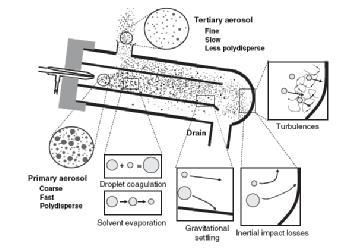
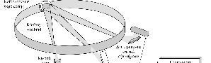

# Φασματοσκοπία Εκπομπής Ορατού Με Επαγωγικά Συζευγμένο Πλάσμα (ICP-OES)

## Εισαγωγή

Έχει δύο ονόματα, φασματομετρία *ατομικής εκπομπής* ή *οπτικής εκπομπής*. Σε αυτή τη τεχνική πυρσός επαγωγικά σεζευγμένου πλάσμα προκαλεί την ατομοποίηση αλλά και τη διέγερση του ατόμων μέσω των πολύ υψηλά θερμοκρασιών του πυρσού.

## Πυρσός Πλάσματος

Το *πλάσμα* θεωρείται από κάποιους ως η τέταρτη κατάσταση της ύλης και είναι ένα αεριώδες και ηλεκτρικά αγώγιμο μίγμα κατιόντων και ηλεκτρονίων. Σχεδών όλοι οι πυρσοί βασίζονται σε αέριο αργό ($Ar$).
$$
Ar+e^-\rightarrow Ar^++2e^-\\
Ar^++M\rightarrow Ar+M^{*+}\\
M^{*+}\rightarrow M^++hv
$$
Κάθε πυρσός αποτελείται από τρεις ροές αερίου που εξυπηρετούν διαφορετικούς σκοπούς. Η ροή *αερίου εκνέφωσης* παρασέρνει και μεταφέρει το δείγμα σε μορφή *αερολύματος* κατά μήκος του πυρσού. Μια δεύτερη *βοηθητική ροή* (ή *ενδιάμεσο αέριο*) ρέει εντός μαγνητικού πεδίου και ταυτόχρονα υπό τη επιρροή επαγωγικού πηνίου που λειτουργεί στη περιοχή RF. Υπό την επίδραση του πηνίου το άεριο *ιοντίζεται* παράγωντας πλάσμα και περίσσεια κατιόντων αργού. Τα κατιώντα αργού αυτά προκαλούν τον ιοντισμό του αναλύτη στο δείγμα, όμως τα κατιώντα που παράγουν, βρίσκονται σε *διεγερμένη* κατάσταση, οπότε σύντομα ξεκινούν να εκπέμπουν ακτινοβολία. Τέλος υπάρχει και μια τρίτη ροή που δρα προστατευτικά στο πλάσμα.

\
\
\
\

Το συνοπτικό προφίλ είναι:

1. Μεταφορά αερολύματος με αέριο εκνέφωσης
2. Επαγωγικό πηνίο
3. Μαγνητικό πεδίο
4. Βοηθητική ροή/ ενδιάμεσο αέριο
5. Εφαπτομενική βοηθητική ροή

Στο πλάσμα γίνονται τέσσερεις διαδικασίες:

* Αποδιαλύτωση & σχηματισμός αερολύματος
* Ατομοποίηση
* Διέγερση
* Ιοντισμός

Η φλόγα του πυρσού αποτελείται από τρεις ζώνες, μία *αρχική ζώνη εκπομπής* , την ενδιάμεση *αναλυτική ζώνη* και τέλος το *λοφίο* ή *ουρά*. Από αυτές μόνο η ενδιάμεση ζώνη είναι αναλυτικά χρήσιμη, γιατί στην πρώτη δεν έχει ολοκληρωθεί η διάσπαση των οξειδίων και στην ουρά η θερμοκρασία είναι αρκετά χαμηλή ώστε να επασχηματίζονται οξείδια. Για παράδειγμα:

\
*Μπλε αναλυτικά χρήσιμη ζώνη, κάτω κόκκινη αρχική ζωνη εκπομπής, πάνω κόκκινη ουρά*\
\
*Ουρά ή  λοφίο*\
\
\
\

Οι γραμμές εκπομπής μπορεί να είναι *ατομικές*, *ιοντικές μονοσθενών* ή *ιοντικές διασθενών ιόντων*.

Αν και η τριπλή ροή αερίου οδηγεί σε υψηλή κατανάλωση και τελικά υψηλό κόστος είναι αποτελεσματικότερη φλόγα από τις κοινές. Η θερμοκρασία είναι τυπικά 2-3 φορές μεγαλύτερη, δεν υπάρχουν καθόλου χημικές παρεμποδίσεις γιατί το περιβάλλον είναι χημικώς αδρανές, ούτε παρεμποδίσεις ιοντισμού γιατί υπάρχει μεγάλη περίσσεια ηλεκτρονίων από τον ιοντισμό του $Ar$. Επίσης δεν εμφνανίζεται καθόλου αυτοαπορρόφηση κάτι που οδηγεί σε μεγάλες γραμμικές περιοχές.

*Βασικά τμήματα οργάνου ICP-OES*

>**Μέθοδοι Εισαγωγής Δείγματος AAS:**
>Μέθοδος|Τύπος Δείγματος
>-------|-----------
>Πνευματική Εκνέφωση|Διάλυμα ή εναιώρημα
>Υπερηχητική Εκνέφωση|Διάλυμα
>Ηλεκτροθερμική εξαέρωση|Στερεό, υγρό ή διάλυμα
>Παραγωγή υδριδίου|Διάλυμα (για λίγα στοιχεία μόνο)
>Απευθείας Εισαγωγή|Στερεά και σκόνες
>Θερμική αποσύνθεση με laser|Στερεά και κράμματα
>Θερμική αποσύνθεση σε τόξο ή με σπινθήρα|Αγώγιμα στερεά
>Ψεκασμός με εκκένωση λάμψης|Αγώγιμα στερεά

## Εισαγωγή Δείγματος

Στην ICP-OES μια *περισταλτική αντλία* ρουφάει το δείγμα από κάποιο δοχείο και το διοχετεύει στο σύστημα, αρχικά σε κάποιον *εκνεφωτή*.\
\
*Περισταλτική αντλία*\
Οι πρώτοι εκνεφωτές που αναπτύχθηκαν ήταν *πνευματικοί εκνεφωτές* που ακόμη χρησημοποιούνται συχνά.

### Πνευματικοί Εκνεφωτές

Οι τέσσερεις κυριότερες τεχνολογίες πνευματικών εκνεφωτών είναι *συγκεντρωτικοί σωλήνες*,*εκνεφωτές διασταυρούμενης ροής*,*πορώδεις δίσκοι* και *εκνεφωτές Babington*.
Στον *συγκεντρωτικό σωλήνα* το δείγμα ρέει διαμέσου σωλήνα και σε αυτό εισέρχεται κάθετα μια ροή αερίου υψηλής πίεσης, προκαλώντας εκνέφωση. Αποτελείται από δύο, ομόκεντρους σωλήνες, έναν εσωτερικό τριχοειδοί. Στον *εκνεφωτή διασταυτούμενης ροής* η ροή δείγματος και αερίου συναντιούνται κάθετα στην οπή εξόδου όμως, όχι μέσα στον σωλήνα. Στον *εκνεφωτή πορώδη δίσκου* υπάρχει ένας δίσκος στον πάτο ενός σωλήνα (σαν δοκιμαστικό σωλήνας) σε σχήμα πυραμίδας. Από το πίσω μέρος του δίσκου διοχετεύεται αέριο υψηλής πίεσης, ενώ το δείγμα οδηγείται να "στάζει" πάνω στο δίσκο υπό κάποια γωνία. Κάτω από τον δίσκο , παράλληλα με τον ροή δείγματος υπάρχει ένας σωλήνας που φεύγουν το απόβλητα, δηλαδή δείγμα που δεν έγινε αερόλυμα. Ο *εκνεφωτής Babington* έχει σχήμα σφαίρας ενσωματομένης σε κυλινδιρκό σωλήνα και έχει μια οπή κάθετα στον άξονα του σωλήνα. Ακριβώς πάνω από τον δίσκο ρέει το διάλυμα, το οποίο απλώνεται στη σφαίρα μέχρι που φτάνει στη οπή. Εκεί συναντιέται με τη ροή αερίου υψηλής πίεσης που έρχεται από μέσα από τον σωλήνα.

\
*Πνευματικοί εκνεφωτές*

Υπάρχουν και άλλοι ποιό εξειδικευμένοι εκνεφωτές, όπως:

* Εκνεφωτές υπερήχων
* Παραγωγής Υδριδίων (HG)
  
Ειδικά για στερεά δείγματα, υπάρχουν ακόμη:

* Ηλεκτροθερμικοί εξαερωτές (ETV)
* Εκνεφωτές εξαέρωσης με laser (laser abresion, LA)

Οι εκνεφωτές διασταυρούμενης ροής είναι γενικά ανθεκτική σε TDS, οι διασταυρούμενης ροής είναι ανθεκτικοί σε διαλυτά και αδιάλυτα στερεά και γενικότερα, αλλά δίνουν μεγαλύτερα σωματίδια και έχουν χαμηλότερη ευαισθησία. Επιλόγονται κυρίως γιατί είναι ανθεκτικοί σε HF. O babington είναι ιδανικός για διάφορους διαλύτες και αιωρούμενα στερεά και είναι επίσης ανθεκτικός σε HF.
Η λειτουργία του *εκνεφωτή υπερήχων* βασίζεται στον φαινόμενο του *πιέζοηλεκτρισμού*. Το υγρό δείγμα περνά από την επιφάνεια κρυστάλλου στον οποίοι εφαρμώζεται σε ταχεία εναλλασώμενη τάση. Η εναλλαγή της τάσης κάνει τον κρύσταλλο να πάλλεται, οπότε το δείγμα εκνεφώνεται. Οι ατμοί του διαλύτη απομακρύνονται με θέρμανση και ψυκτήρα.

>**Πιεζοηλεκτρισμός:**\
Ορισμένα κρυσταλλικά στερεά εμφανίζουν την εξής ιδιότητα. Όταν παραμορφωθούν με κάποια μηχανική πίεση, εμφανίζουν, διαφορά δυναμικού στα άκρα τους. Αυτό το φαινόμενο ονομάζεται *πιεζοηλεκτρισμός* και τον εκμεταλευόμαστε αντίστροφα, δηλαδή δηλαδή εφαρμώζουμε εναλλασώμενη τάση στον κρύσταλλο, οπότε παραμορφώνεται (επειδή είναι εναλλασόμενη πάλλεται).

## Θάλαμος Εκνέφωσης

Κατά το ψεκασμό, δημιουργούνται σταγονίδια με διάφορες διαμέτρους. Τα μεγαλύτερα τείνουν να αποσταθεροποιήσουν τη φλόγα του πυρσού, γι αυτό και θέλουμε να τα απομακρύνουμε και το αερόλυμα μας να έχει γενικά σταγονίδια μικρής διαμέτρου (<10μm). Αυτο το πετυχαίνουμε με τον *θάλαμο ψεκασμού*. Υπάρχουν τρεις κύριες τεχνολογίες, οι *τύπου Scott μονή* και *διπλής κατεύθυνσης* και οι *cyclonic*.

\
*Cyclonic*\
\
*Τύπου Scott μονής κατεύθυνσης με impact bead*\
\
*Διπλή κατεύθυνσης*

Τεχνολογία|Πλεονεκτήματα|Περιορισμοί
-----------|-------------|-------
Cyclonic|Μικρή απόλεια αερολυματος, αποτελεσματική μείωση μεγάλων σταγονιδίων (>20μm), ποικιλία σχεδιασμών και όγκων, μικρός νεκρός όγκος, μικροί χρόνοι έκπλυσης, ελάχιστα φαινόμενα μνήμης| Έντονη επίδραση η θέση του ρυγχους, συχνά μεγαλύτερος θόρυβος στο σήμα
Single Pass Scott|Μικρότερα φαινόμενα μνήμης, υψηλή ευαισθησία, εύκολο συνδιασμός με impact bead|Κακή επιλογή σωματιδίων, με πολλά μεγάλα να διέρχονται. Αυτό απαιτεί ιδιαίτερα ανθεκτικό plasma, δηλαδή υψηλή ένταση RF
Double Pass Scott|Αποτελεσματική απομάκρυνση μεγάλων σταγονιδίων|Μεγάλος νεκρός όγκος, αναποτελεσματικος έλεγος θερμοκρασίας, μεγάλες απώλειες αερολύματος, ισχυρά φαινόμενα μνήμης. Η λειτουργία του εξαρτάται από το αν η διάταξη είναι οριζόντια ή κάθετη. Γενικά είναι ξεπερασμένος σχεδιασμός

## Γεννήτρια Ραδιοσυχνοτήτων

Η γεννήτρια RF αποτελείται από μια διάταξη ταλαντωτών που δημιουργούν εναλλασόμενο ρεύμα σε κάποια προκαθορισμένη συχνότητα - συνήθως 27,12 ή 40,68 MHz. Προτιμούμε συνήθως τη δεύτερη, γιατί δίνει πλάσμα μεγάλης σταθερότητας, ειδικά παρουσία οργανικών διαλυτών. Επιπλέον δίνει μεγαλύτερες γραμμικές περιοχές, λιγότερες παράσιτες ακτινοβολίες, και λιγότερες παρεμποδίσεις. Υπάρχουν *γεννήτριες ελεύθερης διαδρομής* και *γεννήτριες ελεγχόμενες από κρυστάλλους*.
Τα χάλκινο σπείραμα έχει μέγεθος που καθορίζει αυτό του πλάσματος και πρέπει να ψύχεται.

## Διεύθυνση Παρατήρησης

Μπορούμε να παρατηρήσουμε τον πυρσό με δύο τρόπους, είτε κάθετα στον πυρσό (*ακτινική παρατήρηση*), είτε από πάνω (*αξονική παρατήρηση*). Στη τελευταία περίπτωση το φασματόμετρο εκτίθεται στη υψηλή θερμοκρασία αλλά και σε θερμική ακτινοβολία. Για το προστατεύσουμε, εισάγουμε μια ακόμη ροή αργου, που το ονομάζουμε *αέριο διάτμησης*. Σκοπός του είναι να "κόβει" την ουρά του πλάσματος, πρστατεύοντας το όργανο. Μερικά όργανα λαμβάνουν ακτινοβολίες και από τις δύο παρατηρήσεις (*dual view*).

Παρατήρηση|Χαρακτηριστηκά
-------|-------------
Ακτινική Παρατήρηση|Μπορούμε να συλλέξουμε δεδομένα από ολόκληρη την αναλυτική περιοχή, η δυναμική περιοχή είναι μεγαλύτερη, και η διάταξη είναι ανθεκτική σε διαλυτά στερεά. Οι παρεμποδίσεις είναι μικρότερες λόγο μικρότερης επίδρασης μήτρας (οργανικά) λόγο λιγότερη παράσιτης ακτινοβολίας. Η κατανάλωση αργού είναι μικρότερη και ο πυρσός έχει μαγαλύτερο χρόνο ζωής. Τα LOD's είναι τυπικά
Αξονική Παρατήρηση| Τα LOD's είναι χαμηλότερα αλλά μειώνεται ο χρόνος ζωής του πυρσού, και η αντοχή του σε διαλυτά στερεά. Εμφανίζονται ισχυρές παρεμποδίσεις, ιδαίτερα όταν υπάρχουν στοιχεία που ιοντίζονται εύκολα
Διπλή Παρατήρηση| Δίνει τα χαμηλότερα LOD's, την μεγαλύτερη δυναμική περιοχή, και είναι ανθεκτικό σε διαλυτά στερεά. Ομως οι επιδράσεις της μήτρας είναι έντονες και ο χρόνος ζωής του πυρσού μειωμένος

>**Χαρακτηριστικά Ποιότητας:**\
Γενικά προτιμόνται τα όργανα υψηλής διακριτική ικανότητας 167(nm) Al - 825(nm) (Cs). Η υψηλή διακριτική ικανότητα απαιτεί φράγματα περίθλασης με πολλές χαραγές ανά mm, μικρές σχισμές εισόδου και εξόδου, μεγάλο εστιακό μήκος, και υψηλή τάξη διασποράς. Κατα την αγορά δοκιμάζουμε τον διαχωρισμό
>* Cu,P @ 2316.6 (nm) $\approx$ 20 (pm)
>* Cd,As @ 228.8 (nm) $\approx$ 10 (pm)
>* Tl doublet @ 190.86 (nm) $\approx$ 8 (pm)

Τα όργανα ICP-OES μπορεί να είναι διαδοχικής σάρωσης είτε με συνεχή είτε με αλματικό τρόπο, παράλληλα πολυδιαύλικα, ή με μετασχηματισμό Fourier. Μπορεί να έχουν μονοχρωμάτωρα συμβατικό ή κλιμακωτο, τύπου echelle ή να έχουν πολυχρωμάτωρες. Οι ανιχνευτές μπορεί να είνια φωτοπολλαπλασιαστές ή στερεάς κατάστασης (SSD's).

\
\
*Κλασσικός μονοχρωμάτωρας echelle*\
\
\
*Φράγμα περίθαλσης, τύπου echelle*\
\
\
\
*Πολυδιαυλικό όργανο Paschen-Runge . Το φράγμα και οι ανιχνευτές είναι στο κύκλο του rowland*

## Μεταλλάκτες

Συνήθως χρησημοποιούνται *ανιχνευτές στερεάς κατάστασης (SSD's)* και συγκεκριμένα, *ανιχνευτές μεταφοράς φορτίου (CTD's)*. Είναι ημιαγωγοί που αποτελούνται από σειρές μεταλλακτών-εικονοστοιχείων (pixels). Καθένα από αυτά τα στοιχεία συσσωρεύει φορτίο όταν εκτεθούν σε ακτινοβολία. Αφού εκτεθούν σε ακτινοβολία, καταχωρούν την εγγραφή τους - κατά τη διάρκεια της καταχώρησης, συνήθως δεν ακτίθενται σε ακτινοβολία. Βρίσκονται πάντα υπό ψύξη - κάτω από τους $0\;^oC$. Υπάρχουν δύο τύποι, μεταλλάκτες *εκχυσης φορτίου (CID's)* και *σύζευξης φορ΄τιου (CCD's)*.
Οι μεταλλάκτες έγχυσης φορτίου είναι n-ντοπαρισμένοι αγωγοί πυριτίου. Το dopping οδηγεί σε παρουσία θετικών φορτίων ("οπών"). Αυτό το θετικό φορτίο συλλέγεται σε κάθε pixel υπό φρέαρ δυναμικού. Η διαδικασία είναι σταδιακή και γίνεται χωρίς να χαθεί το είδη υπάρχον φορτίο (*λειτουργία μη καταστροφικής ανάγνωσης*). Αυτός είναι και το κύριο πλεονέκτημα τους έναντι των CCD's, δηλαδή το οτι μπορούν να γίνονται διαδοχικές μετρήσεις χωρίς να διοκοπεί η ανάγνωση. Επιπλέον δεν υπάρχει κορεσμός και υπερχείλιση (*blooming*). Επιτρέπουν την ταυτόχρονη μέτρηση γειτονικών γραμμών με υψηλή ένταση χωρίς διαστοιχειακή παρεμπόδιση. Δίνουν μεγάλη γραμμική περιοχή ,καλύτερον λόγο και χαμηλότερα LOD's. Επιπλέον μειώνουν τον *readout θόρυβο* λόγο άθροισης σημάτων.

Οι μεταλλάκτες σύζευξης φορτίου είναι *p* ντοπαρισμένοι ημιαγωγοί πυριτίου και αντίθετα με τους CID's χαρακτηρίζονται από περίσσεια αρνητικών φορτίων - ηλεκτρονίων, τα οποία συλλέγουν με έκθεση σε ακτινοβολία. Οι ανιχνευτές αυτοί, συλλέγουν φορτίο για κάποιο προκαθωρισμένο χρόνο, ανά pixel σε όλη τη σειρά. Αφού ολοκληρωθεί η συλλογή το φορτίο προωθείται - το pixel όμως αδειάζει. Είναι ευαίσθητοι ανιχνευτές σε χαμηλά μήκοι κύματος αλλά έχουν καταστροφική ανάγνωση, και με κορεσμό μπορεί να υπερχειλίσουν και το φορτίο τους να φτάσει σε γειτονικά pixels. Οι μετρίσεις είναι αργές, η δυναμική περιοχή περιορισμένη και ο λόγος $\frac SN$ μειωμένος. Υπάρχει και ο *ανιχνευτής σύζεξης φορτίου κατά τμήματα*.
Επειδη και οι δύο αποτελούνται από pixels καθένα από τα οποία μπορεί να κάνει ανεξάρτητες μετρήσεις, με κατάλληλο διαχωρισμό μπορούμε να μετρήσουμε πολλά μήκοι κύματος παράλληλα. Αν ο ανιχνευτής μπορεί να "χωρέσει" όλα τα διασπαρμένα μήκοι κύματος τότε σχηματίζουμε το *εσελόγραμμα*.