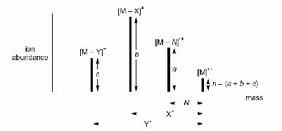
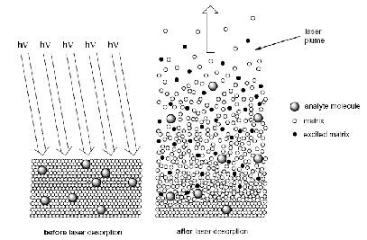
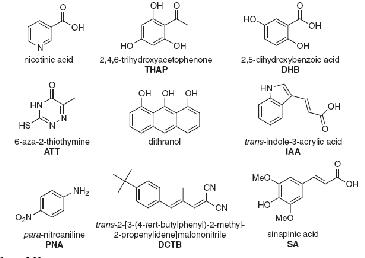
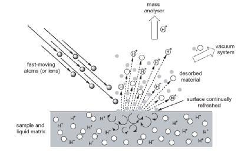
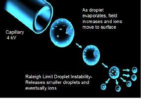
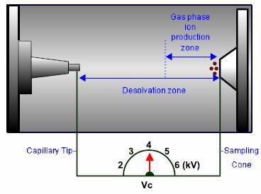
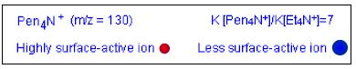
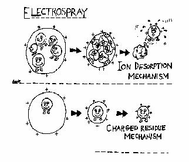
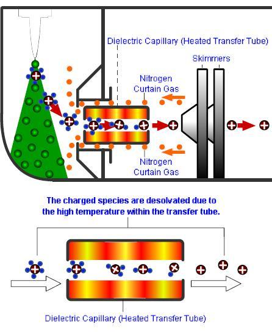
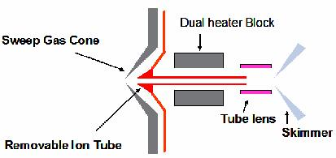

# Υγροχρωματογραφία και Φασματομετρία

## Εισαγωγή

Σχετικά με το θέμα το σύζευξης υγροχρωματογραφίας και φασματομετρίας μαζών, μεγαλύτερη σημασία για τη σύζευξη έχει η επιλογή της *πηγής ιοντισμού* γι αυτό και θα εξαιτάσουμε σε βάθος αυτό το θέμα.
Υπάρχουν πάρα πολλές τεχνολογίες για πηγές ιοντισμού, κάποιες είναι πηγές *αέριας φάσης* και άλλες *πηγές εκρρόφησης*. Στις πηγές αέρια φάσης το δείγμα πρώτα εξαερώνεται και μετά ιοντίζεται. Τέτοιες είναι οι πηγές *πρόσκρουσης ηλεκτρονίων (EI)* και οι πηγή *χημικού ιοντισμού (CI)*. Στις πηγές εκρόφησης το δείγμα είναι αρχικά σε υγρή ή στερεά κατάσταση και μετατρέπεται σε αεριώδη ιόντα. Τέτοιες είναι οι τεχνολογίες *βομβαρδισμού ατόμων μεγάλης ταχύτητας (FAB)*, *εκρόφησης υποβοηθούμενης από υλικό μήτρας (MALDI)*, και *Ηλεκτροψεκασμού (ESI)*.

## Πηγές Ιοντισμού

### Πηγές Αέριας Φάσης

#### Πρόσκρουσης Ηλεκτρονίων(EI)

Ήταν η πρώτη πηγή που χρησιμοποιήθηκε και παραμένει σημαντική στις τεχνολογίες MS. Ένα νήμα $W$ ή $Re$ θερμαίνεται με ρεύμα οπόται εκλύει ηλεκτρόνια. Αυτά επιταχύνονται με μαγνητικό πεδίο υπό σταθερά τάση ($70\;V$) ενώ τα ηλεκτρόνια που εκτρέπονται από τη κάθετη πορεία, συγκεντρώνονται από πεδίο σε σπειροειδή τροχειά. Τότε έχουμε μια στενή δέσμη ηλεκτρονίων, η οποία προσκρούει στα μόρια του αναλύτη και τα ιοντίζει.

$$
M+e^-\rightarrow M^{.+}+2\;e^-
$$
Τα αντίστοιχα φάσματα είναι της εξής γενικής μορφής:
| | | |
-----|------|----
$nM+e^-$|$\rightarrow$|$n[M^{+*}]+2n\;e^-$
$n[M]^{.+}$|$\rightarrow$|$a[M-N]^{.+}+N$
$n[M]^{.+}$|$\rightarrow$|$a[M-Y]^.+Y^*$
$n[M]^{.+}$|$\rightarrow$|$a[M-X]^++X^.$

Γενικότερα, είναι μια καθιερωμένη και επαρκώς μελετημένη τεχνική, που εφαρμόζεται πρακτικά σε όλα τα πτηρικά μόρια. Τα φάσματα είναι επανλήψημα, και η θραυσματοποίηση είναι εκτενέστατη, επομένως είναι κατάλληλη για ταυτοποίηση δομής αλλά και για ανάπτυξη βιβλιοθήκης με το αποτύπωμα κάθε ένωσης. Όμως το δείγμα θα πρέπει να είναι θερμικά σταθερό και σχετικά πτητικό (για να μετατραπεί σε αέριο). Η εκτενής θραυσματοποίηση όμως μπορεί να οδηγήσει το μοριακό ιόν σε πλήρη καταστροφή και απουσία και αν παρουσιάζεται μπορεί να είναι σε πολύ χαμηλή αφθονία. Αυτά τα χαρακτηριστικά του, τον καθιστούν δημοφιλή επιλογή για τετράπολα και παγίδες ιόντων με GC, για προσδιορισμούς μη πολικής μικρής μάζας.

#### Χημικός Ιοντισμός (CI)

Σε αυτή τη τεχνική κάποιο αέριο βομβαρδίζεται με ηλεκτρόνια υψηλής ενέργειας, σχηματίζονται δραστηκά ιόντα. Αυτά συγκρούονται με τα μόρια του αναλύτη  και τα ιοντίζουν μέσω αντιδράσεων μεταφοράς πρωτονίων, προσθήκης, πυρηνόφιλης υποκατάστασης ή μεταφοράς φορτίων. Σε κάθε περίπτωση, πρέπει ο λόγος αντιδραστηρίου προς δείγματος της τάξης των $10^3\;-10^4$. Υπάρχουν κάποιες παραλλαγές χαμηλής πίεσης ($10^{-3}-10^{-4}$ Torr ) για GC-MS, και *ατμοσφαιρικής πίεσης (APCI)* ιδανική για LC-MS.

$$
CH_4+e^-\rightarrow CH_4^{+.}+2\;e^-\\
CH_4^{+.}\rightarrow CH_2^{+.}+H_2\\
CH_4^{+.}\rightarrow ^+CH_3+^.H
$$

| | | | | | | |
------|------|----|----|------|-------|------|-----|
$CH_4^{+.}$|$RH$|$\rightarrow$|$RH^{+.}$|$CH_4$|$M^{+.}$|Μεταφορά Φορτίου
$CH_5^+$|$RH$|$\rightarrow$|$RH_2^+$|$CH_4$|$[M+1]^+$|Μεταφορά Πρωτονίου
$C_2H_5^+$|$RH$|$\rightarrow$|$RH_2^+$|$C_2H_4$|Μεταφορά Φορτίου
$CF_3^+$|$RH$|$\rightarrow$|$R^+$|$CF_3H$|$[M-1]^+$|Απόσπαση Υδριδίου
$C_2H_5^+$|$RH$|$\rightarrow$|$R^+$|$C_2H_6$|Απόσπαση Υδριδίου
$C_2H_5^+$|$RH$|$\rightarrow$|$RH^{+.}$|$(C_2H_5:RH)^+$|$[M+29]^+$|Παραγωγή Ιοντικών Συμπλόκων Μετά Από Σύγκρουση
$CH_4^+$|$RH$|$\rightarrow$|$RH^{+.}$|$(C_3H_5:RH)^+$|$[M+41]^+$|Παραγωγή Ιοντικών Συμπλόκων Μετά Από Σύγκρουση

Ως μαλακή πηγή δίνει πληροφορίες για το βάρος της ένωσης, η οποία συνήθως δίνει τα ψευδομοριακά ιόντα $[M+1]^+$ και $[M-1]^-$. Λόγο περιορισμένης θραυσματοποίσης τα φάσματα είναι απλά, με λίγα θραύσματα. Όμως το δείγμα πρέπει σχετικά πτητικό και θερμικά σταθερό, ενώ τ' αποτελέσματα εξαρτώνται από τον τύπο του αερίου, την πίεση, τον χρόνο αντίδραης και τη φύση του δείγματος. Γι αυτούς τους λόγους η τεχνική είναι χρήσιμη για GC-MS με τετράπολα και παγίδες ιόντων για μη-πολικά μικρής μάζας αλλά ακατάλληλη για ταυτοποιήσεις και ανάπτυξη βιβλιοθηκών.

### Πηγές Εκρόφησης

#### Εκρόφηση με LASER, υποβοηθούμενη από Υλικό Μήτρας (MALDI)

\
*Εκρόφηση Μήτρας*

Είναι μια απλή και ήπια τεχνική που βασίζεται σε "ενσωμάτωση" του αναλύτη σε κάποιο υλικό - γενικά πολυμερικό που μπορεί να απορροφήσει σε συγκεκριμένες συχνότητες. Βάλλεται με παλμό LASER, η μήτρα εκροφάται παρασέρνοντας μαζί του και τον αναλυτη.

\
*Μήτρες MALDI*

Γενικά, δίνει πληροφορίες για το βάρος της ένωσης και συνήθως παράγει τα μοριακά ιόντα $[Μ+1]^+$, και απλά φάσματα χωρίς θόρυβο υποβάθρου και πολλά θραύσματα. Αυτά χαρακτηρίζονται όμως από χαμηλή επαναληψημότητα, απαιτεί παλμικούς αναλυτές, ενώ ο αναλύτης δεν πρέπει να απορροφά στην περιοχή του LASER. Χάρην της απαλότητας του προτιμάται συνήθως στο TοF για προσδιορισμό πολικών βιομορίων μεγάλης μάζας και είναι εξαιρετικά διαδεδομένη στην ανάλυση πρωτεϊνών.

#### Βομβαρδισμός Ταχέων Ατόμων (FAB)

Το δείγμα βομβαρδίζεται με βαρέα (σε σχέση με τις άλλες τεχνικές) άτομα, οπότε ο αναλύτης σε υγρή μήτρα εκροφάται προς τον αναλυτή μαζών. Τα άτομα βολής είναι συνήθως άτομα $Xe$ ή $Cs$.
Έχει περιορισμένο εύρος εφαρμογών γιατί αν και γρήγορη και απλή, με ευρεία ποικιλία μορίων αναλυτών, υπάρχει υψηλός θόρυβο υποβάθρου, ενώ ο αναλύτης πρέπει να είναι διαλυτός και σταθερός σε υγρή μήτρα. Τα φάσματα είναι απλά με μοριακά ιόντα και ισχυρών ιοντικών ρευμάτων, κάτι που οδηγεί σε μετρήσεις διακριτικής ικανότητας. Η λειτουργία του είναι προβληματική σε χαμηλούς λόγους $\frac mz$. Απαντάται σπανίως και σχεδόν αποκλιστηκά σε όργανα μαγνητικού τομέα για προσδιορισμό πολικών μεγάλης μάζας και κυριότερα για την μελέτη υλικών (SIMS).

\
*Η τεχνική FAB*

### Ατμοσφαιρική Πίεση (API)

#### Ηλεκτροψεκασμός (ESI)

Αυτή η τεχνική εφαρμώζεται σε υγρά δείγματα. Το δειγμά περνά μέσα από τριχοειδή σωλήνα κατά μήκος του οποίου εφαρμώζουμε δαιφορά δυναμικού (~4kV). Το δείγμα ψεκάζεται και πλέον υπάρχει ως αερόλημμα σταγονιδίων φορτισμένων στην αέρια φάση. Στον ίδιο χώρο περνά θερμό ρεύμα αέρα, οπότε ο διαλύτης ξεκινά να εξατμίζεται και η διάμετρος της σταγόνας μειώνεται (*αποδιαλύτωση*). Το φορτίο όμως παραμένει, οπότε η πυκνότητα φορτίου αυξάνεται και εντείνονται οι ηλεκτροστατικές απώσεις μεταξύ ομοφορτισμένων. Τότε τα ομοφορτισμένα μόρια του αναλύτη έρχονται στην επιφάνεια , λόγο αμοιβέων απώσεων. Πέραν κάποιου ορίου (*όριο Rayleigh*) οι απώσεις γίνονται τόσο ισχυρές, ώστε να μην μπορούν να τις υποστηρίξουν οι σταγόνες, οπότε και "εκκρήγονται" διασπόμενες σε μικρότερες (*Κουλομβική έκκρηξη*). Η διαδικασία επαναλαμβάνεται πολλές φορές, ώστε στο τέλος παραμένουν μόνο μόρια στην αεριώδη φάση.

\
\
\
*ESI*

>**Μηχανισμοί:**\
Υπάρχουν δύο απόψεις για τον ακριβή μηχανισμό ESI. Σύμφωνα με τη μία πρόταση πολλοί φορτισμένοι αναλύτες βρίσκονται σε μία σταγόνα και απελευθυερώνονται με την έκκρηξη (*μηχανισμός εκρρόφησης ιόντων*). Άλλοι πιστεύουν οτι βρίσκεται μόνο ένα μόρια αναλύτης ανά σταγόνα, και με την εξάτμηση του διαλύτη, παραμένει μόνο του (*μηχανισμός φορτισμένου κατάλοιπου*). Δεν υπάρχουν απόδηξεις ούτε για τη μία πρόταση, ούτε για την άλλη.

Γενικά είναι μια τεχνική προσδιορισμού χωρίς περιορισμούς στη μάζα, αποτελεσματική για ποικιλία μορίων(πολικών και μετρίως πολικών), κατάλληλη για μελέτη θερμικώς ασταθών μορίων, καλή ευαισθησία και εύκολη ποσοτικοποίηση. Απαιτεί όμως χαμηλή ροή κινητής, με ιόντα που δημιουργούνται στην υγρή φάση και συχνές αποσβέσεις σήματος σε διαλυμένα άλατα και ανταγωνιστικές μήτρες, ενώ σχηματίζονται και ιόντα προσθήκης. Είναι διαδεδομένη τεχνική με ευρύα χρήση με όργανα LC-MS.

#### APCI

Λειτουργεί παρόμοια με την πηγή CI αλλά με τριχοειδή σωλήνα. Η βελώνα που εκκλύει ηλεκτρόνια, το τριχοειδές και ο κώνος δειγματοληψίας βρίσκονται σε οξεία γωνία. Επειδή τα διαλύματα ήταν υδατικά, αντί $NH_3$, $CH_4$ χρησημοποιούμε ύδωρ για τον ιοντισμό.
$$
H_2O+e^-\rightarrow H_2O+2\;e^-\\
H_2O+H_2O \rightarrow H_3O^+ + ^.OH\\
\text{Θετικός Ιοντισμός}\;\;\;H_3O^++M\rightarrow [M+H]^++H_2O\\
\text{Αρνητικός Ιοντισμός}\;\;\;^.ΟΗ+Μ\rightarrow [M-H]^-+H_2O^{.+}
$$
Ο σωλήνας διαμέσου του οποίου ρέει ο διαλύτης θερμαίνεται, οπότε τα μόρια του δείγματος μεταβαίνει στην αέρια φάση. Είναι μια μαλακή πηγή, που σχηματίζει μοριακό ιόν, εύχρηστη, με καλή επαναληψημότητα, με καλή ευαισθησία, μεγάλο εύρος ταχύτητας τοής κινητής. Όμως είναι ακατάλληλη για ενώσεις βάρους πάνω από 2000 κσι επειδή οι θερμοκρασίες είναι υψηλές, δεν μπορούμε να προσδιορίσουμε βιομόρια λόγο του μεγάλου βάρους τους (εκτός του εύρους ανάγνωσης του οργάνου). Πρέπει επίσης να έχουμε πτητικά ρυθμιστηκά και ο θόρυβος είναι αυξημένος σε χαμηλές τιμές $\frac mz$. Τελικά η τεχνική χρησημοποιείται σε όργανα LC-MS για μετρίως πολικά και μικρά μόρια.
Η τεχνική APPI σχετίζεται άμεσα με την APCI. Ουσιαστικά πρόκειται για την ίδια λογική αλλά αντί ηλεκτρονίων, έχουμε έκθεση σε ακτιβολία UV των μορίων. Τα διεγερμένα μόρια του αναλύτη είναι πλέον ενυδατωμένα, όμως καθώς περνά από τον θερμαινόμενο σωλήνα, τα μόρια του διαλύτη απομακρύνονται.

Παράμετρος|APCI|ESI
------|------|------
Ιοντισμός|Αέρια Φάση|Διάλυμα
Δυναμικό|Σε ακίδα|Σε τριχοειδή σωλήνα
Θραυσματοποίηση|Σκληρή Τεχνική- Περισσότερα θραύσματα|Μαλακός ιοντισμός με λιγότερα θραύσματα
Αναλύτες|Μ.Β.<1000|Μικρά και μεγάλα μόρια, κυρίως πολικά
Ιόντα|Μονοφορτισμένα|Μονο- και πολυ- φορτισμένα
Ροή Κινητής Φάσης|$0,2-2\;\;\frac {mL}{min}$|$0.001-1\;\;\frac {mL}{min},0.4 \frac {mL}{min}$ κυρίως
*Σύγκριση ESI-APCI*

## Σύζευξη LC - MS

Τα κυριότερα προβλήματα που αντιμετοπίζουμε στη σύζευξη των δύο αυτών τεχνικών, ο ιοντισμός μη πτητικών και θερμοευαίσθητων, η ασυμβατότητα μεγάλων όγκων διαλυτών τις LC και το κενού του MS, και η ασυμβατότητα κινητής με τα μη πτητικά ρυθμιστικά.
Μπορούμε να μειώσουμε τον όγκο διαλύτη της LC μειώνοντας τη διάμετρο και το μήκος της στήλης (άρα και τη διάμετρο των σωματιδίων του πληρωτικού υλικού), οπότε μειώνουμε τον *νεκρό όγκο*. Μπορούμε επίσης να διαχωρήσουμε τη ροή της κινητής, επιτρέποντας μόνον ένα μικρό κλάσμα της να φτάσει στη πηγή ιόντων. Για τα προβλήματα ρυθμιστικών, το μόνο που μπορούμε να κάνουμε είναι να επιλέξουμε πτητικά ρυθμιστικά και ρυθμιστές pH ($HCOOH|HCOONH_4$,$HCOOH,CH_3COOH,Et_3N$). Μπορούμε να αποφύγουμε εντελώς αυτά τα προβλήματα χρησιμοποιόντας νεότερες τεχνικές ιοντισμούς, όπως ESI,APCI,MALDI.

\
\

>**Case Study - Ανάπτυξη Μεθόδου LC-MS/MS:**\
Προσπαθούμε να αναπτύξουμε μέθοδο για τον ταυτόχρονο προσδιορισμό 2 βιοκτόνων - Igarol 1051, και Diuron σε νερό, ίζημα και μύδια. Θα πρέπει να συμπεριλάβουμε και τα 4 προϊόντα αποικοδόμησης τους και επιζητούμε τη λιγότερη δυνατή προετοιμασία.
Θα πρέπει να καταλήξουμε σε μια στατηγική βελτιστοποίησης με εφαρμωγή πειραματικού σχεδιασμού. Επιλέγουμε δύο πηγές ιοντισμού, ESI και APCI ώστε να συγκρίνουμε τα αποτελέσματα τους και θα πρέπει επίσης να μελετήσουμε τη επίδραση μήτρας.

