# Φασματομετρία Μαζών

## Εισαγωγή

Η φασματομετρία μαζών είναι η τεχνική με τη μεγαλύτερη ποικιλία εφαρμωγών και την εντυπωσιακότερη ανάπτυξη την τελευταία δεκαετία. Παρέχει πληροφορίες για τη *στοιχειακή σύσταση* του δείγματος, τη *δομή* ανόργανων, οργανικών, μεταλλικών και βιολογικών μορίων, τη *ποιοτική* και *ποσότική* σύσταση μιγμάτων, τη *δομή* και τη *σύσταση* *επιφανειών* και *αναλογία ισοτόπων* στοιχείων.

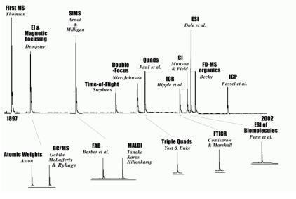\
*Ιστορική εξέλιξη των τεχνικών ΜS*

>**Ορισμός:**\
Φασματομετρία μαζών είναι μια οικογένεια τεχνικών προσδιορισμού δομής και ποσοτικού προσδιορισμού ενώσεων και στοιχείων, οι οποίες βασίζονται στον ιοντισμό ατόμων και στοιχείων και την παραγωγή ιοντικών θραυσμάτων στην αέρια φάση. Καταγράφεται η σχετική ένταση του ιοντικού ρεύατος που αντιστοιχέι σε κάθε τιμή του λόγου $\frac mz$.

Η γενικές διαδικασίες των τεχνικών MS έχουν ως εξής:\
**Ιοντισμός**
$$
Μ+e^+\rightarrow M^{.+}+2e^-
$$
**Θραυσματοποίηση:**
$$
M^{.+}\rightarrow
\begin{cases}
EE^++R^.\\
\text{\tiny{Ζυγό Ιόν}}\;\;\;\;\;\;\text{\tiny{Ρίζα}}\\
OE^++N\\
\text{\tiny{Μονό Ιόν}}\;\;\;\;\;\text{\tiny{Μόριο}}\\
\end{cases}
$$

>**Σημείωση - Κανόνας Αζώτου:**\
Μόρια με περιττό αριθμό ατόμων Ν θα έχουν περιττό βάρος. Τα ιοντικά θραύσματα που προκύπτουν με απλή θρασυσματοποίηση θα έχουν άρτια μάζα. Μόρια με περιττό αριθμό Ν θα έχουν άρτιο βάρος και τα θραύσματα τους θα έχουν περιττή μάζα.

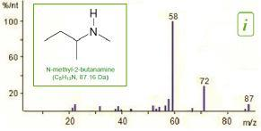\
*Ο κανόνας του αζώτου*

Στη τεχνική MS ατμοί δείγματος απορροφούν περίσσεια ενέργεια από κάποια *πηγή ιοντισμού*, και μετά από κάποιο χρονικό διάστημα θραυσματοποιούνται και τα θραύσματα καταγράφονται. Ένα τέτοιο φάσμα μαζών παρουσιάζεται ως ραβδόγραμμα *σχετικής αφθονίας* (συνήθως).

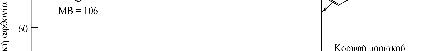\
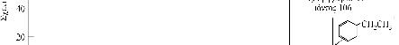\
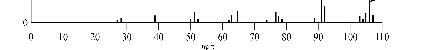\
*Ένα τυπικό φάσμα μάζας*

>**Κορυφή Μοριακού Ιόντος:**\
Είναι η κορυφή που αντιπροσωπεύει το αρχικό ιόν. Επειδή κάθε θραύσμα προφανώς έχει μικρότερη μάζα από το αρχικό, αδιάσπαστο μόριο, αυτή η κορυφή θα είναι πάντα η δεξιότερη στο φάσμα, αγνοώντας τις πολύ μικρές κορυφές που μπορεί να βρίσκονται γύρω απο κάθε μεγαλύτερη κορυφή. Σε κάποιες περιπτώσεις η θραυσματοποίηση είναι τόσο πλήρης ώστε το αρχικό μόριο να μην εμφανίζεται καθόλου. Δηλαδή για να εκτιμήσουμε οτι η αριστερότερη κορυφή είναι πράγματι αυτή του μοριακού ιόντος, θα πρέπει πράγματι το $\frac mz$ να συμβαδίζει με αυτό του αρχικού μορίου.

>**Βασική Κορυφή:**\
Συνήθως τα φάσματα μαζών δείχνουν σχετικό σήμα ως *σχετική αφθονία* (όχι όμως πάντα). Θέτουμε την υψηλότερη κορυφή ως 100% και εκφράζουμε τις υπόλοιπες ως κλάσμα αυτής. Τότε αυτή η κορυφή, με το υψηλότερο σήμα ονομάζεται *βασική κορυφή*.

>**Ουδέτερες Απώλειες:**\
Η τεχνική MS ανιχνεύει αποκλειστικά φορτισμένα σωματίδια/ιόντα. Επομένως ουδέτερα μόρια και ρίζες που παράγονται κατά την θραυσματοποίηση δεν ανιχνεύονται άμεσα, μόνο ως εκ διαφοράς με αυτά τα ιόντα. Αυτές ακριβώς οι οντότητες ονομάζονται *ουδέτερες απώλειες*.

Από Σχάση Δεσμού||Από Ανακατανωμές||
-------|--------|-------|------
Θραύσμα|Μάζα|Ουδέτερο Μόριο|Μάζα
$Η$|1|$Η_2$|2
$CΗ_3$|15|$NH_2$|17
$ΝΗ_2$ ή $Ο$ (από $NO$) |16|$H_2O$|18
$OH$|17|$C_2H_2$|26
$F$|19|$HCN$|27
$CN$|26|$CO$ ή $C_2H_4$|28
$C_2H_3$|27|$CH_2O$|30
$C_2H_5$ ή $CHO$|29|$CH_3OH$|32
$NO$|30|$H_2S$|34
$OCH_3$ ή $CH_2OH$|31|$C_3H_6$ ή $C_2H_2O$|42
$SH$ ή $CH_2OH$|33|$CO_2$|44
$Cl$|35|$C_2H_5OH$|46
$C_3H_7$ ή $CH_3O$|43|$C_3H_7OH$ ή $CH_3CO_2H$|60
$NO_2$|46|$C_6H_6$|78
$C_4H_8$|57|$HBr$|80
*Τυπικές Ουδέτερες Απώλειες*

Τύπος Ουσίας|Τύπος|Τυπικά Θραύσματα
-------|-----------|--------
Αλκάνια|$C_nH_{2n+1}^+$|15,29,43,57,71,85,...
Αλκένια, Κύκλοαλκάνια|$C_nH_{2n}^+$|28,42,56,70,84,...
Κυκλοαλκένια|$C_nH_{2n-1}^+$|27,41,55,69,83,...
Αλδεύδης, Κετόνες|$C_nH_{2n-1}O^+$|29,41,55,69,83,...
Αμίνες|$C_nH_{2n+2}N^+$|30,44,58,72,86,...
Αλκόολες, Αιθέρες|$C_nH_{2n+1}O^+$|31,45,59,73,87,...
Οξέα, Εστέρες|$C_nH_{2n-1}O^+$|45,59,73,87,...
Αρωματικές Ενώσεις||91,77
*Τυπικά ιοντικ΄ά θραύσματα οργανικών μορίων*

>**Ατομική & Μοριακή Μάζα:**\
Μονάδα ατομική μάζας (u ή Da) είναι το 1/12 ενός ουδέτερου ατόμου $^{12}C$. Η κοινή μάζα στην οποία αναφερόμαστε, δεν είναι η πραγματική μάζα, αλλά η μέση μάζα, δηλαδή τα άθροισμα των μαζών των ισοτόπων, πολ/σμενα με την φυσική αναλογία έκαστου. Γι αυτό και οι μάζες τους Π.Π. είναι κλασματικοί αριθμοί.

Στη φασματομετρία μαζών ιδαίτερα για όργανα υψηλής διακριτικής ικανότητας έχει σημασία να διακρίνουμε τα διάφορα ισότοπα στοιχείου. Μπορούμε να διακρίνουμε τρεις τύπους στοιχείων. Για τα "τύπου Α" στοιχεία υπάρχει ένα φυσικό ισότοπο (πχ F), για τα "τύπου Α+1" στοιχεία υπάρχουν δύο φυσικά ισότοπα, που διαφέρουν κατά 1 Da , ενώ τέλος για τα τύπου "Α+2" υπάρχουν δύο φυσικά ισότοπα που δαιφέρουν κατά 2 Da.

Για τις διάφορες ενώσεις, εμφανίζονται διακριτές κορυφές για κάθε ισότοπο, κάθε στοιχείου τους, εφ' οσο η φυσική αναλογία είναι αρκετά υψηλή για να δώσουν αυτά σήμα. Αυτά τα ισότοπα, εμφανίζονται ως μικρές δορυφορικές κορυφές γύρω από μια κεντρική. Αυτή η κεντρική κορυφή θα αντιστοιχεί στα ισότοπα με τη μεγαλύτερη αφθονία.

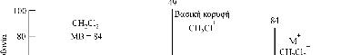\
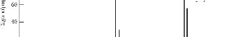\
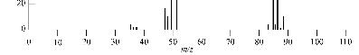\
*Ισοτοπικές κοορυφές*

||$^{12}C^1H_2^{35}Cl_2$|m=84||
------|--------|-----|-------|
$^{13}C^1H_2^{35}Cl_2$|m=87|$^{12}C^1H_2\;^{37}Cl\;^{35}Cl$|m=86
$^{13}C^1H_2^{35}Cl_2$|m=87|$^{12}C^1H_2^{37}Cl_2$|m=88
*Ισοτοπικές Κορυφές*

## Διακριτική Ικονότητα:
Για να συγκρίνουμε τις διάφορες τεχνολογίες MS πρέπει να ορίσουμε ένα μέγεθως που να αποδίδει την αποτελεσματικότητα τους. Αυτή η αποτελεσματικότητα αναφέρεται στην ικανότητα του οργάνου να διακρίνει πολύ κοντινού λόγους $\frac mz$. Στη πραγματικότητα, επειδή τα ιόντα είναι συνήθως μονοφορτισμένα, αναφερόμαστε σε μάζες. Αν έστω $\Delta m$ δύο "πολύ κοντινές" μάζες τότε ορίζουμε την *διακριτική ικανόητα* του οργάνου ως:
$$
R = \frac {m}{\Delta m}
$$
Δηλαδή αυτό το μέγεθως εκφράζει την ικανότητα του οργάνου να διακρίνει δύο μόλις διαχωριζόμενες μάζες $m,m+\Delta m$. Το τι σήμαίνει επακριβώς το "μόλις διαχωριζόμενες" και πως ακριβώς ορίζεται, εξαρτάται στη πράξη από τη τεχνολογία του οργάνου. Για παράδειγμα, για όργανα *μαγνητικού τομέα* το $\Delta m$ ορίζεται ως η απόσταση των κέντρων μεταξύ δύο κορυφών που επικαλύπτονται κατά 10\% και έχουν ίση ένταση. Επειδή πρακτικά δύσκολα εφαρμώζεται αυτός ο ορισμός, το ορίζουμε ως το εύρος κορυφής στο μισό του ύψους της (*FWHM*).

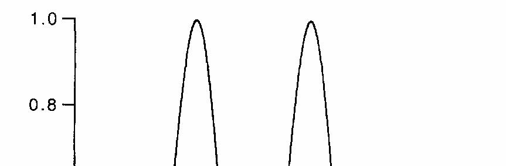\
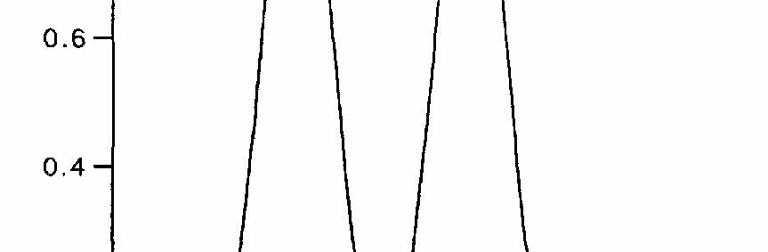\
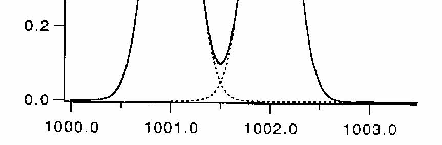\
*FWHM*

Μπορούμε επίσης να εκφράσουμε τα άνω ως *σχετική* διαφορά δύο γειτονικών κορυφών, δηλαδή:
$$
\frac{m_1-m_2}{m_1}=\frac {\Delta m}{m_1}
$$
Αυτό ακριβώς το μέγεθως αναφέρεται ως *διακρισιμότητα* και γενικά αποδίδεται σε μονάδες *ppm* λόγο κλίμακας. Μερικοί το λένε και *ακρίβεια*.

Κοιτώντας το προφίλ μίας μάζας που είναι μια κεντρική κορυφή με διάφορες μικρότερες δορυφορικές κορυφές ισοτόπων, κάποιοι ορίζουν ένα ακόμη μέγεθως. Αν έστω *κεντροειδές* η "φαντασική" κορυφή που βρίσκεται στο μέσο της "ομάδας" κορυφών τότε μπορούμε να περιγράψουμε μια κορυφή ενδιαφέοντος ως απόσταση από το κεντροειδές (*mass offset*).

Μπορούμε επίσης να ορίζουμε και εύρος σάρωσης, δηλαδή το διάστημα μεταξύ ελαχίστου και μεγίστου λόγο που είναι ικανό να καταγράψει το όργανο. Ταχύτητα σάρωσης απ' την άλλη είναι ο αριθμό φασμάτων που μποροεί να καταγράψει το όργανα ανά δευτερόλεπτο. Εκράζεται σε Hertz συνήθως. Χρόνος σάρωσης είναι ο χρόνος που απαιτεί το όργανο για να ολοκληρώσει μια καταγραφή.

## Αναλυτές Μαζών

Αν και υπάρχει τεράστεια ποικιλομορφία στις τεχνολογίες των οργάνων MS όλα κατά βάση αποτελούνται από τα εξής τμήματα:

1. Πηγή Ιόντων/Ιοντισμού (Το τμήμα που μετατρέπει το δείγμα σε ιόντα)
2. Αναλυτής Μαζών (Διαχωρίζει τα ιόντα, βάση του $\frac mz$)
3. Ανιχνευτής (Μετατρέπει τα ιόντα σε ηλεκτρικό σήμα, οποίο καταγράφει)

Οι αναλυτές μαζών διαχωρίζουν τα ιόντα με βάση τον λόγο $\frac mz$, οπότε το ιοντικό ρεύμα που καταγράφεται οφείλεται μόνον σε ένα λόγο κάθε στιγμή. 
Καταρχάς μερικοί αναλυτές είναι *συνεχείς* στο πως διαχωρίζουν τα φορτία ενώ άλλοι - οι περισσότεροι - είναι *παλμικοί* δηλαδή δαιχωρίζουν διακριτά "πακέτα" ιόντων.

### Συνεχείς Αναλυτές Μαζών

#### Αναλυτές Μαγνητικού Τομέα

Είναι η πρώτη τεχνολογία αναλυτών που αναπτύχθηκε. Βασίζεται σε μεταλλικές πλάκες, μεταξύ των οποίων υπάρχει Η/Μ πεδίο. Σε φορτία εντός πεδίου ασκείται μια δύναμη - η *δύναμη Lorentz* . Σε κάθε φορτίο ασκείται διαφορετική δύναμη οπότε και εκτρέπεται σε διαφορετικό βαθμό. Στην έξοδο του τομέα υπάρχει μια στενή σχισμή εξόδου. Ανάλογα με τις Η/Μ παραμέτρους του αναλυτή, μόνο ένας λόγος διασχίζει τη σχισμή. Οι υπόλοιποι προσκρούου στο πέτασμα και δεν φτάνουν στον ανιχνευτή.
Οι αναλυτές αυτού του γνεικού τύπου μπορεί να είναι *μαγνητικοί* ή *ηλεκτροστατικοί*. Μια επέκταση της τεχνολογίας αυτής είναι η παράλληλη χρήση τέτοιων διατάξεων, δαιδοχικά (όργανα *απλής* και *διπλής εστίασης*).
$$
\frac mz=\frac{B^2r^2e}{2V}\;\;\;\;\text{V,r σταθερά}
$$
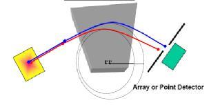\
*Αναλυτής Μαγνητικού Τομέα*\
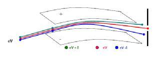\
*Ηλεκτρομαγνητικός Αναλυτής*
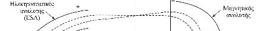\
\
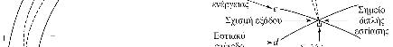\
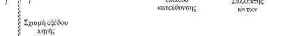\
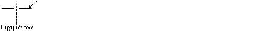\
*Διπλής Εστίασης - Γεωματρία Nier-Johnson. Όργανο υψηλής διακριτική ικανότητας*
\
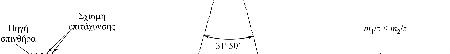\
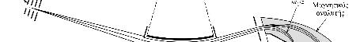\
\
*Διπλής Εστίασης - Γεωματρία Mattachuh-Herzog. Όργανο υψηλής διακριτική ικανότητας*

Αυτά τα όργανα (τα διπλής εστίασης) είναι εξαιρετικά υψηλής διακριτική ικανότητας και κατάλληλα για MS/MS, με πολύ καλή ευαισθησία σε χαμηλά R. Λόγο τις ακρίβειας του αυτής είναι κατάλληλο για τον προσδιορισμό ισοτόπων και μοριακών μαζών. Όμως τα όργανα είναι ογκώδοι, υψηλού κόστους αγοράς και συντήρησης γιατί απαιτούν υψηλό κενό και υψηλές τάσεις λειτουργίας, δύσχρηστα - απαιτώντας εκπαιδευμένο προσωπικό και η σύζευξη του με πηγές ιοντισμού ατμοσφαιρικής πίεσης είναι προβληματική. Κυρίως λόγο τους κόστους τους σπανίως χρησημοποιούνται σήμερα, παρά μόνον για ειδικές εφαρμωγές δηλαδή για τον προσδιορισμό διοξινών, dopping και για μετρήσεις που σχετίζονται με μετρολογία.

#### Αναλυτής Μαζών Τετραπόλου

Τα τετράπολα είναι από τους ποιό διαδεδομένους αναλυτές μαζών με σχετικά απλή λειτουργία και φθηνοί. Ένα τετράπολο αποτελείται από τέσερεις κυλίνδρους τοποθετημένους σε διάταξη τετραγώνου. Οι απέναντι ράβδοι έχουν πάντα το ίδιο φορτίο, και σε αυτά εφαρμώζεται ρεύμα με δύο συνηστώσες, συνεχείς τάσεις (DC) και υψίσυχνες (RF). Τα δύο δυναμικά αυτά αυξάνονται συγχρόνως αλλά ο λόγος τους διατηρείται σταθερός (γιατί σχετίζεται με το ποιοί λόγοι μπορούν να διαβούν).

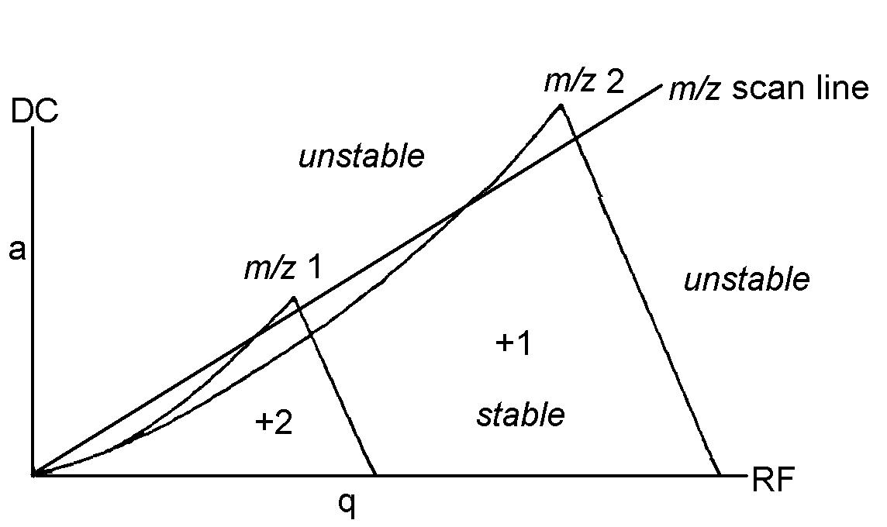\
*Διάγραμμα σταθερότητας. Στη γραμμή λειτουργίας ένας λόγος έιναι σταθερός. Κάτω από αυτή πολλαπλά είναι σταθερά και πάνω από αυτή κανένα δεν είναι σταθερό. Σε λειτουργία πλήρούς σάρωσης κινούμαστε πάνω στη γραμμή λειτουργίας. Κάθε σημείο αυτής είναι μια τιμή λειτουγίας SIM*

Λέγεται και *φίλτρο μαζών* λόγο του τρόπου λειτουργίας τους. Καθώς τα ιόντα διέρχονται στην περιοχή ανάμεσα στις ράβδους, λόγο του μαγνητικού πεδίου, μόνο ένας λόγος $\frac mz$ διατηρεί σταθερή τροχεία. Οι υπόλοιποι λόγοι είναι ασταθείς και τελικά εκτρέπονται από τη διάταξη. Ο λόγος $\frac mz$ που έχει σταθερή τροχεία καθορίζεται από τις ηλεκτρικές παραμέτρους του τετραπόλου (δυναμική ενέργεια, τάση κλπ). Στη πραγματικότητα όταν λέμε "μια τιμή του λόγου" εννοούμε ένα στενό εύρος τιμών, ανάλογα με τη διακριτική ικανότητα του οργάνου (~1 amu). Η σταθερή τροχειά δεν είναι ευθεία αλλά τεθλασμένη, και μοιάζει με καρδιογράφημα.

Το απλό τετράπολο έχει τρείς λειτουργίες

* SIM (Single Ion Monitoring,ένας λόγος διέρχεται)
* RF-only (όλες οι μάζες διέρχονται)
* MIM (Multiple Ion Monitoring) - καταχραστικά, πολλαπλά $\frac mz$, διαδοχικά όμως, όχι ταυτόχρονα
* Full Scan - Όλα τα $\frac mz$ **διαδοχικά** όχι ταυτόχρονα

Συχνότερη είναι η διάταξη *τριπλού τετραπόλου (QqQ)*. Εδώ το μεσσαία τετράπολο είναι μόνιμα σε RF-only λειτουργία. Υπάρχουν οι εξείς δυνατότητες:

Q|q|Q|Περιγραφή
-----|------|-----|------
RF-only|RF-only| RF-only| Δεν έχει ιδιαίτερο ενδιαφέρον. Λαμβάνουμε *συνολικό ρεύμα ιόντων (Total Ion Current, TIC)*
RF-only|RF-only|Full Scan| Επακριβώς όμοιο με το Full Scan ενός τετραπόλου
RF-only|RF-only|SΙΜ| Παρόμοιο με μονό τετράπολο
RF-only|RF-only|ΜΙΜ| Παρόμοιο με μονό τετράπολο
Full Scan|RF-only|RF-only|Παρόμοιο με μονό τετράπολο
SIM|RF-only|RF-only|Παρόμοιο με μονό τετράπολο
MIM|RF-only|RF-only|Παρόμοιο με μονό τετράπολο
Full Scan|RF-only|Full Scan|Για κάθε μητρικό ιόν, εξαιτάζουμε κάθε θυγατρικό. Δίνει τις ποιό πλούσιες πληροφορίες αλλά είναι χρονοβόρο (το δεύτερο τετράπολο σαρώνει όλα τα $\frac mz$ *για κάθε* $\frac mz$ του πρώτου). Προτιμάται όταν αναπτύσσουμε *βιβλιοθήκες αναλυτών*
Full Scan|RF-only|SIM|Εξαιτάζουμε ένα θυγατρικό *για κάθε* πιθανό πρόδρομο. Χρήσιμο αν διερευνούμε την προέλευση κάποιας παρεμπόδισης
Full Scan|RF-only|MIM|Ομοίως με άνω αλλά πολλαπλά θυγατρικά ιόντα. όπως και το άνω, σπανίως χρησημοποιείται
SIM|RF-only|Full Scan|Πλήρη σάρωση όλων των θυγατρικών ιόντων για επιλεγμένο πρόδρομο ιόν. Αν και σπανιώς χρησημοποιείται, μπορούμε να καταφύγουμε σε αυτό για να βρούμε όλα τα παράγωγα ιόντα κάποιου πρόδρομου. Αυτό μπορούμε να το κάνουμε, όταν διερευνούμε κάποια *ισοβαρική παρεμπόδιση* ή όταν αντί για τον πρόδρομο αναλύτη, ποσοτικοποιούμε μέσω κάποιου θυγατρικού. Επιπλέον είναι χρήσημο για μελέτες δομής, ταυτοποίησης, και χαρακτηρισμού όταν ο αναλύτης είναι επακριβώς γνωστός. Δεν το συναντάμε συχνά αλλά περισσότερο σε εφαρμωγές *συνθετικής χημείας*
SIM|RF-only|SIM|Ένα επιλεγμένο θυγατρικό για ένα επιλεγμένο πρόδρομο. Είναι η συνηθέστερη περίπτωση ρουτίνας, μαζί με το αντίστοιχο MIM, όταν δεν υπάρχουν πολλαπλά θυγατρικά διαθέσημα. Λέγεται και SRM (single reaction monitoring)
SIM|RF-only|MIM|Πολλαπλά θυγατρικά για ένα πρόδρομο. Είναι η συνηθέστερη περίπτωση ρουτίνας, όταν γνωρίζουμε την θραυσματοποίηση των ουσιών ενδιαδέροντος
MIM|RF-only|Full Scan|Δεν έχει ιδιαίτερο ενδιαφέρον
MIM|RF-only|SIM|Δεν έχει ιδιαίτερο ενδιαφέρον, εκτός αν διευρευνούμε την πιθανή προέλευση κάποιας παρεμπόδισης
MIM|RF-only|MIM|Δεν έχει ιδιαίτερο ενδιαφέρον αν υπάρχουν περισσότερο του ενός πρόδρομα για ένα θυγατρικό. Μπορούμε να θεωρήσουμε τυπικά, ότι είναι η συνηθέστερη περίπτωση για τη συνολική πορεία (πολλοί αναλύτες, πολλά θυγατρικά)

>**Παρατήρηση:**\
Στη πραγματικότητα και το ενδιάμεσο τετράπολο έχει υπο-λειτουργίες, CAD,CID και χωρίς αέριο συγκρούσεων. Ωστόσο αυτή η λειτουργία είναι ανεξάρτητη αυτής των άλλων δύο τετραπόλων και δε οι αντίστοιχοι συνδιασμοί δεν έχουν πρακτικό ενδιαφέρον.

>**Σημείωση:**\
Εκτός από τα τετρόπολα έχουν αναπτυχθεί και παραλλές όπως οκτάπολα, εξάπολα, επτάπολα κλπ. Αυτά βρίσκονται συχνότερα ως τμήμα οργάνων με διαφορετικό "κύριο" αναλυτή.

Γενικά η τεχνολογία αυτή ήταν η συχνότερη μέχρι προσφάτως διότι παρότι είναι χαμηλής διακριτικής ικανότητας, τα αντίστοιχα όργανα είναι μικρού μεγέθους, τα πλέον φθηνότερα, με υψηλή ταχύτητα σάρωσης, και διότι είναι ανθεκτική. Επιπλέον λόγο της εκτεταμένης χρήσης τους, οι περισσότερς βιβλιοθήκες φασμάτων αφορούν τετράπολα. Είναι αξιόπιστος και κατάλληλος για ποσότική ανάλυση με σχετικά εύκολη σύζευξη με χρωματογραφία και ο πλέον ιδανικός για πηγές AP. Απαιτεί μέτριο κενό και τάσεις λειτουργίας. Κύριο μεινόκτημα είναι η μικρή διακριτική ικανόητα και δευτερευόντως το περιορισμένο εύρος (έως 4000u) με μειωμένη ευαισθησία σε υψηλά R.

### Παλμικοί Αναλυτές Μάζας

#### Αναλυτής Τετραπολικής Παγίδας Ιόντων (Ion Trap)

Είναι μια διάταξη που αποτελείται από τρία ηλεκτρόδια, δύο πλευρικά που είναι γειωμένα, και ένα ηλεκτρόδιο σε σχήμα δακτυλίου με μια οπή εισόδου και μια οπή εξόδου. Σε αυτό εφαρμώζεται τάση RF που διαρκώς αυξάνει. Η όλη διάταξη μοιάζει με παραμορφωμένο κώνο. 

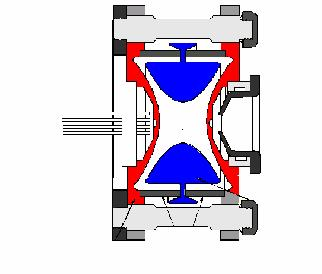\
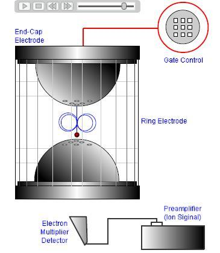\
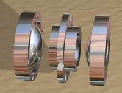\
*Παγίδα Ιόντων*

Τα ιόντα εισέρχονται από τη οπή σαν "πακέτα" και ξεκινούν να περιστρέφονται λόγο του πεδιου. Για κάποια τιμή της τάσης, ένας λόγος εκτινάσεται από την οπή εξόδου και φτάνει στον ανιχνευτή. Σε κάποιες εφαρμωγές τα ιόντα θραυσματοποιούνται *μέσα στον αναλυτή* ενώ γενικά κάποιες φορές αυτές οι συγκρούσεις και οι θραυσματοποιήσεις είναι ανεπιθύμητες.

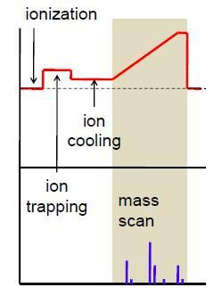\
*Λειτουργία Παγίδας Ιόντων*

Είναι γενικά φθηνός αναλυτής, μικρού μεγέθους, ταχείας σάρωσης, με δυνατότητα MS/MS υψηλή ευαισθησία, εύκολο συνδιασμό με χρωματογραφίες και χαμηλές απαιτήσεις κενού. Μειάζει λειτουγικά με τα τετράπολα, με την έννοια οτι είναι χαμηλής διακριτικής ικανότητας και περιορισμένου εύρους (100-6000). Η παλμική λειτουργία του είναι περίπλοκη και οδηγεί σε κορεσμό και ανεπιθύμητες θραυσματοποιήσεις, ενώ η ακρίβεια ποσοτικοποίησης είναι μικρή, όπως και η γραμμική περιοχή. Γι αυτούς του λόγους χρησημοποιείται για μελέτες σε μεταβολίτες φαρμάκων και δομής πρωτεϊνών.

#### Γραμμική Παγίδα Ιόντων

Είναι μια διάταξη που μοιάζει με συνδιασμό τετραπόλου και παγίδας ιόντων. Παγιδεύει τα ιόντα και τα αποβάλει αξονικά σε δύο ανιχνευτές. Με αυτή τη διάταξη αυξάνεται η χωρητικότητα, οπότε βελτιώνεται και η γραμμική περιοχή ενώ μειώνονται οι ανεπιθύμητες θραυσματοποιήσεις. Δεν υπάρχει κατώτερος περιορισμός μαζών και μπορεί να δράσει και ως κυψελίδα θραυσματοποιήσεως χωρίς να παγιδεύει (μοιάζει με το RF-only) του τετραπόλου. Είναι συμβατό με την τεχνολογία Orbitrap.

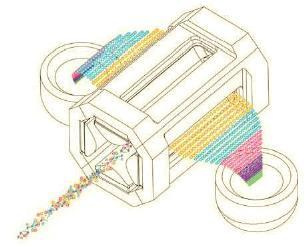\
*Γραμμική Παγίδα Ιόντων*

#### Αναλυτές Χρόνου Πτήσης (ToF)

Οι αναλυτές μαζών χρόνου πτήσης βασίζονται στο ότι τα ιόντα με μεγαλύτερη μάζα κινούνται βραδύτερα, επομένως αν ένα σύνολο ιόντων ξεκινήσουν ταυτόχρονα, τότε όσο βαρύτερα είναι, τόσο περισσότερο χρόνο θα κάνουν να διανήσουν μια καθορισμένη απόσταση. Αυτός ο χρόνος ονομάζεται *χρόνος πτήσης* και είναι της τάξεως του 1-30 (μs)
$$
T=\frac 12mv^2=zV\\
L=vt\\
t_{\tiny{flight}} = L (\frac{\small{2Vez}}m)^{-\frac 12}
$$

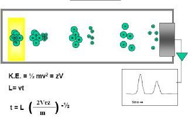\
*Βασικό ToF*

Στη πραγματικότητα στο ToF δεν εισέρχονται όλα τα ιόντα με την ίδια κινητική ενέργεια, αλλά μια μια κατανομή ενέργειας που μειώνει την αποτελσματικότητα του οργάνου.
Μπορούμε να αντιμετοπίσουμε αυτό το πρόβλημα με μια διάταξη που ονομάζεται *ανακλαστήρας*. Αυτή η διάταξη απωθεί τα ιόντα, οπότα αυτά ουσιαστικά κάνουν αναστροφή και η τελική τους τροχειά είναι ημικυκλική αντι ευθείας. Με αυτό το τρόπο εξομαλύνεται η κατανομή ταχυτήτων αλλά ταυτόχρονα διπλασιάζεται ουσιαστικά και το μήκος διαδρομής.

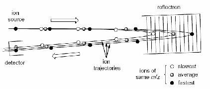\
*ToF με ανακλαστήρα*

Το όργανο ως έχει μπορεί δεν μπορεί να εκτελέσει MS/MS διότι δεν υπάρχει κάποια επιλογή ιόντων- **όλα** τα ιόντα φτάνουν εν τέλη στον ανιχνευτή. Μπορούμε να χρησιμοποιήσουμε μια παραλλαγή του τετραπόλλου - το *οκτάπολο* για επιλέξουμε ιόντα, οπότε τώρα υπάρχει δυνατότητα tandem ms.
Γενικά είναι απλός αναλυτής με θεωρητικά απεριόριστο εύρος μαζών, την μεγαλύτερη ταχύτητα σάρωσης αλλά περιορισμένη δυναμική περιοχή. Η ευαισθησία του είναι περιορισμένα αλλά αυτό το πρόβλημα λύνεται εύκολα με το οκτάπολο. Τα ηλεκτρονικά του πρέπει να είναι ταχύτατα γι αυτό και είναι ακριβά. Το "σκέτο" ToF απαιτεί παλμική πηγή ιοντισμού όπως η MALDI-ToF, κάτι που μπορεί να ξεπεραστεί με το οκτάπολο. Κυρίως λόγο του μεγάλου εύρους μαζών του, με δυνατότηα MS/MS προτιμάται για ιδιαίτερα για βιομόρια και μελέτες δομής πρωτεϊνών. Όμως έχει ευρεία χρήση και για διάφορους άλλους αναλύτες.

#### Αναλυτές Μαζών Κυκλοτρονικού Συντονισμού 

Μοιάζει με την παγίδα ιόντων με την έννοια ότι ότι τα ιόντα φέρονται εντός μαγνητικού πεδίου οπότε περιστρέφονται σε κυκλικές τροχειές. Τότε η συχνότητα περιστροφής ($\omega_c$) σχετίζεται με το λόγο μάζα προς φορτίο. Η ισχύ της τεχνικής έχει να κάνει με τη μαθηματική σχέση που συνδέει τα μεγέθοι (δεν υπάρχει ρίζα για παράδειγμα)
$$
\omega_c=\frac{Bq}m
$$
Τα όργανα αυτά δίνουν σήμα μορφής $S=S(t)$ οπότε χρησιμοποιούμε τον μετασχηματισμό Fourier για να το φέρουμε σε μορφή $S=S(f)$

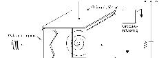\
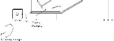\
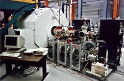\
*Κυκλοτρόνια Συντονισμού*

Τα όργανα εμφανίζουν την υψηλότερη διακριτική ικανότητα (R>1 000 000) και είναι -θεωρητικά τουλάχιστον - ο καλύτερος αναλυτής μαζών, με μεγάλυ ακρίβεια κια σταθερότητα στη βαθμονόμηση, οπότε είναι κατάλληλα για εξαιρετικά πολύπλοκα μίγματα με εφαρμωγές σε μελέτες βιομορίων, περιβάλλοντος, ισοτοπικής ανάλυσης, προσδιορισμού λεπτής δομής, πρωτείνών και πεπτιδίων. Έχουν όμως τεράστειες απαιτήσεις κενού κάτι που τα καθιστά ακριβά όργανα με πολύπλοκη λειτουργία και είναι και πολύ ογκώδοι. Τέλος έχουν χαμηλές ταχύτητες σάρωσης.

#### Orbitrap

Είναι ο ποιό πρόσφατος αναλυτής μαζών και είναι ακόμη υπό ενεργή πατέντα. Μοιάζει στη λειτουργεία με την παγίδα ιόντων με ένα περίππου κυλινδρικό ηλεκτρόδιο που περιβάλλει ένα αξονικό ηλεκτρόδιο που μοιάζει με κύλινδρο. Λόγο τάσης στο αξονικό και το πλευρικό ηλεκτρόδιο τα ιόντα εξαναγκάζονται σε σπειροειδή κίνηση γύρο από τον κεντρικό άξονα. Επειδή τα ιόντα είναι φορτισμένα σωματίδια που κινούνται σε πεδίο, επάγουν ρεύμα στο αξονικό ηλεκτρόδιο με συχνότητα που εξαρτάται από το λόγο μάζα προς φορτίο
$$
\omega_z=\sqrt{\frac k{\frac{m}{z}}}
$$

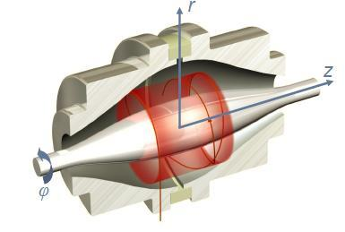\
*Βασικό Orbitrap*

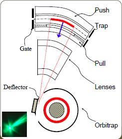\
*Οrbitrap με παγίδα*

Το σήμα αυτό εξαρτάται από τον χρόνο, επομένως θα πρέπει να εφαρμώσουμε μετασχηματισμό Fourier.
Επειδή χρειαζόμαστε παλμική λειτουργία χρησημοποιούμε μια παγίδα ιόντων που μοιάζει με τετράπολο σε σχήμα ημικυκλίου και άλλες διατάξεις ανάκλασης και εστίασης για να στείλουμε στον αναλυτή. Αυτές οι παγίδες έχουν μεγάλη χωρητικότητα, έως και 1 εκατμύρρια φορτισμένα σωματίδια.

Έχουν την υψηλότερη διακριτή ικανόητα μετά το ICR, μεγάλη ακρίβεια για τον προσδιορισμό μαζών, μεγάλη χωρητικότητα. Αν και από μόνης δεν επιδέχεται MS/MS μπορεί να συνδιαστεί με ιοντική παγίδα για αυτό το σκοπό. Είναι γενικά ακριβά όργανα με υψηλές απαιτήσεις κενού, ενώ η σάρωση τους είναι αργή για UPLC. Παρά το κόστος είναι καλή επιλογή για διάφορες εφαρμωγές, όπως προσδιορισμό βιομορίων, περιβαλλοντικών δειγμάτων, τροφίμων, proteomics, lipidomics.
Γενικά αυτά τα τρία τελευταία είναι τα ποιό πρόσφατα όργανα, με το ToF να κερδίζει σε ταχύτητα σάρωσης και κόστος , ενώ τα άλλα δύο σε διακριτική ικανότητα.

## Περισσότερα για την Tandem Φασματομετρία

Λόγο του πόσο διαδεδομένη είναι η τεχνολογία τριπλού τετραπόλου τη χρησιμοποιούμε συχνά ως σημείο αναφοράς για τις tandem τεχνικές. Συνοπτικά οι συνδιασμοί με κάποιο πρακτικό ενδιαφέρον είναι:

Q|q(CAD ή CID)|Q|Παρατηρήσεις
------|-------|------|------
Full Scan|CAD ή CID|RF-only|Είναι πλήρης σάρωση ισοδύναμη με απλό τετράπολο. Δίνει πληροφορίες για το μοριακό βάρος, αλλά η σάρωση είναι αργή και δεν μπορούμε να ποσοτικοποιήσουμε
SIM|CAD ή CID|RF-only|Παρακολουθούμε συγκεκριμένο αναλύτη σαν να είχαμε ένα μόνο τετράπολο. Η λειτουργία είναι απλή και γρήγορα, αλλά οι παρεμποδίσεις συχνές. Η παρόμοια λειτουργία SRM έχει μεγαλύτερη ευαισθησία
SIM|CAD ή CID|Full Scan| Λέγεται και σάρωση προϊόντων. Δίνει πληροφορίες για την δομή αλλά η σάρωση είναι αργή και δεν μπορούμε να ποσοτικοποιήσουμε
Full Scan|CAD ή CID|SIM|Δίνει ουσιασικά  το φάσμα πρόδρομων ιόντων. Είναι αργό αλλά σε κάποιες περιπτώσεις μπορούμε να ταυτοποιήσουμε ενώσεις που δίνουν κάποιο συγκεκριμένο προϊόν. Τέτοιο παράδειγμα είναι τα φωσφορικά $PO_4^-$ για τα φωσφοπεπτίδια.
MIM|CAD ή CID|MIM| Η συνεθέστερη περίπτωση ρουτίνας, όπου γνωρίζουμε τα μοτίβα θραυσματοποίησης και παρακολουθούμε συγκεκριμένες αντιδράσεις (MRM)
SIM|CAD ή CID|MIM|Ομοίος αλλά για έναν αναλύτη

>**Μέθοδος Διαλογής (Screening):**\
Σε ημιποσοτικούς προσδιορισμούς μας ενδιαφέρει ο διαχωρισμός δειγμάτων που περιέχουν τις ενώσεις από μια δεδομένη συγκέντρωση (το LOD) κια πάνω από εκείνα που τις περιέχουν σε χαμηλότερες συγκεντρώσεις. Σε ποιοτικές εφαρμωγές, μέσω των φασμάτων μαζών για την ανίχνευση ενώσεων με παρόμοια δομή ή άγνωστους μεταβολίτες μιας ένωσης μια ένωσης που είτε δίνουν κοινό προϊόν ιόν ή έχουν κοινή απώλεια ουδέτερου μορίου.

### Σαρώσεις Πρόδρομων Ιόντων

Για πειράματα διαλογής *screening* συχνά αντιμετοπίζουμε περιπτώσεις όπου πολλαπλοί αναλύτες δίνουν το ίδιο θραύσμα. Τέτοια περίπτωση είναι δομικά ανάλογα φαρμάκων για παράδειγμα.

### Σαρώσεις Ουδέτερων Απώλειων

Σε κάποιες άλλες περιπτώσεις μια ομάδα μορίων ενδιαφέροντος εμφανίζουν την ίδια ουδέτερη απώλεια. Τότε σε πειράματα διαλογής θα επιλέξουμε αυτές τις ουδέτερες απώλειες σε πειράματα διαλογής (screening).

Αναλύτης|Ματαπτώσεις
------|---------
Diuron|232,9 $\rightarrow$ 72,3
||232.9 $\rightarrow$ 46.5
DCPMU|218.9 $\rightarrow$ **127.0**
||218.9 $\rightarrow$ 161.9
DCPU|205.0 $\rightarrow$ **127.1**
||205.0 $\rightarrow$ 161.9
DCA|162.0 $\rightarrow$ **127.1**
||109.1 $\rightarrow$ 72,3
Irgarol|254.0 $\rightarrow$ 197.9
||254.0 $\rightarrow$ 108.1
M1|214.0 $\rightarrow$ 158.0
||214.0 $\rightarrow$ 68.3
*Εδώ οι ενώσεις DCPMU,DCPU και DCA έχουν κοινό θραύσμα. Επομένως μπορούμε να εφαρμώσουμε τεχνική σάρωσης πρόδρομου ιόντος. Δηλαδή σαρώσουμε όλα τα πρόδρομα για το συγκεκριμένο θραύσμα. Για τους δύο τελευταίους αναλύτες παρατηρούμε οτι υπάρχει κοινή ουδέτερη απώλεια στα 56. Οπότε μπορούμε να σαρώσουμε όλα τα πρόδρομα για τις ουδέτερες απώλειες*

>**Data Dependent Scans:**\
Οι "σαρώσεις" μητρικών ιόντων που εξαρτόνται από κάποιο προϊόν ονομάζονται και Data Dependent Scans. Τέτοιες διάφορες τεχνικές είναι η σάρωση ουδέτερης απώλειας και η σάρωση θυγατρικού ιόντος.

### Μελέτη Περίπτωσης Σουλφοναμίδες Σε Λαυράκι

Λαμβάνουμε δείγμα από Λαυράκι στο εργαστήριο που θεωρείται ύποπτο για νοθεία με παράνομες σουλφοναμίδες. Μια αρχική σάρωση για γνωστές σουλφοναμίδες δεν ανιχνεύει κάποια ουσία. Οι σουλφοναμίδες είναι μια κατηγορία φαρμακευτικών ενώσεων με δράση ως αντιβιωτικά, με γενικό τύπο:

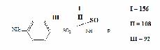\
*Σουλφοναμίδες*

Επειδή όλες οι σουλφοναμίδες έχουν ένα κοινό δομικό μοτίβο (άνω) έχουν και κοινά θραύσματα (**I,II,III**). Υποπτευόμαστε μια νέα σουλφοναμίδα, οπότε σκεπτόμαστε ότι αν αυτή υπάρχει, θα εμφανίζει αυτά τα θραύσματα (γιατί παραμένει σουλφοναμίδα). Επομένως καταφεύγουμε σε σάρωση πρόδρομου, δηλαδή πλήρη σάρωση πρόδρομων για όλα τα τρία θυγατρικά ιόντα. Αυτή η περίπτωση σε τριπλό τετράπολο θα ήταν τύπου Q(Full Scan) q(CAD,CID) Q( MIM(I,II,III) ).
Πράγματι τα θραύσματα εμφανίζονται οπότε λαμβάνουμε τις αντίστοιχες πρόδρομες. Γνωρίζοντας τον ακριβή χρόνο έκλουσης μπορούμε να επαναλάβουμε μια πλήρη θραυσματοποίηση για αυτή ακριβώς την ένωση (*profiling*). Έτσι λοιπόν την ταυτοποιούμε.

### Υβριδικά Όργανα

Τα μοντέρνα όργανα είναι κατά κύριο λόγο *υβριδικά* δηλαδή έχουν συνδιασμό πολλαπλών τεχνολογίων. Κάποια τα αναφέρομε είδη, όπως για παράδειγμα η τεχνολογία 2D-Ion Trap-Orbitrap ή Q-ToF. Μερικά τέτοια υβριδικά είναι:

Όργανο|Τεχνολογίες|Κατασκευαστής|Παρατήρηση
-----|------|-----|-----
QTrap|QqQ-3D-Ion Trap|AB SCIEX QTRAP|Δυνατότητες $MS^n$
IT-TOF|Octapole+3D-Ion Trap-ToF|Shimadzu LCMS-IT-TOF||
LTQ-Orbitrap|Q-O-Q(CAD,CID)-C-Trap-Orbitrap-Q(CAD,CID)||