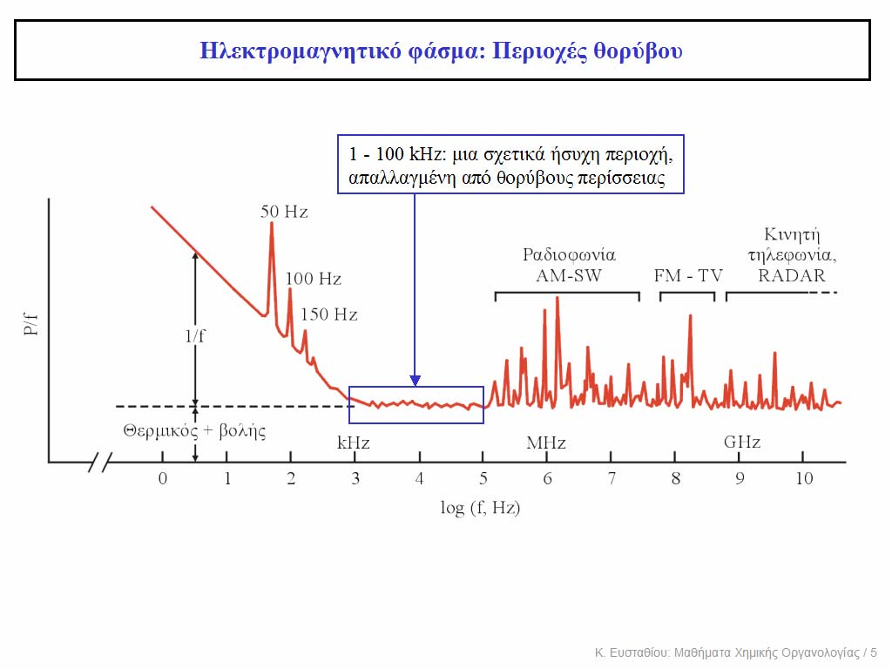

# Χημική Οργανολογία - Σήματα και Θόρυβος

## Εισαγωγή

Ως **σήμα** νοήτε ο φορέας στον οποίον κωδικοποιήται η χημική πληροφορία.
Ως **θόρυβος** νοήτε το σύνολο των ανεπιθύμητων πληροφοριών, οι οποίες συνοδεύουν το σήμα και υποβαθμίζουν την ορθότητα και την ακρίβεια μια μέτρησης.
Διάφορες πηγές θορύβου μπορεί να είναι:

* Σήματα υποβάθρου (ανεπιθύμητες ακτινοβολίες ή παράσιτο φως)
* Ρευμα Σκότους
* Ενδογεννείς θόρυβοι
* Ολίσθηση ρεύματος
* Θόρυβοι Κβαντισμού
* Σφάλματα Ανάγνωσης

## Ορθός και Αντίστροφος Μετασχηματισμός Fourier

Κάθε μορφής καμπύλη μπορεί να αποδοθεί επακριβώς ή με κάποιο επιθυμητό βαθμό ακρίβειας, ως άθροισμα αρμονικών ημιτονικών σειρών. Κάθε σήμα της μορφής $h(t)$ μπορεί να αποδοθεί από μια συνάρτηση της μορφής $H(f)$ δηλαδή τη μεταβολή μιας φυσικής παραμέτρους με τη συχνότητα.
Οι συναρτίσεις  $H(f)$ και $h(t)$ δεν είναι παρά δύο διαφορετικές μορφές της ίδιας πληροφορίας. Ιδιαιτέρος η συνάρτηση $H(f)$ δίνει τα ημιτονικά συστατικά του σήματος. Η μετάβαση από τη μία μορφή/συνάρτηση στην άλλη γίνεται μέσω του *ορθού* και του *αντίστροφου*
***μετασχηματσμού Fourier***. Οι μετασχηματισμοί αυτοί δίδονται χωρίς απόδειξη:

>**Ορθός Μετασχηματισμος Fourier:** $H(f)=\int_{-\infty}^{\infty} {h(t) [cos(2πft)-jsin(2πft)] dt}$
>**Αντίστροφος Μετασχηματισμός Fourier:** $h(t)=\int_{-\infty}^{\infty} {H(f) [cos(2πft)+jsin(2πft)] dt}$
>**Συμβολικά:** $H(f)=F\{h(t)\}$
>               $h(t)=F^{-1}\{H(f)\}$

Υπάρχουν διάφορες κατηγορίες σημάτων. Αν το σήμα είναι συνάρτηση του χρόνου (δηλαδή μορφής h(t)) τότε αυτό μπορεί να είναι:

* Περιοδικό σήμα άπειρης διάρκειας
* Περιοδικό σήμα πεπρασμένης διάρκειας ή μη-περιοδικό σήμα

Κάθε άπειρο σήμα αποδίδεται ως

>$$
>h(t) = \frac {A_0}{2} + {\sum_{n=1}^{\infty} {A_ncos}(2πnft)} \sum_{m=1}^{\infty}{B_msin(2πmft)}
>$$
>'Οπου
>$\frac {Α_0}{2}$: η συνεχής συνιστώσα (ή *μηδενική συχνότητα)* του h(t) - εφ' όσον υπάρχει
>
>$Α_1,Α_2,...Α_n και Β_1,Β_2,...,Β_n$: Τα πλάτη ημιτονικών όρων (ή *συντελεστές Fourier*)
>
>$f(n=m=1)$: Η θεμελιώδης συχνότητα
>
>$nf,mf(n,m,2,3,...)$: η $2^η,3^η,...$ κοκ *αρμονική (συχνότητα)*

Για το τετραγωνικό σήμα, το χ είναι η θεμελιώδη συχνότητα και τα 3χ και 5χ αντιστοιχούν στη τρίτη και $5^η$ αρμονική αντίστοιχα. Στo πριωνοτο (3) και το τετραγωνικό (1) σήμα δεν υπάρχει μηδενική συνότητα.

Οι όροι ($N$) είναι (θεωρητικά) άπειροι και όσο περισσότερους όρους (ή *αρμονικές συχνότητες*) προσθέτουμε τόσο προσεγγίζουμε την πραγματική μορφή του σήματος. Αντιπροσωπεύει τον αριθμό των απλών ημιτονικών σημάτων στα οποία αναλύεται ή *αποσυντίθεται* το αρχικό.

### Φάσματα Fourier Άπειρης Διάρκειας

* Στη δεύτερη εικόνα αριστερά παρατηρούμε οτι αποτελείται από δύο συχνότητες (κάθετες γραμμες). Η πρώτη έχει μεγάλο πλάτος και μικρή συχνότητα, ενώ το δεύτερο έχει μεγαλύτερη συχνότητα και μικρότερο πλάτος.

* Στην εικόνα 3 βλέπουμε δύο σήματα ίσου πλάτους με μικρή διαφορά στη συχνότητα.
* Στο 4 παράδειγμα βλέπουμε θεωρητικώς άπειρες συχνότητες, συνεχώς μειούμενου πλάτους
* Στο 5 τριγωνικό
* Στο πριωνοτο (6) απαρτίζεται από άπειρες συχνότητες μειούμενου πλάτους αλλά τα πρόσημα έναλλάσσονται (προκύπτει από τη μαθηματική επεξεργασία του σήματος)

Όταν έχουμε απότομες μεταβολες  σε σήμα μορφής $h(y)$ αυτό σημαίνει οτι εμπεριέχουνται πολλές πληροφορίες σε υψηλές συχνότητες (τετραγωνικό, πριωνοτό). πχ στο πριωνοτό βλέπουμε μεγάλο πλάτος στη πρώτη συχνότητα.

### Φάσματα Fourier Πεπερασμένης Διάρκειας

Στα περιοδικά πεπερασμένης διάρκειας το φάσμα Fourier είναι συνεχές οχι γραμμικό (7-12)

### Φάσμα Πλάτους & Φάσμα Ισχύος

Τα άνω είναι παραδείγματα φασμάτων πλάτους. Συνήθως χρησημοποιούμε φάσμα *ισχύος* που δεν εμφανίζει αρνητικά πλάτοι (τετράγωνο του προηγούμενου φάσματος). Μας δίνει σε ποιές περιοχές συχνοτήτων βρίσκονται πληροφορίες. Πληροφορίες ανάλογες πλάτους.

## Ο Λόγος Σήματος Προς Θόρυβο

Θεωρώντας οτι ο θόρυβος ακολουθεί κατανομή Gauss (κάτι που είναι και το συνηθέστερο) περιμένουμε οτι το σήμα θα παίζει ανάμεσα κάποιες τιμές γύρω από την *ονομαστική τιμή*

Τότε θα είναι: 
$$\frac S N = \frac {\bar S}{N_{RMS}}$$
Όπου $N_{RMS}$ είναι η τυπική απόκλιση του θορύβου. Δηλαδή:
$$Ν_{RMS}=\sqrt{\frac{\sum_{i=1}^{n}({\bar S - S_i})^2}{n}}$$

Οι διάφοροι θόρυβοι διαδίδονται και δρουν αθροιστικά. Δηλαδή:

Υπάρχουν διάφοροι τύποι θορύβου με κυριότερους τους *ηλεκτρικούς θορύβους*.

## Ηλεκτρικοί Θόρυβοι

Διακρίνουμε διάφορους τύποι ηλεκτρικών θορύβων:

* Θεμελιώδεις, που έιναι ενδογεννείς και οφείλονται στη θερμική(?) κίνηση ηλεκτρονίων και **δεν εξαρτονται απο τη συχνότητα**
* Μη θεμελιωδεις
* * *Θερμικός* θόρυβος
* * Θόρυβος *Βολής*
* * Θόρυβος *fliker*
* Θόρυβος *Κβαντισμού* 

Ο θόρυβος *κβαντισμού* είναι μια ιδιαίτερη κατηγορία. Εμφανίζεται σε μέτρηση αναλογικών σημάτων με ψηφιακό τρόπο. Ο *μη θυμελιώδης* εμφανίζενται σε συγκεκριμένες συχνότητες.

### Θόρυβος Βολής (shot noise)

Εξαρταται απο το ρεύμα που διαρρέει αγωγό.

### Θερμικός Θόρυβος

Εξαρτάται από το ρεύμα που διαρρέει αγωγό και τη θερμότητα.

### Θόρυβος flicker

Ενδογεννης θόρυβος που εμφανίζεται σε χαμηλές συχνότηες (γι αυτό και ονομάζεται *θόρυβος $\frac 1 f$* ). Αντιμετοπίζεται με μια ιδιαίτερη τεχνική που ονομάζεται *διαμόρφωση*.

Συνήθως μετράμε κοντα σε 6MHZ όπου οι εξωγεννείς θόρυβοι είναι αρκετά περιορισμένοι.

>50Hz $\rightarrow$ απο το δικτυο

>100Hz $\rightarrow$ δεύτερη αρμονική του άνω

>150Hz $\rightarrow$ τρίτη αρμονική του 50Hz

### Κβαντισμού`

Εκτός ύλης

## Διαμόρφωση

Η διαδικασία *διαμόρφωσης* είναι διαδικασία διόρθωσης σήματος. Τα βήματα είναι ως εξής:

* Αρχικά το σήμα μετατοπίζεται σε υψηλότερες συχνότητες
* Το διαβιβάζεται μέσω *ημιπερατού φίλτρου*, το οποίο αποκόπτει τις "θορυβώδεις"συχνότητες
* Το σήμα μειώνεται εκ νέου σε μικρότερες συχνότητες (*αναδιαμόρφωση*)

Η αρχική μετατόπηση του σήματος γίνεται με απλό συνδιασμό του με ένα σήμα - συνήθως απλό ημιτονοειδές - υψηλότερης συχνότητας. Αυτό το σήμα ονομάζεται *φέρον σήμα*. Η διαδικασία αυτή δεν αλλοιώνει τη πληροφορία του σήματος και είναι απολύτως αντιστρεπτή. Η συχνότητα του νέου συνδιασμένου σήματος ($f_C$) καθορίζει την συχνότητα του *διαμορφωμένου* σήματος. Ταυτόχρονα το σήμα οδηγείται σε μια *αναδίπλωση* γι αυτό και το απωτέλεσμα αυτής της διαδικασίας ονομάζεται *διπλή πλευρική*. Σε αυτή τη μέθοδο η διαμόρφωση είναι εύκολη και γίνεται με *βαθυπερατό φίλτρο* και Πτ[??]. Η αναδιαμόρφωση σχετικά δύσκολη.
Μια διαφορετική προσέγγιση της διαδικάσίας αυτής είναι λέγεται *διαμόρφωση
AM* που έχει χρησημοποιηθεί καισ τη ραδιοφωνία. Η διαδικασία είναι ακριβώς ίδια με αυτή της *διπλης πλευρικής* αλλά μετά την πρώτη προσθήκη, γίνεται μια ακόμη προσθήκη του ίδιου φέροντος σήματος εκ νέου. Σε αυτή τη περίπτωση η διαμόρφωση είναι εύκολη και αναδιαμόρφωση δυσκολότερη. Αναδιαμόρφωση γίνεται με δίοδο και βαθυπερατό φίλτρο.

Σε μια διαφορετική προσέγγιση αντί ημιτονοειδούς φέροντος σήματος χρησημοποιείται τετραγωνικός παλμός. Η διαδικασία είναι κατά τα άλλα όπως ακριβώς και στην διπλή πλευρική. Είναι ιδιαίτερα δημοφιλής μέθοδος πχ στη φασματοφωτομετρία με διπλή δέσμη.

### Συντονισμένη Ενίσχυση - Διδυμο Τ

Μια άλλη ιδιαίτερη προσέγγιση με ειδικό φίλτρο που αποκόπτει τα πάντα εκτός μίας κατανομής τύπου καμπάνας.

Στην ενισχυτή ευρείας ζώνης ενισχύουμε σήμα και θόρυβο ταυτόχρονα και διαμορφώνουμε ως άνω (τεμαχισμο εικονα) και το σάμα τώρα μεταφέρθηκε σε υψηλές συχνότηες. Το περνάμε από ?? ενισχυτή και ενισχύουμε μόνο σήμα οπότε με αναδιαμόρφωση προκύπτει σήμα ενιχυμένη και απαλλαγμένο από θόρυβο.

### Ολοκληρωτης boxcar

Ο ολοκληρωτής boxcar (βαγόνι) χρησιμοποιείται σε περιπτώσεις ταχύτατων και επαναλαμβανόμενων σημάτων - όπως πχ επαναλλαμβανόμενες φασματικές σαρώσεις ενός δείγματος) (το διάγραμμα δεν χρειάζεται - μόνο η αρχή λειτουργίας).

Με μια ηλεκτρονική διάταξη, από κάθε φάσμα ξεχωρίζουμε μια περιοχή (παλμός σκανδαλισμού) και ξεχωρίζουμε τον θόρυβο. Μεταβάλλουμε τις περιοχές λίγο δεξιότερα διαδοχικα πέρνωντας κάθε φορά τη μέση τιμή. Οι μέσες τιμές θορύβου εξαλείφουν τον θόρυβο (είναι Gaussιανός ή τυχαίος θόρυβος) και αυξάνουμε το λόγο $\frac S N$.
Πρεπει τα σήματανα  ειναι ακριβως ιδια - επαναλαμβανομενα.

## Ψηφιακά Σήματα

Μετατρέπουμε με μια διάταξη μετατροπέας αναλογικό $\rightarrow$ ψηφιακό

## Δειγματοληψία

Οι υπολογιστές λειτουργούν με ψηφιακά σήματα επομένως για κάποιο αρχικό, αναλογικό σήμα θα πρέπει να λάβουμε διακριτά σημεία με μια διαδικασία *δειγματοληψίας*. Η δειγματοληψία γίνεται σε διακριτά διαστήματα τύπου $ΔΤ$. Υπάρχει κίνδυνος να χαθούν κορυφές με εύρος μικρότερο του $ΔΤ$, ενώ εάν δεν υπάρχουν επαρκοί σημεία για μια κορυφή μπορεί αυτή να είναι παραμορφωμένη.

Το πόσα σημεία θα πρέπει να πάρουμε μας το δίνει το *Θεώρημα Δειγματοληψίας του Nyquist*. Απλοϊκά μιλώντας θα πρέπει να ληφθούν τουλάχιστον διπλάσια σημεία από την υψηλότερη συνιστώσα του σήματος.Δηλαδή:

>$f^{'}=|f - kf_s|$

>Κάτω από αυτό το επίπεδο δειγματοληψίας εμφανίζονται παραμορφώσεις

Η επίσημη διατύπωση του θεωρήματος είναι:
> **Θεώρημα Nyquist:** *Η ελάχιστη συχνότητα δειγματοληψίας σήματος που δεν εισάγει παραμόρφωση στην υπάρχουσα πληροφορία είναι διπλάσια τηε πλέον υψίσυχνης συνηστώσας του.*

Όπου $f^{'}$ είναι μια ψευδή συνιστώσα, ως αποτέλεσμα παραμόρφωσης δειγματοληψίας

Κακή συχνότητα δειγματοληψίας εισάγει διάφορες παραμορφώσεις:

## Εξομάλυνση Σημάτων

Λόγο της διαδικασίας της δειγματοληψίας θα πρέπει με κάποιο τρόπο να εξομαλυνθούν οι κορυφές του σήματος ώστε να είναι συμμετρικές και να αντικατοπτρίζουν το αρχικό σήμα. Υπάρχου διάφορες μέθοδοι με τρεις να είναι οι κυριότερες.

### Μέθοδος Κινούμενης Μεσης Τιμης (ΚΜΤ)

Αν η δειγματοληψία γίνεται σε ισαπέχουσα σημεία ($x_{i+1}-x_1$ σταθερό). Χωρίζουμε τα σημεία σε ομάδες περιττού αριθμού σημείων και όλα τα σημεία κάθε ομάδας αντικαθίστανται με τη *μέση τιμή τους*.

Τότε:
>$$
>(y_k)_S = {\frac {\sum_{i=-m}^{m}{y_{k+i}}} {2m+1}}
>$$

### Μέθοδος Savitzky-Golay (S-G)

Η μέθοδος *Savitzky-Golay* λειτουργεί παρόμοια με την *Μέθοδο Κινούμενης Μέσης Τιμής* αλλά αντικαθιστά την απλή μέση τιμή με μισ *σταθμισμένη (weighted) μέση τιμή*. Οι συντελεστές βάρους είναι μικρότεροι για το περισσότερο απομακρυσμένα σημεία.

Ο ακριβής τύπος υπολογισμού της μεθόδου έχει ως εξής:

>$$
>(y_k)_S= \frac {\sum_{m=-i}^m{a_iy_{k+1}}} {N_F}
>$$

Η εξομάλυνση δεν είναι τόσο έντονη και αυτό είναι βασικό χαραστηρικό μεθόδου
Στην ΚΜΤ η εξομάλυνση είναι έντονη αλλά μπορεί να χαθεί λεπτή υφή σήματος.

### Εξομάλυνση Μεσω Μετασχηματιστών Fourier

Η μέθοδος είναι κατάλληλη μόνο για ορισμένες περιπτώσεις - συγκεκριμένα για σήματα επιβεβαρυμένα με θόρυβο σε *υψηλές συχνότητες*. Το φαινόμενο παρατηρείται εμπειρικά - οπτικά στο σήμα όταν αυτό έχει μια λεπτή υφή με μικρές κορυφές πάνω σε μεγαλύτερες πολύ μεγάλης συχνότητας και μεγάλουυ εύρους.
Με μεσχηματισμό Fourier λαμβάνουμε το φάσμα συχνοτήτων του σήματος
Αυτή η εικόνα μετασχηματίζεται συνδιάζοντας το με μια συνάρτηση/σήμα φίλτρο τύπου Dirac $B(F)$ πολλαπλασιαζοντας. Με αντίστροφο Fourier $FT^{-1}$ αποκόπτονται οι επιβεβαρυμένες συχνότητες. *Συχνοτητα αποκοπής* είναι το κατώφλι συχνοτήτων -  που συμβαίνει η απότομη αποκοπή στο φίλτρο $B(f)$. Το φίλτρο αυτό είναι ψηφιακό δηλαδή όχι απτό.

Αν και μπορώ να κατάσκευάσω φίλτρα $B(f)$ που αποκόπτουν διάφορες συχνότητες, θόρυβος  σε χαμηλές ή μέσες συχνότητες δεν είναι εύκολο να εντοπιστεί (με αυτή τη τεχνική). Σε χαμηλές βρίσκεται ο flicker τον οποίο κόβουμαι με με διαμόρφωση

### Εξομάλυνση με Λήψη Μέσω Μορφών Σημάτων

Καταγράφουμε πολλές φορές το ίδιο σήμα και αν ο θόρυβος έιναι τυχαίος τότε
$${\frac S N}_n = {\frac S N}_0 {\sqrt{n}}$$

Αυτή η τεχνική είναι ιδιαίτερα διαδομένη στο NMR, ιδιαίτερα στο FT-NMR

O πομπος RF εφαρμώζει πολύ απότομους παλμούς $10^3 - 10_1 ΜΗz$ διάρκειας $0,5-5 μs$. Στη κλασσική φασμτοσκοπία NMR, ο πομπός RF αρχίζει να "σαρώνει" αργά συχνότητες με το χρόνο και για κάθε μια ο δέκτης RF εξαιτάζει τα σήματα από τις αποδιεγέρσεις. Με το FT-NMR μπορούμε να πάρουμε πλήρες φάσμα σε μερικά $μs$ όποτε λαμβάνουμε πολλαπλά και υπολογίζουμε τη *διόρθωση μετασχηματισμού Fourier* ως άνω.

>!improtant
>fourier, αν εμπεριερχει ευψηλες χαμηλες αρχη λειουτραις εξομαλυνση οχι λεπτομεριες
