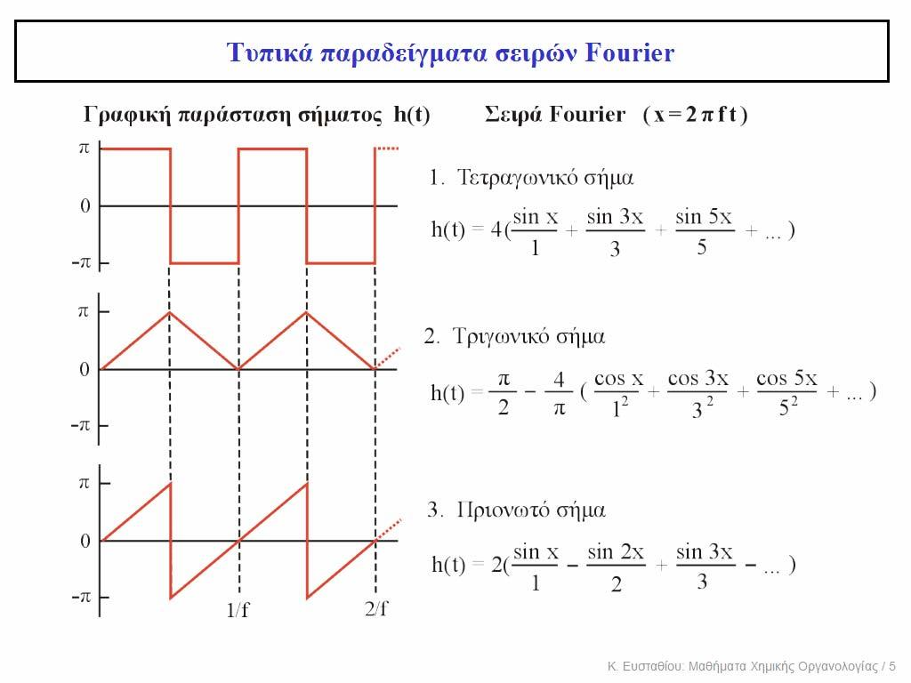
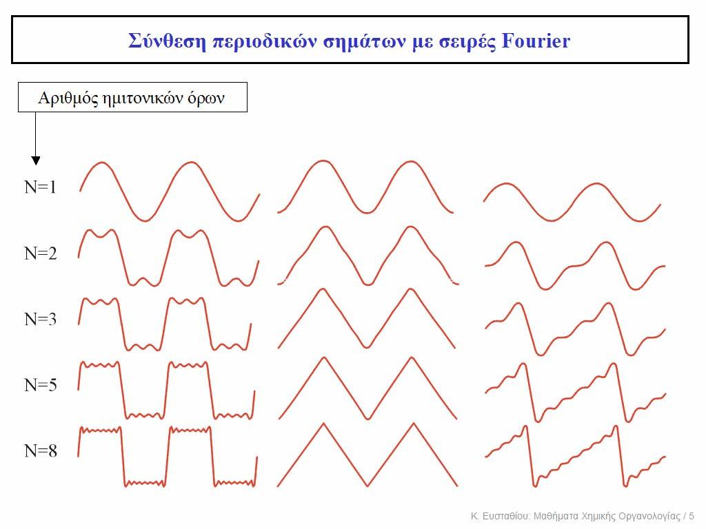
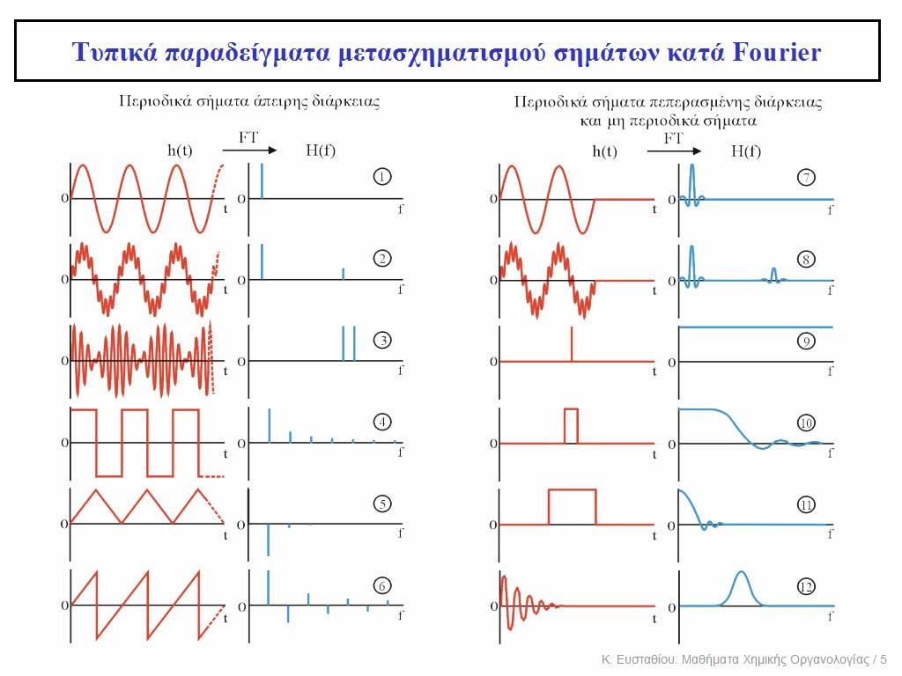
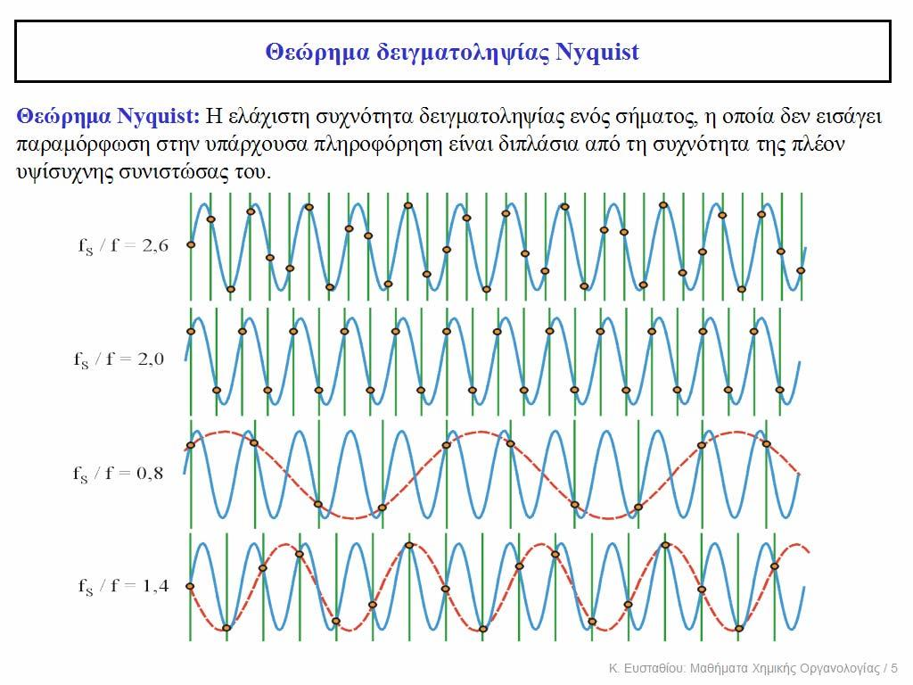
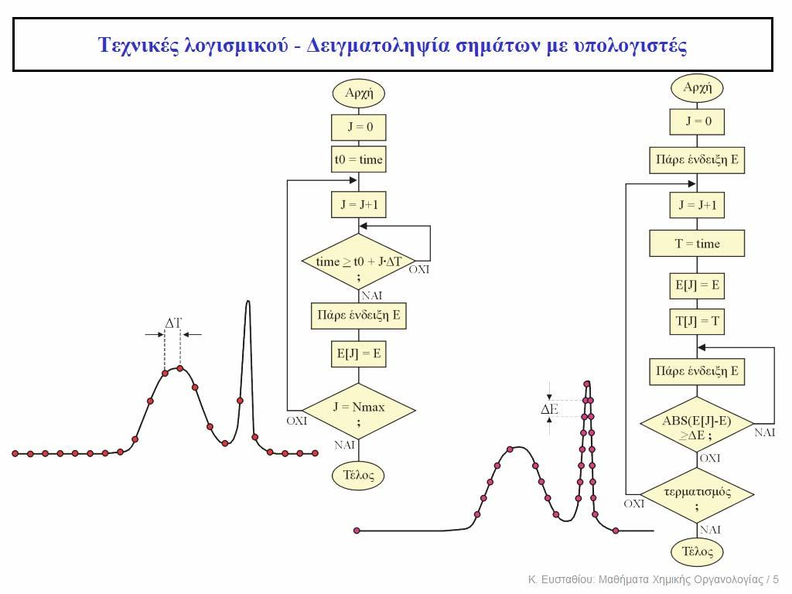
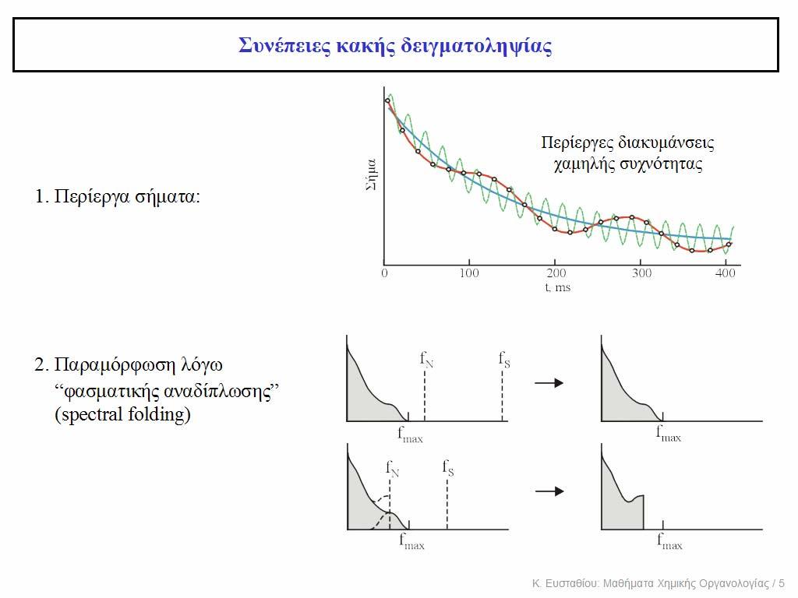

# Επεξεργασία Ψηφιακών Σημάτων

## Εισαγωγή

**Σήμα** είναι ο φορέας της ζητούμενης πληροφορίας κατά τη διάρκεια μιας μέτρησης. **Θόρυβος** είναι το σύνολο των ανεπιθύμητων πληροφοριών, οι οποίες συνοδεύουν το σήμα και υποβαθμίζουν την ορθότητα και την ακρίβεια της μέτρησης.
Μερικά παραδείγματα πηγών θορύβου είναι αστάθεια φλόγας, ανεπιθύμητες ακρινοβολίες, πατάσιτο φως, ρεύματα σκότους, ενδογενείες θόρυβοι, ολίσθηση σημάτων, θόρυβος κβαντισμού ανιχνευτή,σφάλματα ανάγνωσης κ.α.

## Ο μετασχηματισμός Fourier

Μπορούμε να διακρίνουμε δύο τύπους σημάτων, τα *περιοδικά σήματα άπειρης διάρκειας* και τα *περιοδικά σ΄ήματα πεπερασμένης διάρκειας* ή *μη περιοδικά σήματα*. Κάθε σήμα που είναι περιοδικό και άπειρης διάρκειας προκύπτει από πεπερασμένο ή άπειρο αριθμό όρων της εξής εξισώσεως:
$$
h(t)=\frac {A_0}2+\sum_{n=1}^{\infty}{A_ncos(2\;\pi\;n\;f\;t)}+\sum_{m=1}^{\infty}{\Beta_m\;sin(2\;\pi\;m\;f\;t)}
$$

Εδώ $\frac{A_0}2$ είναι μια συνεχής συνιστώσα που την ονομάζουμε *μηδενική συχνότητα* και μπορεί να μην υπάρχει. Οι όροι $A_1,A_2,A_3,[\;\dots],A_n,\;\;B_1,B_2,B_3,[\dots],B_m$ είναι τα πλάτη των ημιτονικών όρων που ονομάζονται και *συντελεστ΄ές Fourier*. $f$ είναι η *θεμελιώδης συχνότητα* και $nf,mf$ η n-οστη ή m-οστη *αρμονική συχνότητα*.
Από τα μαθηματικά προκύπτει ότι, κάθε μορφή καμπύλης μπορεί να αποδοθεί επακριβώς ή με κάποια επιθυμητή ακρίβεια ως άθροισμα αρμονικών ημιτονικών σειρών. Για εμάς αυτό σημαίνει ότι κάθε σήμα μορφής ($h(t)$), δηλαδή η μεταβολή μιας φυσικής παραμέτρου ως προς τον χρόνο μπορούμε βα τι αποδόσουμε με μια συνάρτηση μορφής $Η(f)$, δηλαδή μεταβολή φυσικής παραμέτρου ως προς τη συχνότητα.

Στη πραγματικότητα οι συναρτήσεις $h(t)$ και $H(f)$ είναι **δύο διαφορετικές μορφές της ίδιας πληροφορίας**. Η πρώτη δίνει το σήμα και η δεύτερη δίνει τα ημιτονικά συστατικά του σήματος. Μπορούμε να μεταβούμε από τη μία μορφή στην άλλη μέσω του *ορθού* και του *αντίστροφου* μετασχηματισμού Fourier
$$
\def\arraystretch{2.5}
\begin{array}{cc}
\text{Ορθός Μετασχηματισμός Fourier:}&&Η(f)=\int_{_{-\infty}}^{^{\infty}}h(t)\;[cos(2\;\pi\;f\;t)-j\;sin(2\;\pi\;f\;t)]\;dt\\
\text{Αντίστροφος Μετασχηματισμός Fourier:}&&h(t)=\int_{_{-\infty}}^{^{\infty}}H(f)\;[cos(\;2\pi\;f\;t)+j\;sin(2\;\pi\;f\;t)]\;dt
\end{array}
$$
Συμβολικά:
$$
\def\arraystretch{2.5}
\begin{array}{c}
H(f)=\boldsymbol{F}\{h(\boldsymbol{t})\}\\
h(t)=\boldsymbol{F}^{^{-1}}\{H(f)\}
\end{array}
$$
Μερικά παραδείγματα έχουν ως εξής:

\
*Πριωνοτά Σήματα και Μετασχηματισμός Fourier*\
\
*Σύνθεση Πολύπλοκων Σημάτων από Απλούστερα με Σειρές Fourier*\
\
*Συνιστώσες Fourier απλών σημάτων*

## Φάσματα

Εκτός από την αμεσότερη περιγραφή του σήματος $h(t)$ χρησιμοποιούμε επίσης το *φασμα πλάτους σήματος* και το *φάσμα ισχύος σήματος*. Στη πρώτη περίπτωση έχουμε ένταση συναρτήση πλάτους και στη δεύτερη *ισχύ* συναρτήση συχνότητας ($S^2$).

## Θόρυβος

Όπως είπαμε υπάρχουν πολλαπλές πηγές θορύβου, οπότε η τελική εικόνα θορύβου είναι κάποιος γραμμικός συνδιασμός των επί μέρους κομματιών θορύβου. Δηλαδή η θόρυβος *διαδίδεται* στις μετρήσεις. Τότε:
$$
NF=\frac {({\frac SN})_i}{{(\frac SN})_o} \iff\\
NF(dB)=20\;log(\frac{(\frac SN)_i}{(\frac SN)_0})\\
NF>1\iff\;\text{Η μονάδα επιβαρύνει το σήμα σε θόρυβο}
$$
$$
NF=(NF)_1+\frac{(NF)_2-1}{A_1}+\frac{(NF)_3-1}{A_1A_2}+[\;\dots]+\frac{(NF)_n-1}{A_1A_2A_3\dots A_{n-1}}\iff\\
NF=(NF)_1+\sum_{i=2}^{n\in\mathbb{N}}{ \frac{(NF)_i-1}{\prod_{j=2}^{n-1}{A_j} } }
$$

Πρακτικά, όταν προσπαθούμε να μειώσουμε τον θόρυβο στις μετρήσεις οργάνου θα πρέπει να επικεντρωνόμαστε κυρίως στον ίδιο τον ανιχνευτή και στο πρώτο στάδιο της ενίσχυσης.

### Λόγοσ Σήμα Προς Θόρυβο ($\frac SN$)

Γενικά υποθέτουμε ο ίδιο ο θόρυβος ακολουθεί κανονική κατανομή τύπου $\mathbb{N}(\bar N,N_{RMS})$. Τότε:
$$
\frac SN\equiv SNR=\frac{\bar S}{N_{RMS}}
$$

Ακριβώς όπως γίνεται σε όλες τις κανονικές κατανομές:
$$
Ν_{RMS}=\sqrt{\frac{\sum_{i=1}^{n\in\mathbb{N}{(S-S_i)^2}}}{n}}
$$
Και η σύνθεση πολλαπλών θορύβων θα είναι:
$$
Ν_{total}^2=\sum_{i=1}^{n\in\mathbb{N}}{N_i^2}
$$
Όπως και με τους ήχους, μετράμε τον θόρυβο σε $dB$. Για να χρησημοποιήσουμε τέτοιες μονάδες θα πρέπει να τον ορίσουμε λίγο διαφορετικά:
$$
\def\arraystretch{2.5}
\begin{array}{cc}
\text{Ισχύος:}&&\frac SN=10\;log(\frac{P_{signal}}{P_{RMS \;θορύβου}})\\
\text{Τάσης:}&&\frac SN=20\;log(\frac{V_{signal}}{V_{RMS \;θορύβου}})\\
\text{Έντασης:}&&\frac SN=10\;log(\frac{I_{signal}}{I_{RMS \;θορύβου}})\\
\end{array}
$$

### Τύποι Ηλεκτρικού θορύβου

Ανάλογα με τα διάφορα χαρακτηριστικά και την προέλευση του ο θόρυβος μπορεί ανήκει σε διάφορες κατηγορίες.

Οι *θεμελιώδεις θόρυβοι* ενδογενής του συστήματος, δηλαδή δεν είναι προϊόν ατέλειας αλλά χαρακτηριστηκό του συστήματος ως έχει. Οφείλεται γενικά στη θερμική κίνηση φορέων ηλεκτρικού φορτίου (i.e. ηλεκτρόνια) αλλά και σε στατικά φαινόμενα. Αυτοί οι θόρυβοι είναι κατά βάση *λευκοί* δηλαδή ανεξάρτητη της συχνότητας. Μπορουμε να τους ελαχιστοποιήσουμε με προσεκτικό σχεδιασμού του συστήματος αλλά όχι τους εξαλείψουμε εν τέλη. Υπάρχουν υπο-κατηγορίες:

* *Θερμικός Θόρυβος* ή *θόρυβος Johnson-Nyquist*
* *Θόρυβος Βολής*
* *Θόρυβος flicker* ή *θόρυβος $\frac1f$*

Οι *μη θεμελιώδεις θόρυβοι* ή *θόρυβοι περίσσειας* προέρχονται από το περιβάλλον (όπως είναι για παράδειγμα ηλεκτρικές εκκενώσεις, αναφλέξεις μηχανών καύσης). Ένα ιδιαίτερο παράδειγμα είναι ο θόρυβος 50 Hz του ηλεκτρικού δικτύου. Είναι γενικά εξωγενείς και εξαρτόνται στη γενική περίπτωση από τον τόπο και τον χρόνο. Συχνά είναι *εγχρωμοι* με την έννοια ότι εξαρτόνται από τη συχνότητα και έχουν χαρακτηριστηκό φάσμα συχνοτήτων. Μπορούμε να τους μειώσουμε με θωρακίσεις, φίλτρα, μικρά καλώδια και άλλες στρατηγικές.

Τέλος, υπάρχουν και οι *θόρυβοι ειδικού τύπου* με μοναδικό εκπρόσωπο τον *θόρυβο κβαντισμού*. Οφείλεται σε στρογγυλοποίηση αριθμών και δεδομένων και την διακριτική ικανότητα των αναλογικοψηφιακών μετατροπέων.

#### Θερμικό Θόρυβος - Θόρυβος Johnson - Nyquist

Ας δούμε μερικά παραδείγματα θορύβου στη Χημεία. Για μέτρηση pH με ηλεκτρόδιο ύαλου θα μελετήσουμε τον θερμικό θόρυβο και θα τον εκφράσουμε σε οικίες μονάδες pH. Στους $25\;^oC$ το ηλεκτρόδιο έχει εσωτερική αντίσταση $1000\;\Mu\Omega$, και το εύρος ζώνης συχνοτήτων για τα υπόλοιπα στάδιο ενίσχυσης είναι $100\;kHz$ που είναι γενικά τυπικό για τελεστικούς ενισχυτές με ζέυξη DC.
$$
V^{^{thermal}}_{_{RMS}} = \sqrt{4\;(1.38*\;10^{-23}\;JK^{-1})(298\;K)(10^9\;\Omega)(10^5\;s^{-1})}=0.00128\;V
$$
Από την εξίσωση Nernst μια μονάδα pH αντιστοιχεί σε 0,05916 V άρα για να μετατρέψουμε τον θόρυβο σε pH είναι:
$$
\frac{0.00128\;V}{0.05916\;\frac{V}{μονάδα\;pH}}=0.022\;\text{μονάδες pH}
$$

#### Θόρυβος flicker ή θόρυβος $\frac 1f$

Η ακριβής προέλευση του θορύβου flicker δεν μας είναι γνωστή να και αρκετοί πιστεύουν οτι οφείλεται σε αποσυνδέσεις και επανασυνδέσεις οπώς-ηλεκτρονίων. Άρα είναι έντονες στους ημιαγωγούς, ενώ η ίδια η ολίσθηση μπορεί να αποδοθεί στον θόρυβο flicker. Εμφανίζεται ιδαίτερα όταν ρεύμα διέρχετα από μίγμα διαφόρων ατόμων (υλικά φωτοκαθόδων) και από κοκκώδη υλικά. Είναι έντονος σε σήματα χαμηλών συχνοτήτων με ισχύ ανάλογη του $\frac 1{f^n}$. Για να τον αντιμετοπίσουμε μπορούμε να μεταφέρουμε το σήμα σε υψηλές συχνότητες (*διαμόρφωση*) και να μείνουμε μακριά από τις μηδενικές συχνότητες - δηλαδή το συνεχές ρεύμα.

## Δειγματοληψία Σήματος

Στην πραγματικότητα δεν μπορούμε να καταγράψουμε σήμα με κάποιο συνεχή τρόοο. Πρέπει αντίθετα να λαμβάνουμε την τιμή του σήματος ανά τακτά χρονικά διαστήματα $\Delta t$ και να παρουσιάσουμε το συνεχές σήμα ως μια γραμμή που ενώνει αυτά τα σημεία. 
\
*Δειγματοληψία*\
Μπορούμε να φανταστούμε όμως οτι για κορυφή σήματος, με εύρος μικρότερο του $\Delta t$ η κορυφή μπορεί να χαθεί εντελώς και να πάρουμε μια ψευδή εικόνα που αντιστοιχεί σε μια συχνότητα μεγαλύτερη της πραγματικής. 
$$
f_{false}=|f-kf_{sample}|
$$
\
*Δειγματοληψία*\
Ποιό είναι όμως το κατάλληλο διάστημα για τη δειγματοληψία? Η απάντηση δίνεται από το *θεώρημα Nyquist*.

>**Θεώρημα Nyquist:**\
*Η ελάχιστη συχνότητα δειγματοληψίας ενός σήματος, η οποία δεν είσαγει παραμόρφωση στην υπάρχουσα πληροφορία είναι διιπλάσια της συχνότητας της επί πλέον υψίσυχνης συνιστώσας του.*

Κακή δειγματοληψία μπορεί να οδηγήσει σε περίεργα σήματα ή και ένα φαινόμενο που ονομάζεται *φασματική αναδίπλωση (spectral folding)*.

\
*Συνέπιες κακής δειγματοληψίας*

### Aliasing

Σήματα μεγαλύτερη συχνότητας από αυτή της δειγματοληψίας μπορούν να "αναδιπλωθούν", δηλαδή εμφανίζονται ως ψευδείς συχνότητες εντός του διαστήματος διεγματοληψίας. Η αναδίπλωση αυτή γίνεται ως εξής, η συχνότητα "αντικατοπτρίζονται" από την άλλη μερία του ορίου (ανώτερο ή κατώτατο) μέχρι να πέσουν μέσα στο διάστημα. Λόγο αυτού, δεν εμφανίζεται ως αρμονική σαν τις υπόλοιπες. Αυτό το φαινόμενο ονομάζεται *aliasing*.  Έχουμε δυο επιλογές για να το αντιμετοπίσουμε. Και σε δύο περιπτώσεις, θα πρέπει να καθορίσουμε τον ανώτατο όριο χρήσιμων συχνοτήτων $f_{max}$. Θα πρέπει να κάνουμε φασματική ανάλυση για να το προσδιορίσουμε αυτό.

Πρώτον μπορούμε να περάσουμε το σήμα από *βαθυπερατό φίλτρο*, δηλαδή μια συνάρτηση που αποκόπτει ορισμένες συχνότητες. Στη δικιά μας περίπτωση θα πρέπει αυτό το φίλτρο να αποκόπτει συχνότητες πάνω από το $f_{max}$. Εναλλακτικλα μπορούμε να κάνουμε δειγματοληψία σήματος με συχνότητα ίσης ή μεγαλύτερη του $2\;f_{max}$.

### Εξομάλυνση (smoothing) Σήματος

Τα πραγματικά σήματα που λαμβάνουμε με ένωση σημείων δειγματοληψίας είναι ανόμαλα και "οδοντοτά". Για να τα απεικονήσουμε σωστά, πρέπει να τα μετατρέψουμε σε ποιό ομαλές γραμμές, μια διαδικασία που ονομάζεται *εξομάλυνση*. Υπάρχουν διάφοροι τρόποι να το πατύχουμε αυτό.

#### Μέθοδος Κινούμενης Μέσης Τιμής

Αν κάνουμε δειγματοληψία με ισαπέχοντα σημεία τότε μπορούμε να εφαρμώσουμε τον εξής αλγόριθμο. Χωρίζουμε τα σημεία σε ομάδες των $k$ και αντικαθιστουμε κάθε ομάδα με τον μέσο όρο των σημείων της.
$$
(\forall i\in\mathbb{N}^+)(\forall x_i)[x_{i+1}-x_i=c\in \mathbb{R},\;\text{Σταθερό}]\iff\\
(y_k)_S=\frac{\sum_{i=-m}^{m\in\mathbb{N}^+}y_{k+i}}{2\;m+1}
$$

#### Μέθοδος Savitzky-Golay

Η μέθοδος αυτή εφαρμώζεται με τον ίδιο περιοσιμό με άνω, αλλά χωρίζουμε τα σημεία σε ομάδες περισττού αριθμού και προσαρμώζουμε πολυόνυμο δεύτερου ή ανώτερου βαθμού. Τότε ως κεντρική τιμή της ομάδας παίρνουμε τη θεωρητική τιμή, όπως προκύπτει από την εξίσωση πολυονύμου. Εναλλακτικά μπορούμε να το υπολογίσουμε και ως στατιστικά ζυγισμένη μέση τιμή:
$$
(\forall i\in\mathbb{N}^+)(\forall x_i)[x_{i+1}-x_i=c\in \mathbb{R},\;\text{Σταθερό}]\iff\\
(y_k)_S=\frac{\sum_{i=-m}^{m\in\mathbb{N}^+}{a_i\;y_{k+i}} }{N_F}
$$

>**Σημείωση:**\
Συγκριτικά, η μέθοδος κινούμενων τιμών δίνει υπερβολλική και ανισοβαρή εξομάλυνση, ιδαιτέρος για μεγάλο αριθμό σημείων στη δειγματοληψία και για θορυβώδοι σήματα. Η δε Savitzky-Golay είναι πολυπλοκότερη αλλά δαιτηρεί της "ροπές" των κορυφών.

>**Παρατήρηση:**\
Ιδιαιτέρως σε εφαρμωγές μετασχηματισμού Fourier, μια εναλλακτική προσέγγιση είναι η λήψη πολλαπλών φασμάτων και η παρουσίαση της μέσης τιμής τους ως τελικό φάσμα.